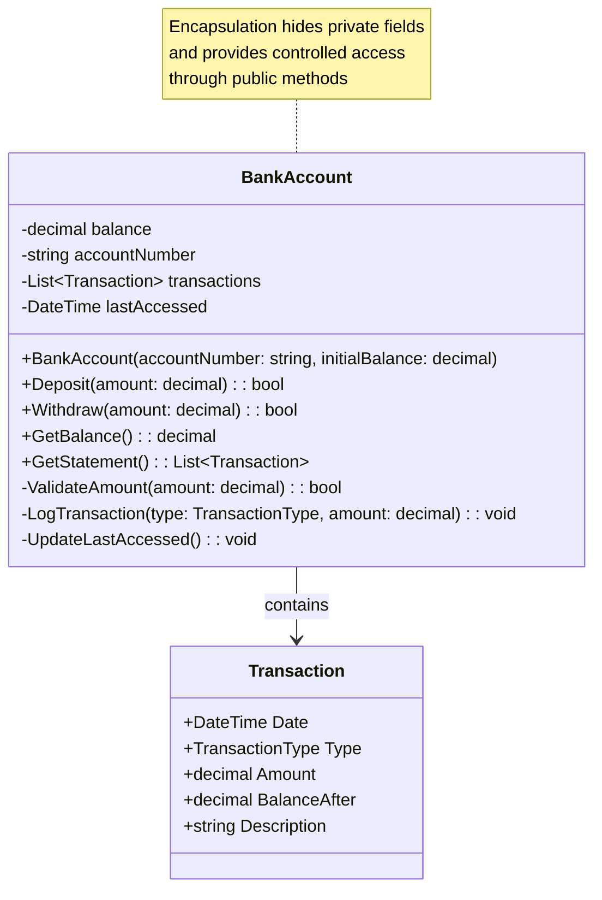

# Encapsulation

> **"Encapsulation is the bundling of data and the methods that operate on that data into a single unit, and restricting access to the inner workings of that unit."**

## 🎯 Definition

Encapsulation is the OOP principle that combines data (fields) and behavior (methods) into a single unit (class) while controlling access to the internal implementation details. It's about **hiding the "how"** and exposing only the **"what"** through well-defined interfaces.

## 🏠 Real-World Analogy

Think of a **car's engine**:

- ✅ **Internal complexity hidden** - You don't see pistons, valves, timing belts
- ✅ **Simple interface exposed** - Gas pedal, brake, steering wheel, ignition
- ✅ **Protected internals** - Can't accidentally damage critical components
- ✅ **Controlled access** - Mechanic has special tools for internal access
- ✅ **Data and behavior together** - Engine contains fuel system, cooling system, and control methods

## 📊 UML Diagram



## 🚫 Violation Example (Poor Encapsulation)

```csharp
// ❌ BAD: No encapsulation - fields exposed, no validation, no protection

public class Employee
{
    // Public fields - no protection or validation!
    public string FirstName;
    public string LastName;
    public decimal Salary;
    public DateTime HireDate;
    public string Department;
    public List<string> Projects;
    public bool IsActive;
    public string SocialSecurityNumber;
    public decimal BonusPercentage;
}

public class PayrollSystem
{
    public void ProcessPayroll(List<Employee> employees)
    {
        foreach (var employee in employees)
        {
            // Direct field access - dangerous!
            if (employee.IsActive)
            {
                // No validation - can set negative salary!
                employee.Salary = -1000;
                
                // Can modify sensitive data directly
                employee.SocialSecurityNumber = "123-45-6789";
                
                // Can corrupt data
                employee.Projects = null;
                employee.Department = "";
                
                // Logic scattered everywhere
                var bonus = employee.Salary * employee.BonusPercentage;
                var totalPay = employee.Salary + bonus;
            }
        }
    }
}

// Usage shows the problems
public class HRManager
{
    public void HireEmployee()
    {
        var employee = new Employee();
        
        // No validation or business rules!
        employee.Salary = -50000; // Negative salary!
        employee.HireDate = DateTime.Now.AddYears(1); // Future hire date!
        employee.BonusPercentage = 500; // 50000% bonus!
        employee.SocialSecurityNumber = "invalid"; // Invalid format!
        employee.IsActive = true;
        employee.Projects = null; // Null reference waiting to happen!
    }
}
```

### Problems with this approach

1. **No data protection** - Anyone can modify any field directly
2. **No validation** - Invalid data can be set (negative salary, future dates)
3. **No business rules** - Logic is scattered across the codebase
4. **Security risks** - Sensitive data like SSN can be accessed/modified freely
5. **Maintenance nightmare** - Changes require updating multiple locations
6. **No consistency** - Different parts of code may handle data differently

## ✅ Correct Implementation (Proper Encapsulation)

```csharp
// ✅ GOOD: Proper encapsulation with data hiding and controlled access

public class Employee
{
    // Private fields - encapsulated data
    private string _firstName;
    private string _lastName;
    private decimal _salary;
    private DateTime _hireDate;
    private string _department;
    private List<string> _projects;
    private bool _isActive;
    private string _socialSecurityNumber;
    private decimal _bonusPercentage;
    private readonly List<PayrollRecord> _payrollHistory;
    private readonly string _employeeId;

    // Constructor with validation
    public Employee(string employeeId, string firstName, string lastName, 
        string socialSecurityNumber, decimal initialSalary, string department, DateTime hireDate)
    {
        _employeeId = employeeId ?? throw new ArgumentNullException(nameof(employeeId));
        
        FirstName = firstName; // Uses property setter for validation
        LastName = lastName;
        SocialSecurityNumber = socialSecurityNumber;
        Salary = initialSalary;
        Department = department;
        HireDate = hireDate;
        
        _projects = new List<string>();
        _payrollHistory = new List<PayrollRecord>();
        _isActive = true;
        _bonusPercentage = 0.0m;
    }

    // Public properties with validation and business rules
    public string EmployeeId => _employeeId; // Read-only

    public string FirstName
    {
        get => _firstName;
        set
        {
            if (string.IsNullOrWhiteSpace(value))
                throw new ArgumentException("First name cannot be empty", nameof(value));
            
            if (value.Length > 50)
                throw new ArgumentException("First name cannot exceed 50 characters", nameof(value));
            
            _firstName = value.Trim();
        }
    }

    public string LastName
    {
        get => _lastName;
        set
        {
            if (string.IsNullOrWhiteSpace(value))
                throw new ArgumentException("Last name cannot be empty", nameof(value));
            
            if (value.Length > 50)
                throw new ArgumentException("Last name cannot exceed 50 characters", nameof(value));
            
            _lastName = value.Trim();
        }
    }

    public string FullName => $"{FirstName} {LastName}"; // Computed property

    public decimal Salary
    {
        get => _salary;
        set
        {
            if (value < 0)
                throw new ArgumentException("Salary cannot be negative", nameof(value));
            
            if (value > 1_000_000)
                throw new ArgumentException("Salary cannot exceed $1,000,000", nameof(value));
            
            _salary = value;
        }
    }

    public DateTime HireDate
    {
        get => _hireDate;
        set
        {
            if (value > DateTime.Now)
                throw new ArgumentException("Hire date cannot be in the future", nameof(value));
            
            if (value < new DateTime(1900, 1, 1))
                throw new ArgumentException("Hire date cannot be before 1900", nameof(value));
            
            _hireDate = value;
        }
    }

    public string Department
    {
        get => _department;
        set
        {
            if (string.IsNullOrWhiteSpace(value))
                throw new ArgumentException("Department cannot be empty", nameof(value));
            
            var validDepartments = new[] { "IT", "HR", "Finance", "Marketing", "Operations", "Sales" };
            if (!validDepartments.Contains(value))
                throw new ArgumentException($"Invalid department. Must be one of: {string.Join(", ", validDepartments)}", nameof(value));
            
            _department = value;
        }
    }

    public bool IsActive
    {
        get => _isActive;
        private set => _isActive = value; // Private setter - controlled termination
    }

    public decimal BonusPercentage
    {
        get => _bonusPercentage;
        set
        {
            if (value < 0)
                throw new ArgumentException("Bonus percentage cannot be negative", nameof(value));
            
            if (value > 1.0m) // Maximum 100%
                throw new ArgumentException("Bonus percentage cannot exceed 100%", nameof(value));
            
            _bonusPercentage = value;
        }
    }

    // Controlled access to sensitive data
    public string SocialSecurityNumber
    {
        get => MaskSocialSecurityNumber(_socialSecurityNumber);
        set
        {
            if (!IsValidSocialSecurityNumber(value))
                throw new ArgumentException("Invalid Social Security Number format", nameof(value));
            
            _socialSecurityNumber = value;
        }
    }

    // Read-only collection - internal list is protected
    public IReadOnlyList<string> Projects => _projects.AsReadOnly();

    public IReadOnlyList<PayrollRecord> PayrollHistory => _payrollHistory.AsReadOnly();

    public int YearsOfService => (DateTime.Now - _hireDate).Days / 365;

    // Public methods for controlled operations
    public void AssignToProject(string projectName)
    {
        if (string.IsNullOrWhiteSpace(projectName))
            throw new ArgumentException("Project name cannot be empty", nameof(projectName));
        
        if (!_isActive)
            throw new InvalidOperationException("Cannot assign projects to inactive employee");
        
        if (_projects.Contains(projectName))
            throw new InvalidOperationException($"Employee is already assigned to project: {projectName}");
        
        if (_projects.Count >= 5)
            throw new InvalidOperationException("Employee cannot be assigned to more than 5 projects");
        
        _projects.Add(projectName);
    }

    public void RemoveFromProject(string projectName)
    {
        if (string.IsNullOrWhiteSpace(projectName))
            throw new ArgumentException("Project name cannot be empty", nameof(projectName));
        
        if (!_projects.Contains(projectName))
            throw new InvalidOperationException($"Employee is not assigned to project: {projectName}");
        
        _projects.Remove(projectName);
    }

    public void PromoteWithSalaryIncrease(decimal increasePercentage)
    {
        if (!_isActive)
            throw new InvalidOperationException("Cannot promote inactive employee");
        
        if (increasePercentage < 0 || increasePercentage > 0.5m) // Max 50% increase
            throw new ArgumentException("Salary increase must be between 0% and 50%", nameof(increasePercentage));
        
        var oldSalary = _salary;
        _salary = _salary * (1 + increasePercentage);
        
        LogPayrollChange(PayrollChangeType.Promotion, oldSalary, _salary, $"Promoted with {increasePercentage:P} increase");
    }

    public void SetBonusPercentage(decimal bonusPercentage, string reason)
    {
        if (!_isActive)
            throw new InvalidOperationException("Cannot set bonus for inactive employee");
        
        if (string.IsNullOrWhiteSpace(reason))
            throw new ArgumentException("Reason for bonus change is required", nameof(reason));
        
        var oldBonus = _bonusPercentage;
        BonusPercentage = bonusPercentage; // Uses property validation
        
        LogPayrollChange(PayrollChangeType.BonusAdjustment, oldBonus, bonusPercentage, reason);
    }

    public void Terminate(string reason)
    {
        if (!_isActive)
            throw new InvalidOperationException("Employee is already terminated");
        
        if (string.IsNullOrWhiteSpace(reason))
            throw new ArgumentException("Termination reason is required", nameof(reason));
        
        _isActive = false;
        _projects.Clear(); // Remove from all projects
        
        LogPayrollChange(PayrollChangeType.Termination, 0, 0, reason);
    }

    public void Reactivate(string reason)
    {
        if (_isActive)
            throw new InvalidOperationException("Employee is already active");
        
        if (string.IsNullOrWhiteSpace(reason))
            throw new ArgumentException("Reactivation reason is required", nameof(reason));
        
        _isActive = true;
        
        LogPayrollChange(PayrollChangeType.Reactivation, 0, 0, reason);
    }

    public decimal CalculateAnnualCompensation()
    {
        if (!_isActive)
            return 0;
        
        var baseSalary = _salary * 12; // Monthly to annual
        var bonusAmount = baseSalary * _bonusPercentage;
        
        return baseSalary + bonusAmount;
    }

    public PayrollCalculation CalculatePayroll(DateTime payPeriodStart, DateTime payPeriodEnd)
    {
        if (!_isActive)
            throw new InvalidOperationException("Cannot calculate payroll for inactive employee");
        
        ValidatePayPeriod(payPeriodStart, payPeriodEnd);
        
        var daysInPeriod = (payPeriodEnd - payPeriodStart).Days + 1;
        var workingDays = CalculateWorkingDays(payPeriodStart, payPeriodEnd);
        
        var basePay = (_salary / 30) * workingDays; // Assuming 30-day month
        var bonusPay = basePay * _bonusPercentage;
        var totalPay = basePay + bonusPay;
        
        var payroll = new PayrollCalculation
        {
            EmployeeId = _employeeId,
            PayPeriodStart = payPeriodStart,
            PayPeriodEnd = payPeriodEnd,
            BasePay = basePay,
            BonusPay = bonusPay,
            TotalPay = totalPay,
            WorkingDays = workingDays
        };
        
        _payrollHistory.Add(new PayrollRecord
        {
            Date = DateTime.Now,
            PayPeriod = $"{payPeriodStart:yyyy-MM-dd} to {payPeriodEnd:yyyy-MM-dd}",
            Amount = totalPay,
            Type = PayrollChangeType.RegularPayroll
        });
        
        return payroll;
    }

    // Protected method for derived classes or internal access
    protected string GetUnmaskedSocialSecurityNumber()
    {
        return _socialSecurityNumber;
    }

    // Private methods - internal implementation details
    private bool IsValidSocialSecurityNumber(string ssn)
    {
        if (string.IsNullOrWhiteSpace(ssn))
            return false;
        
        // Simple validation - in real app, use more robust validation
        var pattern = @"^\d{3}-\d{2}-\d{4}$";
        return System.Text.RegularExpressions.Regex.IsMatch(ssn, pattern);
    }

    private string MaskSocialSecurityNumber(string ssn)
    {
        if (string.IsNullOrWhiteSpace(ssn) || ssn.Length < 4)
            return "***-**-****";
        
        return $"***-**-{ssn.Substring(ssn.Length - 4)}";
    }

    private void ValidatePayPeriod(DateTime start, DateTime end)
    {
        if (end < start)
            throw new ArgumentException("Pay period end cannot be before start date");
        
        if ((end - start).Days > 31)
            throw new ArgumentException("Pay period cannot exceed 31 days");
        
        if (start < _hireDate)
            throw new ArgumentException("Pay period cannot start before hire date");
    }

    private int CalculateWorkingDays(DateTime start, DateTime end)
    {
        // Simplified - excludes weekends
        var workingDays = 0;
        for (var date = start; date <= end; date = date.AddDays(1))
        {
            if (date.DayOfWeek != DayOfWeek.Saturday && date.DayOfWeek != DayOfWeek.Sunday)
                workingDays++;
        }
        return workingDays;
    }

    private void LogPayrollChange(PayrollChangeType type, decimal oldValue, decimal newValue, string reason)
    {
        _payrollHistory.Add(new PayrollRecord
        {
            Date = DateTime.Now,
            Type = type,
            Amount = newValue,
            PreviousAmount = oldValue,
            Reason = reason
        });
    }

    // Override for better string representation
    public override string ToString()
    {
        return $"Employee: {FullName} ({EmployeeId}) - {Department} - {(IsActive ? "Active" : "Inactive")}";
    }
}

// Supporting classes
public class PayrollCalculation
{
    public string EmployeeId { get; set; }
    public DateTime PayPeriodStart { get; set; }
    public DateTime PayPeriodEnd { get; set; }
    public decimal BasePay { get; set; }
    public decimal BonusPay { get; set; }
    public decimal TotalPay { get; set; }
    public int WorkingDays { get; set; }
}

public class PayrollRecord
{
    public DateTime Date { get; set; }
    public PayrollChangeType Type { get; set; }
    public decimal Amount { get; set; }
    public decimal PreviousAmount { get; set; }
    public string PayPeriod { get; set; }
    public string Reason { get; set; }
}

public enum PayrollChangeType
{
    RegularPayroll,
    Promotion,
    BonusAdjustment,
    Termination,
    Reactivation,
    SalaryAdjustment
}

// Usage with proper encapsulation
public class HRManagementService
{
    private readonly List<Employee> _employees;
    private readonly ILogger<HRManagementService> _logger;

    public HRManagementService(ILogger<HRManagementService> logger)
    {
        _logger = logger ?? throw new ArgumentNullException(nameof(logger));
        _employees = new List<Employee>();
    }

    public void HireEmployee(string firstName, string lastName, string ssn, 
        decimal salary, string department, DateTime hireDate)
    {
        try
        {
            var employeeId = GenerateEmployeeId();
            
            // Encapsulation ensures validation happens in constructor
            var employee = new Employee(employeeId, firstName, lastName, ssn, salary, department, hireDate);
            
            _employees.Add(employee);
            _logger.LogInformation("Successfully hired employee: {EmployeeName} ({EmployeeId})", 
                employee.FullName, employee.EmployeeId);
        }
        catch (Exception ex)
        {
            _logger.LogError(ex, "Failed to hire employee: {FirstName} {LastName}", firstName, lastName);
            throw;
        }
    }

    public void PromoteEmployee(string employeeId, decimal increasePercentage)
    {
        var employee = FindEmployee(employeeId);
        
        try
        {
            employee.PromoteWithSalaryIncrease(increasePercentage);
            _logger.LogInformation("Promoted employee {EmployeeId} with {Increase:P} salary increase", 
                employeeId, increasePercentage);
        }
        catch (Exception ex)
        {
            _logger.LogError(ex, "Failed to promote employee {EmployeeId}", employeeId);
            throw;
        }
    }

    private Employee FindEmployee(string employeeId)
    {
        var employee = _employees.FirstOrDefault(e => e.EmployeeId == employeeId);
        if (employee == null)
            throw new ArgumentException($"Employee not found: {employeeId}");
        
        return employee;
    }

    private string GenerateEmployeeId()
    {
        return $"EMP{DateTime.Now:yyyyMMdd}{_employees.Count + 1:D4}";
    }
}
```

## 🏢 ERP Example: Document Management System

```csharp
// Document management with proper encapsulation
public class Document
{
    private string _title;
    private string _content;
    private string _fileName;
    private DateTime _createdDate;
    private DateTime _lastModified;
    private string _createdBy;
    private string _lastModifiedBy;
    private DocumentStatus _status;
    private List<DocumentVersion> _versions;
    private List<string> _tags;
    private AccessLevel _accessLevel;
    private byte[] _fileContent;
    private readonly string _documentId;

    public Document(string title, string fileName, byte[] content, string createdBy, AccessLevel accessLevel)
    {
        _documentId = Guid.NewGuid().ToString();
        
        Title = title;
        FileName = fileName;
        SetContent(content, createdBy);
        CreatedBy = createdBy;
        AccessLevel = accessLevel;
        
        _createdDate = DateTime.UtcNow;
        _lastModified = _createdDate;
        _status = DocumentStatus.Draft;
        _versions = new List<DocumentVersion>();
        _tags = new List<string>();
        
        CreateInitialVersion(createdBy);
    }

    // Public properties with validation
    public string DocumentId => _documentId;

    public string Title
    {
        get => _title;
        set
        {
            if (string.IsNullOrWhiteSpace(value))
                throw new ArgumentException("Document title cannot be empty");
            
            if (value.Length > 200)
                throw new ArgumentException("Document title cannot exceed 200 characters");
            
            _title = value.Trim();
        }
    }

    public string FileName
    {
        get => _fileName;
        private set
        {
            if (string.IsNullOrWhiteSpace(value))
                throw new ArgumentException("File name cannot be empty");
            
            if (!IsValidFileName(value))
                throw new ArgumentException("Invalid file name format");
            
            _fileName = value;
        }
    }

    public DateTime CreatedDate => _createdDate;
    public DateTime LastModified => _lastModified;
    public string CreatedBy => _createdBy;
    public string LastModifiedBy => _lastModifiedBy;
    public DocumentStatus Status => _status;
    public AccessLevel AccessLevel => _accessLevel;
    public long SizeInBytes => _fileContent?.Length ?? 0;
    public IReadOnlyList<DocumentVersion> Versions => _versions.AsReadOnly();
    public IReadOnlyList<string> Tags => _tags.AsReadOnly();

    // Controlled operations
    public void UpdateContent(byte[] newContent, string modifiedBy)
    {
        ValidateModificationAccess(modifiedBy);
        SetContent(newContent, modifiedBy);
        CreateVersion(modifiedBy, "Content updated");
    }

    public void Publish(string publishedBy)
    {
        ValidateModificationAccess(publishedBy);
        
        if (_status == DocumentStatus.Published)
            throw new InvalidOperationException("Document is already published");
        
        _status = DocumentStatus.Published;
        _lastModified = DateTime.UtcNow;
        _lastModifiedBy = publishedBy;
        
        CreateVersion(publishedBy, "Document published");
    }

    public void Archive(string archivedBy, string reason)
    {
        ValidateModificationAccess(archivedBy);
        
        if (_status == DocumentStatus.Archived)
            throw new InvalidOperationException("Document is already archived");
        
        _status = DocumentStatus.Archived;
        _lastModified = DateTime.UtcNow;
        _lastModifiedBy = archivedBy;
        
        CreateVersion(archivedBy, $"Document archived: {reason}");
    }

    public byte[] GetContent(string requestedBy)
    {
        ValidateReadAccess(requestedBy);
        
        if (_fileContent == null)
            throw new InvalidOperationException("Document content is not available");
        
        // Return copy to prevent external modification
        var contentCopy = new byte[_fileContent.Length];
        Array.Copy(_fileContent, contentCopy, _fileContent.Length);
        
        return contentCopy;
    }

    public void AddTag(string tag, string modifiedBy)
    {
        ValidateModificationAccess(modifiedBy);
        
        if (string.IsNullOrWhiteSpace(tag))
            throw new ArgumentException("Tag cannot be empty");
        
        var normalizedTag = tag.Trim().ToLowerInvariant();
        
        if (_tags.Contains(normalizedTag))
            throw new InvalidOperationException($"Tag '{tag}' already exists");
        
        _tags.Add(normalizedTag);
        _lastModified = DateTime.UtcNow;
        _lastModifiedBy = modifiedBy;
    }

    public void RemoveTag(string tag, string modifiedBy)
    {
        ValidateModificationAccess(modifiedBy);
        
        var normalizedTag = tag?.Trim().ToLowerInvariant();
        
        if (!_tags.Contains(normalizedTag))
            throw new InvalidOperationException($"Tag '{tag}' does not exist");
        
        _tags.Remove(normalizedTag);
        _lastModified = DateTime.UtcNow;
        _lastModifiedBy = modifiedBy;
    }

    // Private methods - internal implementation
    private void SetContent(byte[] content, string modifiedBy)
    {
        if (content == null || content.Length == 0)
            throw new ArgumentException("Document content cannot be empty");
        
        if (content.Length > 50 * 1024 * 1024) // 50MB limit
            throw new ArgumentException("Document size cannot exceed 50MB");
        
        _fileContent = new byte[content.Length];
        Array.Copy(content, _fileContent, content.Length);
        
        _lastModified = DateTime.UtcNow;
        _lastModifiedBy = modifiedBy;
    }

    private void CreateInitialVersion(string createdBy)
    {
        _versions.Add(new DocumentVersion
        {
            VersionNumber = 1,
            CreatedDate = _createdDate,
            CreatedBy = createdBy,
            Changes = "Initial version",
            SizeInBytes = SizeInBytes
        });
    }

    private void CreateVersion(string modifiedBy, string changes)
    {
        var nextVersion = _versions.Count + 1;
        _versions.Add(new DocumentVersion
        {
            VersionNumber = nextVersion,
            CreatedDate = DateTime.UtcNow,
            CreatedBy = modifiedBy,
            Changes = changes,
            SizeInBytes = SizeInBytes
        });
    }

    private void ValidateReadAccess(string userId)
    {
        // Simplified access control - in real system, check against user permissions
        if (string.IsNullOrWhiteSpace(userId))
            throw new UnauthorizedAccessException("User authentication required");
        
        if (_accessLevel == AccessLevel.Restricted && userId != _createdBy)
            throw new UnauthorizedAccessException("Insufficient permissions to read document");
    }

    private void ValidateModificationAccess(string userId)
    {
        ValidateReadAccess(userId);
        
        if (_status == DocumentStatus.Archived)
            throw new InvalidOperationException("Cannot modify archived document");
        
        if (_accessLevel == AccessLevel.ReadOnly)
            throw new UnauthorizedAccessException("Document is read-only");
    }

    private bool IsValidFileName(string fileName)
    {
        if (string.IsNullOrWhiteSpace(fileName))
            return false;
        
        var invalidChars = Path.GetInvalidFileNameChars();
        return !fileName.Any(c => invalidChars.Contains(c));
    }
}

// Supporting classes
public class DocumentVersion
{
    public int VersionNumber { get; set; }
    public DateTime CreatedDate { get; set; }
    public string CreatedBy { get; set; }
    public string Changes { get; set; }
    public long SizeInBytes { get; set; }
}

public enum DocumentStatus
{
    Draft,
    UnderReview,
    Published,
    Archived
}

public enum AccessLevel
{
    Public,
    Internal,
    Restricted,
    ReadOnly
}
```

## 🧪 Unit Testing Encapsulation

```csharp
[TestFixture]
public class EmployeeEncapsulationTests
{
    [Test]
    public void Constructor_Should_Validate_Required_Fields()
    {
        // Arrange & Act & Assert
        Assert.Throws<ArgumentNullException>(() => 
            new Employee(null, "John", "Doe", "123-45-6789", 50000, "IT", DateTime.Now.AddYears(-1)));
        
        Assert.Throws<ArgumentException>(() => 
            new Employee("EMP001", "", "Doe", "123-45-6789", 50000, "IT", DateTime.Now.AddYears(-1)));
        
        Assert.Throws<ArgumentException>(() => 
            new Employee("EMP001", "John", "Doe", "123-45-6789", -1000, "IT", DateTime.Now.AddYears(-1)));
    }

    [Test]
    public void Salary_Property_Should_Validate_Range()
    {
        // Arrange
        var employee = CreateValidEmployee();

        // Act & Assert
        Assert.Throws<ArgumentException>(() => employee.Salary = -1000);
        Assert.Throws<ArgumentException>(() => employee.Salary = 2_000_000);
        
        // Valid salary should work
        Assert.DoesNotThrow(() => employee.Salary = 75000);
        Assert.AreEqual(75000, employee.Salary);
    }

    [Test]
    public void SocialSecurityNumber_Should_Be_Masked_When_Retrieved()
    {
        // Arrange
        var employee = CreateValidEmployee();

        // Act
        var maskedSSN = employee.SocialSecurityNumber;

        // Assert
        Assert.That(maskedSSN, Does.StartWith("***-**-"));
        Assert.That(maskedSSN, Does.EndWith("6789"));
        Assert.AreNotEqual("123-45-6789", maskedSSN);
    }

    [Test]
    public void Projects_Collection_Should_Be_ReadOnly()
    {
        // Arrange
        var employee = CreateValidEmployee();
        employee.AssignToProject("Project A");

        // Act
        var projects = employee.Projects;

        // Assert
        Assert.IsInstanceOf<IReadOnlyList<string>>(projects);
        Assert.AreEqual(1, projects.Count);
        Assert.AreEqual("Project A", projects[0]);
    }

    [Test]
    public void AssignToProject_Should_Validate_Business_Rules()
    {
        // Arrange
        var employee = CreateValidEmployee();

        // Act & Assert - Empty project name
        Assert.Throws<ArgumentException>(() => employee.AssignToProject(""));

        // Assign valid project
        Assert.DoesNotThrow(() => employee.AssignToProject("Project A"));

        // Duplicate assignment
        Assert.Throws<InvalidOperationException>(() => employee.AssignToProject("Project A"));
    }

    [Test]
    public void CalculatePayroll_Should_Include_Bonus()
    {
        // Arrange
        var employee = CreateValidEmployee();
        employee.Salary = 60000; // $5000 per month
        employee.SetBonusPercentage(0.1m, "Performance bonus"); // 10%

        var payPeriodStart = new DateTime(2023, 1, 1);
        var payPeriodEnd = new DateTime(2023, 1, 31);

        // Act
        var payroll = employee.CalculatePayroll(payPeriodStart, payPeriodEnd);

        // Assert
        Assert.AreEqual(5000m, payroll.BasePay); // Monthly salary
        Assert.AreEqual(500m, payroll.BonusPay); // 10% of base
        Assert.AreEqual(5500m, payroll.TotalPay);
    }

    [Test]
    public void Terminate_Should_Prevent_Further_Operations()
    {
        // Arrange
        var employee = CreateValidEmployee();
        employee.AssignToProject("Project A");

        // Act
        employee.Terminate("Resignation");

        // Assert
        Assert.IsFalse(employee.IsActive);
        Assert.AreEqual(0, employee.Projects.Count); // Projects cleared
        
        // Should prevent further operations
        Assert.Throws<InvalidOperationException>(() => employee.AssignToProject("Project B"));
        Assert.Throws<InvalidOperationException>(() => employee.PromoteWithSalaryIncrease(0.1m));
    }

    private Employee CreateValidEmployee()
    {
        return new Employee(
            "EMP001",
            "John",
            "Doe",
            "123-45-6789",
            50000,
            "IT",
            DateTime.Now.AddYears(-1)
        );
    }
}

[TestFixture]
public class DocumentEncapsulationTests
{
    [Test]
    public void Constructor_Should_Create_Initial_Version()
    {
        // Arrange
        var content = System.Text.Encoding.UTF8.GetBytes("Test content");

        // Act
        var document = new Document("Test Doc", "test.txt", content, "user1", AccessLevel.Internal);

        // Assert
        Assert.AreEqual(1, document.Versions.Count);
        Assert.AreEqual("Initial version", document.Versions[0].Changes);
        Assert.AreEqual("user1", document.Versions[0].CreatedBy);
    }

    [Test]
    public void GetContent_Should_Return_Copy_Not_Reference()
    {
        // Arrange
        var originalContent = System.Text.Encoding.UTF8.GetBytes("Original content");
        var document = new Document("Test", "test.txt", originalContent, "user1", AccessLevel.Internal);

        // Act
        var retrievedContent = document.GetContent("user1");
        retrievedContent[0] = 255; // Modify the retrieved content

        // Assert
        var freshContent = document.GetContent("user1");
        Assert.AreNotEqual(255, freshContent[0]); // Original content unchanged
        Assert.AreEqual(originalContent[0], freshContent[0]);
    }

    [Test]
    public void UpdateContent_Should_Create_New_Version()
    {
        // Arrange
        var document = CreateValidDocument();
        var newContent = System.Text.Encoding.UTF8.GetBytes("Updated content");

        // Act
        document.UpdateContent(newContent, "user1");

        // Assert
        Assert.AreEqual(2, document.Versions.Count);
        Assert.AreEqual("Content updated", document.Versions[1].Changes);
    }

    [Test]
    public void Archive_Should_Prevent_Modifications()
    {
        // Arrange
        var document = CreateValidDocument();
        document.Archive("user1", "No longer needed");

        // Act & Assert
        Assert.AreEqual(DocumentStatus.Archived, document.Status);
        
        var newContent = System.Text.Encoding.UTF8.GetBytes("New content");
        Assert.Throws<InvalidOperationException>(() => document.UpdateContent(newContent, "user1"));
        Assert.Throws<InvalidOperationException>(() => document.AddTag("newtag", "user1"));
    }

    private Document CreateValidDocument()
    {
        var content = System.Text.Encoding.UTF8.GetBytes("Test content");
        return new Document("Test Document", "test.txt", content, "user1", AccessLevel.Internal);
    }
}
```

## ✅ Benefits of Proper Encapsulation

1. **Data Protection** - Internal state cannot be corrupted by external access
2. **Validation Enforcement** - Business rules are consistently applied
3. **Maintainability** - Changes to internal implementation don't affect clients
4. **Security** - Sensitive data can be controlled and masked
5. **Consistency** - All operations go through validated methods
6. **Debugging** - Easier to track where data changes occur

## 🎯 When to Use Encapsulation

- **Always** - It's a fundamental principle that should be applied in all OOP designs
- **Data integrity** - When you need to protect object state from invalid changes
- **Business rules** - When validation and constraints need to be enforced
- **Security** - When sensitive information needs controlled access
- **API design** - When you want to provide stable interfaces

## 🚨 Common Mistakes

1. **Public fields** - Exposing data without protection or validation
2. **Get/Set only properties** - Properties that don't add any validation or logic
3. **Exposing collections directly** - Allowing external modification of internal collections
4. **No validation** - Missing business rule enforcement in setters
5. **Breaking encapsulation in derived classes** - Protected fields accessible to children

## 🎯 Interview Questions

**Q: What's the difference between encapsulation and data hiding?**

**A:** Data hiding is a subset of encapsulation. Encapsulation bundles data and methods together and controls access through well-defined interfaces. Data hiding specifically refers to making internal data private and inaccessible from outside the class.

**Q: How does encapsulation help with maintainability?**

**A:** Encapsulation creates a contract through public interfaces while hiding implementation details. This means internal changes don't affect external code, making the system easier to maintain and evolve.

**Q: Give an example of encapsulation violation that could cause problems in an ERP system.**

**A:** Exposing employee salary as a public field without validation could allow negative salaries, causing payroll calculation errors, tax reporting issues, and financial reconciliation problems throughout the system.

**Q: How do you balance encapsulation with performance?**

**A:** Use properties for validation and control, but consider direct field access for internal operations when appropriate. Profile performance-critical code and optimize judiciously while maintaining encapsulation principles.

## 📝 Checklist

- [ ] All fields are private unless specifically needed otherwise
- [ ] Public properties include appropriate validation
- [ ] Business rules are enforced at the object level
- [ ] Collections are exposed as read-only when possible
- [ ] Sensitive data is protected and masked when accessed
- [ ] Methods provide controlled operations on the data
- [ ] Internal implementation details are hidden from clients

---

**Previous**: [← OOP Principles Overview](./README.md) | **Next**: [Abstraction →](./02-abstraction.md)