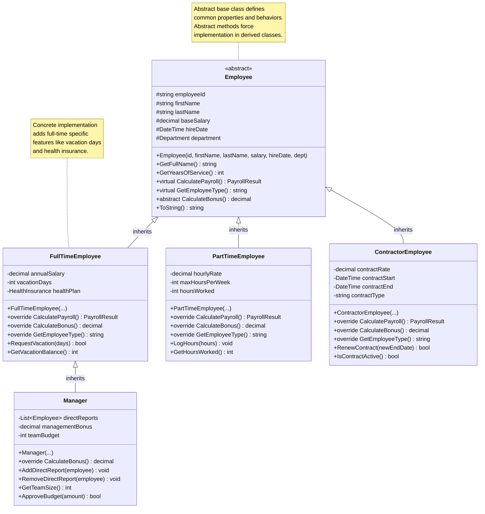

# Inheritance

> **"Inheritance is a mechanism that allows a class to inherit properties and methods from another class, establishing an 'is-a' relationship between the child and parent classes."**

## 🎯 Definition

Inheritance is the OOP principle that enables a class (child/derived class) to inherit characteristics (fields, properties, methods) from another class (parent/base class), promoting **code reuse** and establishing **hierarchical relationships** between classes.

## 🏠 Real-World Analogy

Think of **biological inheritance** in families:

- ✅ **Base characteristics** - Children inherit traits from parents (eye color, height, etc.)
- ✅ **Specialized features** - Each child can have unique characteristics too
- ✅ **Shared behaviors** - Common family behaviors (walking, talking, eating)
- ✅ **Extended capabilities** - Children can learn new skills parents don't have
- ✅ **Hierarchical structure** - Grandparents → Parents → Children → Grandchildren

## 📊 UML Diagram



## 🚫 Violation Example (Code Duplication Without Inheritance)

```csharp
// ❌ BAD: Duplicated code without inheritance

public class FullTimeEmployee
{
    // Duplicated fields in every employee type
    public string EmployeeId { get; set; }
    public string FirstName { get; set; }
    public string LastName { get; set; }
    public DateTime HireDate { get; set; }
    public string Department { get; set; }
    public bool IsActive { get; set; }
    
    // Full-time specific
    public decimal AnnualSalary { get; set; }
    public int VacationDays { get; set; }
    public string HealthPlan { get; set; }

    // Duplicated methods
    public string GetFullName()
    {
        return $"{FirstName} {LastName}";
    }

    public int GetYearsOfService()
    {
        return (DateTime.Now - HireDate).Days / 365;
    }

    // Full-time specific payroll calculation
    public PayrollResult CalculatePayroll(DateTime payPeriodStart, DateTime payPeriodEnd)
    {
        var daysInPeriod = (payPeriodEnd - payPeriodStart).Days + 1;
        var dailySalary = AnnualSalary / 365;
        var basePay = dailySalary * daysInPeriod;
        
        // Full-time bonus calculation
        var bonus = basePay * 0.1m; // 10% bonus
        
        return new PayrollResult
        {
            EmployeeId = EmployeeId,
            BasePay = basePay,
            Bonus = bonus,
            TotalPay = basePay + bonus,
            PayPeriodStart = payPeriodStart,
            PayPeriodEnd = payPeriodEnd
        };
    }

    public void RequestVacation(int days)
    {
        if (days > VacationDays)
            throw new InvalidOperationException("Not enough vacation days");
        
        VacationDays -= days;
    }
}

public class PartTimeEmployee
{
    // Same duplicated fields!
    public string EmployeeId { get; set; }
    public string FirstName { get; set; }
    public string LastName { get; set; }
    public DateTime HireDate { get; set; }
    public string Department { get; set; }
    public bool IsActive { get; set; }
    
    // Part-time specific
    public decimal HourlyRate { get; set; }
    public int HoursWorked { get; set; }
    public int MaxHoursPerWeek { get; set; }

    // Duplicated methods!
    public string GetFullName()
    {
        return $"{FirstName} {LastName}";
    }

    public int GetYearsOfService()
    {
        return (DateTime.Now - HireDate).Days / 365;
    }

    // Part-time specific payroll calculation
    public PayrollResult CalculatePayroll(DateTime payPeriodStart, DateTime payPeriodEnd)
    {
        var basePay = HourlyRate * HoursWorked;
        
        // Part-time bonus calculation - different from full-time!
        var bonus = HoursWorked > 80 ? basePay * 0.05m : 0; // 5% bonus if over 80 hours
        
        return new PayrollResult
        {
            EmployeeId = EmployeeId,
            BasePay = basePay,
            Bonus = bonus,
            TotalPay = basePay + bonus,
            PayPeriodStart = payPeriodStart,
            PayPeriodEnd = payPeriodEnd
        };
    }

    public void LogHours(int hours)
    {
        if (HoursWorked + hours > MaxHoursPerWeek)
            throw new InvalidOperationException("Exceeds maximum hours per week");
        
        HoursWorked += hours;
    }
}

public class ContractorEmployee
{
    // Same duplicated fields again!
    public string EmployeeId { get; set; }
    public string FirstName { get; set; }
    public string LastName { get; set; }
    public DateTime HireDate { get; set; }
    public string Department { get; set; }
    public bool IsActive { get; set; }
    
    // Contractor specific
    public decimal ContractRate { get; set; }
    public DateTime ContractStart { get; set; }
    public DateTime ContractEnd { get; set; }
    public string ContractType { get; set; }

    // Same duplicated methods!
    public string GetFullName()
    {
        return $"{FirstName} {LastName}";
    }

    public int GetYearsOfService()
    {
        return (DateTime.Now - HireDate).Days / 365;
    }

    // Contractor specific payroll calculation
    public PayrollResult CalculatePayroll(DateTime payPeriodStart, DateTime payPeriodEnd)
    {
        var daysInPeriod = (payPeriodEnd - payPeriodStart).Days + 1;
        var basePay = ContractRate * daysInPeriod;
        
        // Contractors don't get bonuses in this system
        var bonus = 0m;
        
        return new PayrollResult
        {
            EmployeeId = EmployeeId,
            BasePay = basePay,
            Bonus = bonus,
            TotalPay = basePay + bonus,
            PayPeriodStart = payPeriodStart,
            PayPeriodEnd = payPeriodEnd
        };
    }

    public bool IsContractActive()
    {
        var now = DateTime.Now;
        return now >= ContractStart && now <= ContractEnd;
    }
}

// Using these classes requires knowing all the different types
public class PayrollService
{
    public List<PayrollResult> ProcessPayroll(List<object> employees, DateTime payPeriodStart, DateTime payPeriodEnd)
    {
        var results = new List<PayrollResult>();
        
        foreach (var employee in employees)
        {
            // Must check type and cast - error-prone!
            if (employee is FullTimeEmployee fullTime)
            {
                results.Add(fullTime.CalculatePayroll(payPeriodStart, payPeriodEnd));
            }
            else if (employee is PartTimeEmployee partTime)
            {
                results.Add(partTime.CalculatePayroll(payPeriodStart, payPeriodEnd));
            }
            else if (employee is ContractorEmployee contractor)
            {
                results.Add(contractor.CalculatePayroll(payPeriodStart, payPeriodEnd));
            }
            // Must remember to add new employee types here!
        }
        
        return results;
    }
}
```

### Problems with this approach

1. **Code duplication** - Common fields and methods repeated in every class
2. **Maintenance nightmare** - Changes to common functionality require updating multiple classes
3. **Type checking everywhere** - Client code must know about all specific types
4. **Hard to extend** - Adding new employee types requires changes in multiple places
5. **No polymorphism** - Cannot treat different employee types uniformly
6. **Violates DRY principle** - Don't Repeat Yourself

## ✅ Correct Implementation (Proper Inheritance)

```csharp
// ✅ GOOD: Proper inheritance hierarchy with code reuse and polymorphism

// Abstract base class - defines common structure and behavior
public abstract class Employee
{
    // Protected fields - accessible to derived classes but not external code
    protected string _employeeId;
    protected string _firstName;
    protected string _lastName;
    protected DateTime _hireDate;
    protected string _department;
    protected bool _isActive;

    // Constructor - ensures all employees have required basic information
    protected Employee(string employeeId, string firstName, string lastName, 
        DateTime hireDate, string department)
    {
        _employeeId = employeeId ?? throw new ArgumentNullException(nameof(employeeId));
        _firstName = firstName ?? throw new ArgumentNullException(nameof(firstName));
        _lastName = lastName ?? throw new ArgumentNullException(nameof(lastName));
        _hireDate = hireDate;
        _department = department ?? throw new ArgumentNullException(nameof(department));
        _isActive = true;
    }

    // Public properties - common to all employees
    public string EmployeeId => _employeeId;
    public string FirstName => _firstName;
    public string LastName => _lastName;
    public DateTime HireDate => _hireDate;
    public string Department => _department;
    public bool IsActive => _isActive;

    // Concrete methods - shared behavior
    public string GetFullName()
    {
        return $"{_firstName} {_lastName}";
    }

    public int GetYearsOfService()
    {
        return (DateTime.Now - _hireDate).Days / 365;
    }

    public void Deactivate(string reason)
    {
        _isActive = false;
        OnEmployeeDeactivated(reason);
    }

    public void Reactivate(string reason)
    {
        _isActive = true;
        OnEmployeeReactivated(reason);
    }

    // Virtual methods - can be overridden by derived classes
    public virtual PayrollResult CalculatePayroll(DateTime payPeriodStart, DateTime payPeriodEnd)
    {
        // Base implementation - derived classes can override
        ValidatePayPeriod(payPeriodStart, payPeriodEnd);
        
        var basePay = GetBasePay(payPeriodStart, payPeriodEnd);
        var bonus = CalculateBonus(payPeriodStart, payPeriodEnd);
        
        return new PayrollResult
        {
            EmployeeId = _employeeId,
            EmployeeName = GetFullName(),
            EmployeeType = GetEmployeeType(),
            PayPeriodStart = payPeriodStart,
            PayPeriodEnd = payPeriodEnd,
            BasePay = basePay,
            Bonus = bonus,
            TotalPay = basePay + bonus,
            CalculatedAt = DateTime.UtcNow
        };
    }

    public virtual string GetEmployeeType()
    {
        return this.GetType().Name.Replace("Employee", "");
    }

    // Abstract methods - must be implemented by derived classes
    public abstract decimal GetBasePay(DateTime payPeriodStart, DateTime payPeriodEnd);
    public abstract decimal CalculateBonus(DateTime payPeriodStart, DateTime payPeriodEnd);
    public abstract EmployeeClassification GetClassification();

    // Protected virtual methods - template method pattern
    protected virtual void ValidatePayPeriod(DateTime start, DateTime end)
    {
        if (end < start)
            throw new ArgumentException("Pay period end cannot be before start");
        
        if (start < _hireDate)
            throw new ArgumentException("Pay period cannot start before hire date");
        
        if (!_isActive)
            throw new InvalidOperationException("Cannot calculate payroll for inactive employee");
    }

    protected virtual void OnEmployeeDeactivated(string reason)
    {
        // Base implementation - derived classes can override for specific behavior
        Console.WriteLine($"Employee {GetFullName()} deactivated: {reason}");
    }

    protected virtual void OnEmployeeReactivated(string reason)
    {
        Console.WriteLine($"Employee {GetFullName()} reactivated: {reason}");
    }

    // Override ToString for better debugging
    public override string ToString()
    {
        return $"{GetEmployeeType()}: {GetFullName()} ({_employeeId}) - {_department}";
    }

    public override bool Equals(object obj)
    {
        if (obj is Employee other)
            return _employeeId == other._employeeId;
        return false;
    }

    public override int GetHashCode()
    {
        return _employeeId.GetHashCode();
    }
}

// Concrete derived class - Full-time employees
public class FullTimeEmployee : Employee
{
    protected decimal _annualSalary;
    protected int _vacationDays;
    protected string _healthPlan;
    protected List<VacationRequest> _vacationHistory;

    public FullTimeEmployee(string employeeId, string firstName, string lastName,
        DateTime hireDate, string department, decimal annualSalary, string healthPlan)
        : base(employeeId, firstName, lastName, hireDate, department)
    {
        _annualSalary = annualSalary;
        _healthPlan = healthPlan ?? throw new ArgumentNullException(nameof(healthPlan));
        _vacationDays = 20; // Standard vacation days
        _vacationHistory = new List<VacationRequest>();
    }

    // Properties specific to full-time employees
    public decimal AnnualSalary => _annualSalary;
    public int VacationDays => _vacationDays;
    public string HealthPlan => _healthPlan;
    public IReadOnlyList<VacationRequest> VacationHistory => _vacationHistory.AsReadOnly();

    // Implement abstract methods
    public override decimal GetBasePay(DateTime payPeriodStart, DateTime payPeriodEnd)
    {
        var daysInPeriod = (payPeriodEnd - payPeriodStart).Days + 1;
        var dailySalary = _annualSalary / 365;
        return dailySalary * daysInPeriod;
    }

    public override decimal CalculateBonus(DateTime payPeriodStart, DateTime payPeriodEnd)
    {
        var basePay = GetBasePay(payPeriodStart, payPeriodEnd);
        var yearsOfService = GetYearsOfService();
        
        // Bonus increases with years of service
        var bonusRate = Math.Min(0.15m, 0.05m + (yearsOfService * 0.01m)); // Max 15%
        return basePay * bonusRate;
    }

    public override EmployeeClassification GetClassification()
    {
        return EmployeeClassification.FullTime;
    }

    // Full-time specific methods
    public bool RequestVacation(DateTime startDate, DateTime endDate, string reason)
    {
        var daysRequested = (endDate - startDate).Days + 1;
        
        if (daysRequested > _vacationDays)
            return false;

        if (startDate < DateTime.Now.Date)
            return false;

        var vacationRequest = new VacationRequest
        {
            StartDate = startDate,
            EndDate = endDate,
            DaysRequested = daysRequested,
            Reason = reason,
            RequestedAt = DateTime.UtcNow,
            Status = VacationStatus.Approved
        };

        _vacationHistory.Add(vacationRequest);
        _vacationDays -= daysRequested;
        
        return true;
    }

    public void AddVacationDays(int days, string reason)
    {
        if (days <= 0)
            throw new ArgumentException("Days must be positive");

        _vacationDays += days;
        Console.WriteLine($"Added {days} vacation days to {GetFullName()}: {reason}");
    }

    public void UpdateHealthPlan(string newHealthPlan)
    {
        if (string.IsNullOrWhiteSpace(newHealthPlan))
            throw new ArgumentException("Health plan cannot be empty");

        var oldPlan = _healthPlan;
        _healthPlan = newHealthPlan;
        Console.WriteLine($"{GetFullName()} health plan changed from {oldPlan} to {newHealthPlan}");
    }

    // Override virtual method for specific behavior
    protected override void OnEmployeeDeactivated(string reason)
    {
        base.OnEmployeeDeactivated(reason);
        
        // Full-time specific deactivation logic
        if (_vacationDays > 0)
        {
            Console.WriteLine($"Processing vacation payout: {_vacationDays} days");
        }
        
        Console.WriteLine($"Terminating health plan: {_healthPlan}");
    }
}

// Another concrete derived class - Part-time employees
public class PartTimeEmployee : Employee
{
    protected decimal _hourlyRate;
    protected int _hoursWorked;
    protected int _maxHoursPerWeek;
    protected List<TimeEntry> _timeEntries;

    public PartTimeEmployee(string employeeId, string firstName, string lastName,
        DateTime hireDate, string department, decimal hourlyRate, int maxHoursPerWeek)
        : base(employeeId, firstName, lastName, hireDate, department)
    {
        _hourlyRate = hourlyRate;
        _maxHoursPerWeek = maxHoursPerWeek;
        _hoursWorked = 0;
        _timeEntries = new List<TimeEntry>();
    }

    public decimal HourlyRate => _hourlyRate;
    public int HoursWorked => _hoursWorked;
    public int MaxHoursPerWeek => _maxHoursPerWeek;
    public IReadOnlyList<TimeEntry> TimeEntries => _timeEntries.AsReadOnly();

    public override decimal GetBasePay(DateTime payPeriodStart, DateTime payPeriodEnd)
    {
        var hoursInPeriod = _timeEntries
            .Where(te => te.Date >= payPeriodStart && te.Date <= payPeriodEnd)
            .Sum(te => te.Hours);
        
        return _hourlyRate * hoursInPeriod;
    }

    public override decimal CalculateBonus(DateTime payPeriodStart, DateTime payPeriodEnd)
    {
        var hoursInPeriod = _timeEntries
            .Where(te => te.Date >= payPeriodStart && te.Date <= payPeriodEnd)
            .Sum(te => te.Hours);
        
        // Bonus for part-time employees who work over 80 hours in pay period
        return hoursInPeriod > 80 ? GetBasePay(payPeriodStart, payPeriodEnd) * 0.05m : 0;
    }

    public override EmployeeClassification GetClassification()
    {
        return EmployeeClassification.PartTime;
    }

    public bool LogHours(DateTime date, decimal hours, string description)
    {
        if (hours <= 0)
            return false;

        // Check weekly hour limits
        var weekStart = date.StartOfWeek();
        var weekEnd = weekStart.AddDays(6);
        
        var weeklyHours = _timeEntries
            .Where(te => te.Date >= weekStart && te.Date <= weekEnd)
            .Sum(te => te.Hours);

        if (weeklyHours + hours > _maxHoursPerWeek)
            return false;

        var timeEntry = new TimeEntry
        {
            Date = date,
            Hours = hours,
            Description = description,
            LoggedAt = DateTime.UtcNow
        };

        _timeEntries.Add(timeEntry);
        _hoursWorked += (int)hours;
        
        return true;
    }

    public void UpdateHourlyRate(decimal newRate, string reason)
    {
        if (newRate <= 0)
            throw new ArgumentException("Hourly rate must be positive");

        var oldRate = _hourlyRate;
        _hourlyRate = newRate;
        Console.WriteLine($"{GetFullName()} hourly rate changed from ${oldRate:F2} to ${newRate:F2}: {reason}");
    }
}

// Third concrete derived class - Contractors
public class ContractorEmployee : Employee
{
    protected decimal _contractRate;
    protected DateTime _contractStart;
    protected DateTime _contractEnd;
    protected string _contractType;
    protected List<ContractExtension> _contractHistory;

    public ContractorEmployee(string employeeId, string firstName, string lastName,
        DateTime hireDate, string department, decimal contractRate,
        DateTime contractStart, DateTime contractEnd, string contractType)
        : base(employeeId, firstName, lastName, hireDate, department)
    {
        _contractRate = contractRate;
        _contractStart = contractStart;
        _contractEnd = contractEnd;
        _contractType = contractType ?? throw new ArgumentNullException(nameof(contractType));
        _contractHistory = new List<ContractExtension>();
    }

    public decimal ContractRate => _contractRate;
    public DateTime ContractStart => _contractStart;
    public DateTime ContractEnd => _contractEnd;
    public string ContractType => _contractType;
    public IReadOnlyList<ContractExtension> ContractHistory => _contractHistory.AsReadOnly();

    public override decimal GetBasePay(DateTime payPeriodStart, DateTime payPeriodEnd)
    {
        // Only pay for days within contract period
        var effectiveStart = payPeriodStart < _contractStart ? _contractStart : payPeriodStart;
        var effectiveEnd = payPeriodEnd > _contractEnd ? _contractEnd : payPeriodEnd;
        
        if (effectiveStart > effectiveEnd)
            return 0; // No overlap with contract period

        var daysInPeriod = (effectiveEnd - effectiveStart).Days + 1;
        return _contractRate * daysInPeriod;
    }

    public override decimal CalculateBonus(DateTime payPeriodStart, DateTime payPeriodEnd)
    {
        // Contractors typically don't receive bonuses in base contract
        return 0;
    }

    public override EmployeeClassification GetClassification()
    {
        return EmployeeClassification.Contractor;
    }

    public bool IsContractActive()
    {
        var now = DateTime.Now;
        return now >= _contractStart && now <= _contractEnd && _isActive;
    }

    public bool RenewContract(DateTime newEndDate, decimal newRate, string reason)
    {
        if (newEndDate <= _contractEnd)
            return false;

        if (newRate <= 0)
            return false;

        var extension = new ContractExtension
        {
            OldEndDate = _contractEnd,
            NewEndDate = newEndDate,
            OldRate = _contractRate,
            NewRate = newRate,
            Reason = reason,
            ExtendedAt = DateTime.UtcNow
        };

        _contractHistory.Add(extension);
        _contractEnd = newEndDate;
        _contractRate = newRate;

        Console.WriteLine($"Contract renewed for {GetFullName()} until {newEndDate:yyyy-MM-dd} at ${newRate:F2}/day");
        return true;
    }

    // Override validation to include contract period checks
    protected override void ValidatePayPeriod(DateTime start, DateTime end)
    {
        base.ValidatePayPeriod(start, end);
        
        if (!IsContractActive())
            throw new InvalidOperationException("Cannot calculate payroll for inactive contract");
    }
}

// Multi-level inheritance - Manager inherits from FullTimeEmployee
public class Manager : FullTimeEmployee
{
    protected List<Employee> _directReports;
    protected decimal _managementBonus;
    protected int _teamBudget;

    public Manager(string employeeId, string firstName, string lastName,
        DateTime hireDate, string department, decimal annualSalary, string healthPlan,
        decimal managementBonus, int teamBudget)
        : base(employeeId, firstName, lastName, hireDate, department, annualSalary, healthPlan)
    {
        _directReports = new List<Employee>();
        _managementBonus = managementBonus;
        _teamBudget = teamBudget;
    }

    public IReadOnlyList<Employee> DirectReports => _directReports.AsReadOnly();
    public decimal ManagementBonus => _managementBonus;
    public int TeamBudget => _teamBudget;
    public int TeamSize => _directReports.Count;

    // Override bonus calculation to include management bonus
    public override decimal CalculateBonus(DateTime payPeriodStart, DateTime payPeriodEnd)
    {
        // Get base full-time employee bonus
        var baseBonus = base.CalculateBonus(payPeriodStart, payPeriodEnd);
        
        // Add management bonus based on team performance
        var teamPerformanceBonus = CalculateTeamPerformanceBonus();
        
        return baseBonus + _managementBonus + teamPerformanceBonus;
    }

    public override EmployeeClassification GetClassification()
    {
        return EmployeeClassification.Management;
    }

    public bool AddDirectReport(Employee employee)
    {
        if (employee == null)
            return false;

        if (_directReports.Contains(employee))
            return false;

        if (employee == this) // Prevent self-reporting
            return false;

        _directReports.Add(employee);
        Console.WriteLine($"{employee.GetFullName()} now reports to {GetFullName()}");
        return true;
    }

    public bool RemoveDirectReport(Employee employee)
    {
        if (employee == null)
            return false;

        var removed = _directReports.Remove(employee);
        if (removed)
        {
            Console.WriteLine($"{employee.GetFullName()} no longer reports to {GetFullName()}");
        }
        return removed;
    }

    public bool ApproveBudget(decimal amount, string purpose)
    {
        if (amount > _teamBudget)
            return false;

        _teamBudget -= (int)amount;
        Console.WriteLine($"Manager {GetFullName()} approved ${amount:F2} for: {purpose}");
        return true;
    }

    private decimal CalculateTeamPerformanceBonus()
    {
        // Simple team performance bonus based on team size
        return _directReports.Count * 100m; // $100 per direct report
    }

    // Override deactivation to handle team reassignment
    protected override void OnEmployeeDeactivated(string reason)
    {
        base.OnEmployeeDeactivated(reason);
        
        if (_directReports.Count > 0)
        {
            Console.WriteLine($"Manager {GetFullName()} has {_directReports.Count} direct reports that need reassignment");
            // In real system, would trigger reassignment process
        }
    }
}

// Polymorphic usage - works with any Employee type
public class PayrollService
{
    private readonly List<Employee> _employees;
    private readonly ILogger<PayrollService> _logger;

    public PayrollService(ILogger<PayrollService> logger)
    {
        _employees = new List<Employee>();
        _logger = logger ?? throw new ArgumentNullException(nameof(logger));
    }

    // Polymorphic method - works with any Employee subclass
    public List<PayrollResult> ProcessPayroll(DateTime payPeriodStart, DateTime payPeriodEnd)
    {
        var results = new List<PayrollResult>();
        
        foreach (var employee in _employees.Where(e => e.IsActive))
        {
            try
            {
                // Polymorphism in action - calls the correct implementation
                var payrollResult = employee.CalculatePayroll(payPeriodStart, payPeriodEnd);
                results.Add(payrollResult);
                
                _logger.LogInformation("Processed payroll for {EmployeeName} ({EmployeeType}): ${TotalPay:F2}",
                    employee.GetFullName(), employee.GetEmployeeType(), payrollResult.TotalPay);
            }
            catch (Exception ex)
            {
                _logger.LogError(ex, "Error processing payroll for employee {EmployeeId}", employee.EmployeeId);
            }
        }
        
        return results;
    }

    public void AddEmployee(Employee employee)
    {
        if (employee != null && !_employees.Contains(employee))
        {
            _employees.Add(employee);
            _logger.LogInformation("Added {EmployeeType} employee: {EmployeeName}",
                employee.GetEmployeeType(), employee.GetFullName());
        }
    }

    public void RemoveEmployee(string employeeId)
    {
        var employee = _employees.FirstOrDefault(e => e.EmployeeId == employeeId);
        if (employee != null)
        {
            employee.Deactivate("Removed from payroll system");
            _logger.LogInformation("Deactivated employee: {EmployeeName}", employee.GetFullName());
        }
    }

    // Method that works with any Employee type through polymorphism
    public void GenerateEmployeeReport()
    {
        foreach (var employee in _employees)
        {
            Console.WriteLine($"Employee Report:");
            Console.WriteLine($"  Name: {employee.GetFullName()}");
            Console.WriteLine($"  Type: {employee.GetEmployeeType()}");
            Console.WriteLine($"  Classification: {employee.GetClassification()}");
            Console.WriteLine($"  Years of Service: {employee.GetYearsOfService()}");
            Console.WriteLine($"  Status: {(employee.IsActive ? "Active" : "Inactive")}");
            
            // Polymorphic method calls
            var samplePayroll = employee.CalculatePayroll(DateTime.Now.AddDays(-30), DateTime.Now);
            Console.WriteLine($"  Monthly Pay: ${samplePayroll.TotalPay:F2}");
            Console.WriteLine();
        }
    }
}

// Supporting classes and enums
public class PayrollResult
{
    public string EmployeeId { get; set; }
    public string EmployeeName { get; set; }
    public string EmployeeType { get; set; }
    public DateTime PayPeriodStart { get; set; }
    public DateTime PayPeriodEnd { get; set; }
    public decimal BasePay { get; set; }
    public decimal Bonus { get; set; }
    public decimal TotalPay { get; set; }
    public DateTime CalculatedAt { get; set; }
}

public class VacationRequest
{
    public DateTime StartDate { get; set; }
    public DateTime EndDate { get; set; }
    public int DaysRequested { get; set; }
    public string Reason { get; set; }
    public DateTime RequestedAt { get; set; }
    public VacationStatus Status { get; set; }
}

public class TimeEntry
{
    public DateTime Date { get; set; }
    public decimal Hours { get; set; }
    public string Description { get; set; }
    public DateTime LoggedAt { get; set; }
}

public class ContractExtension
{
    public DateTime OldEndDate { get; set; }
    public DateTime NewEndDate { get; set; }
    public decimal OldRate { get; set; }
    public decimal NewRate { get; set; }
    public string Reason { get; set; }
    public DateTime ExtendedAt { get; set; }
}

public enum EmployeeClassification
{
    FullTime,
    PartTime,
    Contractor,
    Management,
    Intern
}

public enum VacationStatus
{
    Pending,
    Approved,
    Denied,
    Taken,
    Cancelled
}

// Extension method for date calculations
public static class DateTimeExtensions
{
    public static DateTime StartOfWeek(this DateTime date)
    {
        var diff = (7 + (date.DayOfWeek - DayOfWeek.Monday)) % 7;
        return date.AddDays(-1 * diff).Date;
    }
}
```

## 🧪 Unit Testing Inheritance

```csharp
[TestFixture]
public class EmployeeInheritanceTests
{
    [Test]
    public void FullTimeEmployee_Should_Inherit_Common_Properties()
    {
        // Arrange & Act
        var employee = new FullTimeEmployee("EMP001", "John", "Doe", 
            DateTime.Now.AddYears(-2), "IT", 75000, "Premium Health");

        // Assert - Common properties from base class
        Assert.AreEqual("EMP001", employee.EmployeeId);
        Assert.AreEqual("John Doe", employee.GetFullName());
        Assert.AreEqual(2, employee.GetYearsOfService());
        Assert.IsTrue(employee.IsActive);
        Assert.AreEqual(EmployeeClassification.FullTime, employee.GetClassification());
    }

    [Test]
    public void PartTimeEmployee_Should_Calculate_Pay_Differently()
    {
        // Arrange
        var employee = new PartTimeEmployee("EMP002", "Jane", "Smith",
            DateTime.Now.AddYears(-1), "Marketing", 25.00m, 40);
        
        employee.LogHours(DateTime.Now.AddDays(-20), 8, "Regular work");
        employee.LogHours(DateTime.Now.AddDays(-19), 8, "Regular work");

        // Act
        var payroll = employee.CalculatePayroll(DateTime.Now.AddDays(-30), DateTime.Now);

        // Assert
        Assert.AreEqual(400m, payroll.BasePay); // 16 hours * $25
        Assert.AreEqual(0m, payroll.Bonus); // No bonus for < 80 hours
        Assert.AreEqual(400m, payroll.TotalPay);
    }

    [Test]
    public void Manager_Should_Override_Bonus_Calculation()
    {
        // Arrange
        var manager = new Manager("MGR001", "Bob", "Johnson",
            DateTime.Now.AddYears(-5), "Engineering", 120000, "Executive Health",
            5000, 50000);

        var employee1 = new FullTimeEmployee("EMP003", "Alice", "Brown",
            DateTime.Now.AddYears(-1), "Engineering", 80000, "Standard Health");
        
        manager.AddDirectReport(employee1);

        // Act
        var payroll = manager.CalculatePayroll(DateTime.Now.AddDays(-30), DateTime.Now);

        // Assert
        Assert.Greater(payroll.Bonus, 5000); // Should include management bonus + team performance
        Assert.AreEqual("Manager", manager.GetEmployeeType());
        Assert.AreEqual(EmployeeClassification.Management, manager.GetClassification());
    }

    [Test]
    public void Polymorphism_Should_Work_With_Different_Employee_Types()
    {
        // Arrange
        var employees = new List<Employee>
        {
            new FullTimeEmployee("EMP001", "John", "Doe", DateTime.Now.AddYears(-2), "IT", 75000, "Premium"),
            new PartTimeEmployee("EMP002", "Jane", "Smith", DateTime.Now.AddYears(-1), "Marketing", 25.00m, 40),
            new ContractorEmployee("CON001", "Mike", "Wilson", DateTime.Now.AddYears(-1), "Consulting", 
                500m, DateTime.Now.AddMonths(-6), DateTime.Now.AddMonths(6), "Project Based")
        };

        // Act & Assert - Polymorphic behavior
        foreach (var employee in employees)
        {
            var payroll = employee.CalculatePayroll(DateTime.Now.AddDays(-30), DateTime.Now);
            
            Assert.IsNotNull(payroll);
            Assert.AreEqual(employee.EmployeeId, payroll.EmployeeId);
            Assert.IsTrue(payroll.BasePay >= 0);
            Assert.IsTrue(payroll.TotalPay >= payroll.BasePay);
        }
    }

    [Test]
    public void Abstract_Methods_Must_Be_Implemented()
    {
        // Arrange
        var employee = new FullTimeEmployee("EMP001", "Test", "User",
            DateTime.Now.AddYears(-1), "Test", 50000, "Basic");

        // Act & Assert - Abstract methods work polymorphically
        Assert.DoesNotThrow(() => employee.GetBasePay(DateTime.Now.AddDays(-30), DateTime.Now));
        Assert.DoesNotThrow(() => employee.CalculateBonus(DateTime.Now.AddDays(-30), DateTime.Now));
        Assert.DoesNotThrow(() => employee.GetClassification());
    }

    [Test]
    public void Virtual_Methods_Can_Be_Overridden()
    {
        // Arrange
        var manager = new Manager("MGR001", "Boss", "Leader",
            DateTime.Now.AddYears(-3), "Management", 100000, "Executive",
            3000, 25000);

        // Act
        var bonusAsManager = manager.CalculateBonus(DateTime.Now.AddDays(-30), DateTime.Now);
        
        // Create equivalent full-time employee for comparison
        var fullTime = new FullTimeEmployee("EMP001", "Boss", "Leader",
            DateTime.Now.AddYears(-3), "Management", 100000, "Executive");
        
        var bonusAsFullTime = fullTime.CalculateBonus(DateTime.Now.AddDays(-30), DateTime.Now);

        // Assert - Manager should have higher bonus due to override
        Assert.Greater(bonusAsManager, bonusAsFullTime);
    }
}

[TestFixture]
public class InheritancePolymorphismTests
{
    private PayrollService _payrollService;

    [SetUp]
    public void Setup()
    {
        var mockLogger = new Mock<ILogger<PayrollService>>();
        _payrollService = new PayrollService(mockLogger.Object);
    }

    [Test]
    public void PayrollService_Should_Handle_Mixed_Employee_Types()
    {
        // Arrange
        _payrollService.AddEmployee(new FullTimeEmployee("FT001", "John", "Doe", 
            DateTime.Now.AddYears(-2), "IT", 75000, "Premium"));
        
        var partTime = new PartTimeEmployee("PT001", "Jane", "Smith",
            DateTime.Now.AddYears(-1), "Marketing", 25.00m, 40);
        partTime.LogHours(DateTime.Now.AddDays(-20), 8, "Work");
        _payrollService.AddEmployee(partTime);

        _payrollService.AddEmployee(new ContractorEmployee("CT001", "Mike", "Wilson",
            DateTime.Now.AddYears(-1), "Consulting", 500m, 
            DateTime.Now.AddMonths(-3), DateTime.Now.AddMonths(3), "Fixed"));

        // Act
        var payrollResults = _payrollService.ProcessPayroll(DateTime.Now.AddDays(-30), DateTime.Now);

        // Assert
        Assert.AreEqual(3, payrollResults.Count);
        
        // Verify each type calculated correctly
        var fullTimeResult = payrollResults.First(r => r.EmployeeId == "FT001");
        var partTimeResult = payrollResults.First(r => r.EmployeeId == "PT001");
        var contractorResult = payrollResults.First(r => r.EmployeeId == "CT001");

        Assert.Greater(fullTimeResult.TotalPay, 0);
        Assert.Greater(partTimeResult.TotalPay, 0);
        Assert.Greater(contractorResult.TotalPay, 0);
        
        // Full-time should have bonus, part-time might not, contractor typically doesn't
        Assert.Greater(fullTimeResult.Bonus, 0);
        Assert.AreEqual(0, contractorResult.Bonus);
    }
}
```

## ✅ Benefits of Proper Inheritance

1. **Code reuse** - Common functionality written once in base class
2. **Polymorphism** - Treat different types uniformly through base class interface
3. **Maintainability** - Changes to common functionality made in one place
4. **Extensibility** - Easy to add new employee types without changing existing code
5. **Hierarchical organization** - Natural modeling of "is-a" relationships
6. **Template method pattern** - Base class defines algorithm, subclasses provide specifics

## 🎯 When to Use Inheritance

- **"Is-a" relationships** - When derived class is truly a specialized version of base class
- **Code reuse** - When multiple classes share common functionality
- **Polymorphism needed** - When you want to treat related objects uniformly
- **Template methods** - When you have a common algorithm with variable steps
- **Hierarchical modeling** - When domain naturally has hierarchical relationships

## 🚨 Common Mistakes

1. **Inappropriate inheritance** - Using inheritance for "has-a" relationships (use composition instead)
2. **Deep hierarchies** - Creating too many levels of inheritance
3. **Fragile base class** - Making changes to base class that break derived classes
4. **Violating Liskov Substitution** - Derived classes that can't properly substitute for base class
5. **Multiple inheritance issues** - In languages that support it, diamond problem and complexity

## 🎯 Interview Questions

**Q: What's the difference between inheritance and composition?**
**A:** Inheritance establishes "is-a" relationships where a derived class inherits properties and methods from a base class. Composition establishes "has-a" relationships where a class contains instances of other classes. Inheritance promotes code reuse through class hierarchies, while composition promotes flexibility through object collaboration.

**Q: When would you choose composition over inheritance?**
**A:** Choose composition when you have "has-a" relationships, need to avoid deep inheritance hierarchies, want more flexibility to change relationships at runtime, or when inheritance would violate the Liskov Substitution Principle.

**Q: How does the Liskov Substitution Principle apply to inheritance?**
**A:** LSP states that objects of a derived class should be substitutable for objects of the base class without breaking the application. This means derived classes should strengthen, not weaken, the contracts established by the base class.

**Q: Give an ERP example where inheritance provides significant value.**
**A:** In an ERP system, you might have different document types (Invoice, PurchaseOrder, Receipt) that all inherit from a base Document class. This allows the document management system to handle all document types uniformly while each type implements its specific validation, calculation, and workflow rules.

## 📝 Checklist

- [ ] Base class defines common properties and behavior
- [ ] Abstract methods force implementation in derived classes
- [ ] Virtual methods allow optional overriding in derived classes
- [ ] "Is-a" relationships are properly modeled
- [ ] Polymorphism works correctly with base class references
- [ ] Liskov Substitution Principle is not violated
- [ ] Inheritance depth is reasonable (prefer composition for deep hierarchies)

---

**Previous**: [← Abstraction](./02-abstraction.md) | **Next**: [Polymorphism →](./04-polymorphism.md)