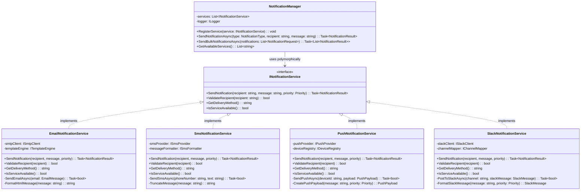

# Polymorphism

> **"Polymorphism allows objects of different types to be treated as instances of the same type through a common interface, enabling a single interface to represent different underlying forms."**

## 🎯 Definition

Polymorphism is the OOP principle that enables **one interface to represent different underlying forms**. It allows a single method call to behave differently depending on the actual type of the object, providing **flexibility** and **extensibility** while maintaining **uniform interfaces**.

## 🏠 Real-World Analogy

Think of a **universal remote control**:

- ✅ **Same buttons** - Power, volume, channel controls work the same way
- ✅ **Different devices** - TV, DVD player, sound system, cable box
- ✅ **Device-specific behavior** - "Power" button does different things for each device
- ✅ **Uniform interface** - You use the same remote regardless of device
- ✅ **Runtime determination** - Remote figures out which device to control based on current selection

## 📊 UML Diagram



```text
    note for INotificationService : "Common interface enables\npolymorphic behavior.\nSame method signature\nworks with all implementations."
    
    note for NotificationManager : "Uses polymorphism to work\nwith any notification service\nwithout knowing specific\nimplementation details."
```

## 🚫 Violation Example (No Polymorphism)

```csharp
// ❌ BAD: No polymorphism - must know specific types and handle each differently

public class NotificationManager
{
    private readonly EmailService _emailService;
    private readonly SmsService _smsService;
    private readonly PushNotificationService _pushService;
    private readonly SlackService _slackService;

    public NotificationManager(EmailService emailService, SmsService smsService, 
        PushNotificationService pushService, SlackService slackService)
    {
        _emailService = emailService;
        _smsService = smsService;
        _pushService = pushService;
        _slackService = slackService;
    }

    // Must handle each notification type separately - no polymorphism!
    public async Task<bool> SendNotificationAsync(string notificationType, string recipient, string message, string priority)
    {
        try
        {
            if (notificationType == "email")
            {
                // Email-specific logic
                if (!IsValidEmail(recipient))
                    return false;

                var emailMessage = new EmailMessage
                {
                    To = recipient,
                    Subject = GetEmailSubject(priority),
                    Body = FormatEmailBody(message),
                    IsHtml = true,
                    Priority = MapPriorityToEmailPriority(priority)
                };

                var result = await _emailService.SendEmailAsync(emailMessage);
                return result.IsSuccessful;
            }
            else if (notificationType == "sms")
            {
                // SMS-specific logic - completely different!
                if (!IsValidPhoneNumber(recipient))
                    return false;

                // SMS has character limits
                var truncatedMessage = TruncateSmsMessage(message);
                var smsMessage = new SmsMessage
                {
                    PhoneNumber = recipient,
                    Text = truncatedMessage,
                    Priority = priority == "high" ? SmsPriority.High : SmsPriority.Normal
                };

                var result = await _smsService.SendSmsAsync(smsMessage);
                return result.MessageId != null;
            }
            else if (notificationType == "push")
            {
                // Push notification logic - different again!
                if (!IsValidDeviceId(recipient))
                    return false;

                var pushPayload = new PushPayload
                {
                    DeviceId = recipient,
                    Title = GetPushTitle(priority),
                    Body = message,
                    Badge = priority == "high" ? 1 : 0,
                    Sound = priority == "high" ? "alert.wav" : "default.wav",
                    CustomData = new Dictionary<string, object> { { "priority", priority } }
                };

                var result = await _pushService.SendPushNotificationAsync(pushPayload);
                return result.IsDelivered;
            }
            else if (notificationType == "slack")
            {
                // Slack-specific logic - yet another different approach!
                if (!IsValidSlackChannel(recipient))
                    return false;

                var slackMessage = new SlackMessage
                {
                    Channel = recipient,
                    Text = message,
                    Username = "System Notification",
                    IconEmoji = priority == "high" ? ":warning:" : ":information_source:",
                    Attachments = priority == "high" ? CreateHighPriorityAttachment(message) : null
                };

                var result = await _slackService.PostMessageAsync(slackMessage);
                return result.Ok;
            }
            else
            {
                throw new NotSupportedException($"Notification type '{notificationType}' is not supported");
            }
        }
        catch (Exception ex)
        {
            // Generic error handling - can't handle type-specific errors well
            Console.WriteLine($"Error sending {notificationType} notification: {ex.Message}");
            return false;
        }
    }

    // Must implement bulk sending for each type separately
    public async Task<List<bool>> SendBulkNotificationsAsync(List<NotificationRequest> requests)
    {
        var results = new List<bool>();

        foreach (var request in requests)
        {
            // Must group by type and handle each group differently
            if (request.Type == "email")
            {
                // Email bulk sending logic
                var emailRequests = requests.Where(r => r.Type == "email").ToList();
                foreach (var emailRequest in emailRequests)
                {
                    var result = await SendNotificationAsync("email", emailRequest.Recipient, 
                        emailRequest.Message, emailRequest.Priority);
                    results.Add(result);
                }
            }
            else if (request.Type == "sms")
            {
                // SMS bulk sending logic - different API!
                var smsRequests = requests.Where(r => r.Type == "sms").ToList();
                var smsMessages = smsRequests.Select(r => new SmsMessage
                {
                    PhoneNumber = r.Recipient,
                    Text = TruncateSmsMessage(r.Message)
                }).ToList();

                var bulkResult = await _smsService.SendBulkSmsAsync(smsMessages);
                results.AddRange(bulkResult.Select(r => r.IsSuccessful));
            }
            // ... more type-specific bulk logic
        }

        return results;
    }

    // Separate validation methods for each type
    private bool IsValidEmail(string email)
    {
        return email.Contains("@") && email.Contains(".");
    }

    private bool IsValidPhoneNumber(string phone)
    {
        return phone.Length >= 10 && phone.All(c => char.IsDigit(c) || c == '+' || c == '-');
    }

    private bool IsValidDeviceId(string deviceId)
    {
        return !string.IsNullOrWhiteSpace(deviceId) && deviceId.Length > 10;
    }

    private bool IsValidSlackChannel(string channel)
    {
        return channel.StartsWith("#") || channel.StartsWith("@");
    }

    // Type-specific formatting methods
    private string GetEmailSubject(string priority)
    {
        return priority == "high" ? "URGENT: System Notification" : "System Notification";
    }

    private string FormatEmailBody(string message)
    {
        return $"<html><body><p>{message}</p></body></html>";
    }

    private string TruncateSmsMessage(string message)
    {
        return message.Length > 160 ? message.Substring(0, 157) + "..." : message;
    }

    private string GetPushTitle(string priority)
    {
        return priority == "high" ? "URGENT" : "Notification";
    }
}

// Adding a new notification type requires modifying the NotificationManager!
public class TeamsNotificationService
{
    // New service but can't be used polymorphically
    public async Task<TeamsResult> SendTeamsMessageAsync(TeamsMessage message)
    {
        // Teams-specific implementation
        return new TeamsResult();
    }
}
```

### Problems with this approach

1. **Tight coupling** - NotificationManager knows about all specific notification types
2. **No extensibility** - Adding new notification types requires modifying existing code
3. **Code duplication** - Similar logic repeated for each notification type
4. **Complex conditional logic** - Long if-else chains to determine behavior
5. **Difficult testing** - Must mock all specific services
6. **Violates Open/Closed Principle** - Must modify existing code to add new types

## ✅ Correct Implementation (Proper Polymorphism)

```csharp
// ✅ GOOD: Polymorphic design with uniform interface

// Common interface - enables polymorphism
public interface INotificationService
{
    Task<NotificationResult> SendNotificationAsync(string recipient, string message, NotificationPriority priority);
    bool ValidateRecipient(string recipient);
    string GetDeliveryMethod();
    bool IsServiceAvailable();
    NotificationServiceInfo GetServiceInfo();
}

// Common data structures
public class NotificationResult
{
    public bool IsSuccessful { get; set; }
    public string MessageId { get; set; }
    public string ErrorMessage { get; set; }
    public DateTime SentAt { get; set; }
    public NotificationStatus Status { get; set; }
    public Dictionary<string, object> AdditionalInfo { get; set; } = new();
}

public class NotificationServiceInfo
{
    public string ServiceName { get; set; }
    public string DisplayName { get; set; }
    public List<string> SupportedRecipientFormats { get; set; }
    public int MaxMessageLength { get; set; }
    public bool SupportsHtml { get; set; }
    public bool SupportsBulk { get; set; }
    public TimeSpan TypicalDeliveryTime { get; set; }
}

public enum NotificationPriority
{
    Low,
    Normal,
    High,
    Critical
}

public enum NotificationStatus
{
    Queued,
    Sent,
    Delivered,
    Failed,
    Rejected
}

// Concrete implementation 1 - Email
public class EmailNotificationService : INotificationService
{
    private readonly ISmtpClient _smtpClient;
    private readonly ITemplateEngine _templateEngine;
    private readonly ILogger<EmailNotificationService> _logger;

    public EmailNotificationService(ISmtpClient smtpClient, ITemplateEngine templateEngine, 
        ILogger<EmailNotificationService> logger)
    {
        _smtpClient = smtpClient ?? throw new ArgumentNullException(nameof(smtpClient));
        _templateEngine = templateEngine ?? throw new ArgumentNullException(nameof(templateEngine));
        _logger = logger ?? throw new ArgumentNullException(nameof(logger));
    }

    public async Task<NotificationResult> SendNotificationAsync(string recipient, string message, NotificationPriority priority)
    {
        try
        {
            _logger.LogInformation("Sending email notification to {Recipient} with priority {Priority}", 
                recipient, priority);

            if (!ValidateRecipient(recipient))
            {
                return new NotificationResult
                {
                    IsSuccessful = false,
                    ErrorMessage = "Invalid email address format",
                    Status = NotificationStatus.Rejected
                };
            }

            var emailMessage = await BuildEmailMessageAsync(recipient, message, priority);
            var result = await _smtpClient.SendAsync(emailMessage);

            return new NotificationResult
            {
                IsSuccessful = result.IsSuccessful,
                MessageId = result.MessageId,
                ErrorMessage = result.ErrorMessage,
                SentAt = DateTime.UtcNow,
                Status = result.IsSuccessful ? NotificationStatus.Sent : NotificationStatus.Failed,
                AdditionalInfo = new Dictionary<string, object>
                {
                    { "EmailSubject", emailMessage.Subject },
                    { "SmtpServer", _smtpClient.ServerName }
                }
            };
        }
        catch (Exception ex)
        {
            _logger.LogError(ex, "Error sending email notification to {Recipient}", recipient);
            return new NotificationResult
            {
                IsSuccessful = false,
                ErrorMessage = ex.Message,
                Status = NotificationStatus.Failed
            };
        }
    }

    public bool ValidateRecipient(string recipient)
    {
        if (string.IsNullOrWhiteSpace(recipient))
            return false;

        try
        {
            var addr = new System.Net.Mail.MailAddress(recipient);
            return addr.Address == recipient;
        }
        catch
        {
            return false;
        }
    }

    public string GetDeliveryMethod() => "Email";

    public bool IsServiceAvailable()
    {
        return _smtpClient.IsConnected;
    }

    public NotificationServiceInfo GetServiceInfo()
    {
        return new NotificationServiceInfo
        {
            ServiceName = "Email",
            DisplayName = "Email Notification",
            SupportedRecipientFormats = new List<string> { "email@domain.com" },
            MaxMessageLength = 100000, // Large limit for email
            SupportsHtml = true,
            SupportsBulk = true,
            TypicalDeliveryTime = TimeSpan.FromMinutes(1)
        };
    }

    private async Task<EmailMessage> BuildEmailMessageAsync(string recipient, string message, NotificationPriority priority)
    {
        var subject = GetSubjectByPriority(priority);
        var htmlBody = await _templateEngine.RenderAsync("notification", new { Message = message, Priority = priority });

        return new EmailMessage
        {
            To = recipient,
            Subject = subject,
            Body = htmlBody,
            IsHtml = true,
            Priority = MapToEmailPriority(priority)
        };
    }

    private string GetSubjectByPriority(NotificationPriority priority)
    {
        return priority switch
        {
            NotificationPriority.Critical => "CRITICAL: System Alert",
            NotificationPriority.High => "URGENT: System Notification",
            NotificationPriority.Normal => "System Notification",
            NotificationPriority.Low => "Info: System Update",
            _ => "System Notification"
        };
    }

    private System.Net.Mail.MailPriority MapToEmailPriority(NotificationPriority priority)
    {
        return priority switch
        {
            NotificationPriority.Critical => System.Net.Mail.MailPriority.High,
            NotificationPriority.High => System.Net.Mail.MailPriority.High,
            NotificationPriority.Normal => System.Net.Mail.MailPriority.Normal,
            NotificationPriority.Low => System.Net.Mail.MailPriority.Low,
            _ => System.Net.Mail.MailPriority.Normal
        };
    }
}

// Concrete implementation 2 - SMS
public class SmsNotificationService : INotificationService
{
    private readonly ISmsProvider _smsProvider;
    private readonly ISmsFormatter _messageFormatter;
    private readonly ILogger<SmsNotificationService> _logger;

    public SmsNotificationService(ISmsProvider smsProvider, ISmsFormatter messageFormatter, 
        ILogger<SmsNotificationService> logger)
    {
        _smsProvider = smsProvider ?? throw new ArgumentNullException(nameof(smsProvider));
        _messageFormatter = messageFormatter ?? throw new ArgumentNullException(nameof(messageFormatter));
        _logger = logger ?? throw new ArgumentNullException(nameof(logger));
    }

    public async Task<NotificationResult> SendNotificationAsync(string recipient, string message, NotificationPriority priority)
    {
        try
        {
            _logger.LogInformation("Sending SMS notification to {Recipient} with priority {Priority}", 
                recipient, priority);

            if (!ValidateRecipient(recipient))
            {
                return new NotificationResult
                {
                    IsSuccessful = false,
                    ErrorMessage = "Invalid phone number format",
                    Status = NotificationStatus.Rejected
                };
            }

            var formattedMessage = _messageFormatter.FormatMessage(message, priority);
            var result = await _smsProvider.SendSmsAsync(recipient, formattedMessage);

            return new NotificationResult
            {
                IsSuccessful = result.IsSuccessful,
                MessageId = result.MessageId,
                ErrorMessage = result.ErrorMessage,
                SentAt = DateTime.UtcNow,
                Status = result.IsSuccessful ? NotificationStatus.Sent : NotificationStatus.Failed,
                AdditionalInfo = new Dictionary<string, object>
                {
                    { "CharacterCount", formattedMessage.Length },
                    { "SmsProvider", _smsProvider.ProviderName }
                }
            };
        }
        catch (Exception ex)
        {
            _logger.LogError(ex, "Error sending SMS notification to {Recipient}", recipient);
            return new NotificationResult
            {
                IsSuccessful = false,
                ErrorMessage = ex.Message,
                Status = NotificationStatus.Failed
            };
        }
    }

    public bool ValidateRecipient(string recipient)
    {
        if (string.IsNullOrWhiteSpace(recipient))
            return false;

        // Remove common formatting characters
        var cleanNumber = recipient.Replace("+", "").Replace("-", "").Replace(" ", "").Replace("(", "").Replace(")", "");
        
        return cleanNumber.Length >= 10 && cleanNumber.All(char.IsDigit);
    }

    public string GetDeliveryMethod() => "SMS";

    public bool IsServiceAvailable()
    {
        return _smsProvider.IsServiceOnline();
    }

    public NotificationServiceInfo GetServiceInfo()
    {
        return new NotificationServiceInfo
        {
            ServiceName = "SMS",
            DisplayName = "Text Message",
            SupportedRecipientFormats = new List<string> { "+1234567890", "1234567890" },
            MaxMessageLength = 160,
            SupportsHtml = false,
            SupportsBulk = true,
            TypicalDeliveryTime = TimeSpan.FromSeconds(30)
        };
    }
}

// Concrete implementation 3 - Push Notifications
public class PushNotificationService : INotificationService
{
    private readonly IPushProvider _pushProvider;
    private readonly IDeviceRegistry _deviceRegistry;
    private readonly ILogger<PushNotificationService> _logger;

    public PushNotificationService(IPushProvider pushProvider, IDeviceRegistry deviceRegistry, 
        ILogger<PushNotificationService> logger)
    {
        _pushProvider = pushProvider ?? throw new ArgumentNullException(nameof(pushProvider));
        _deviceRegistry = deviceRegistry ?? throw new ArgumentNullException(nameof(deviceRegistry));
        _logger = logger ?? throw new ArgumentNullException(nameof(logger));
    }

    public async Task<NotificationResult> SendNotificationAsync(string recipient, string message, NotificationPriority priority)
    {
        try
        {
            _logger.LogInformation("Sending push notification to device {DeviceId} with priority {Priority}", 
                recipient, priority);

            if (!ValidateRecipient(recipient))
            {
                return new NotificationResult
                {
                    IsSuccessful = false,
                    ErrorMessage = "Invalid device ID format",
                    Status = NotificationStatus.Rejected
                };
            }

            var pushPayload = CreatePushPayload(message, priority);
            var result = await _pushProvider.SendPushAsync(recipient, pushPayload);

            return new NotificationResult
            {
                IsSuccessful = result.IsSuccessful,
                MessageId = result.NotificationId,
                ErrorMessage = result.ErrorMessage,
                SentAt = DateTime.UtcNow,
                Status = result.IsSuccessful ? NotificationStatus.Delivered : NotificationStatus.Failed,
                AdditionalInfo = new Dictionary<string, object>
                {
                    { "DeviceType", result.DeviceType },
                    { "PushProvider", _pushProvider.ProviderName }
                }
            };
        }
        catch (Exception ex)
        {
            _logger.LogError(ex, "Error sending push notification to device {DeviceId}", recipient);
            return new NotificationResult
            {
                IsSuccessful = false,
                ErrorMessage = ex.Message,
                Status = NotificationStatus.Failed
            };
        }
    }

    public bool ValidateRecipient(string recipient)
    {
        return !string.IsNullOrWhiteSpace(recipient) && 
               recipient.Length > 10 && 
               _deviceRegistry.IsValidDeviceId(recipient);
    }

    public string GetDeliveryMethod() => "Push";

    public bool IsServiceAvailable()
    {
        return _pushProvider.IsConnected();
    }

    public NotificationServiceInfo GetServiceInfo()
    {
        return new NotificationServiceInfo
        {
            ServiceName = "Push",
            DisplayName = "Push Notification",
            SupportedRecipientFormats = new List<string> { "device-id-format" },
            MaxMessageLength = 2048,
            SupportsHtml = false,
            SupportsBulk = true,
            TypicalDeliveryTime = TimeSpan.FromSeconds(5)
        };
    }

    private PushPayload CreatePushPayload(string message, NotificationPriority priority)
    {
        return new PushPayload
        {
            Title = GetTitleByPriority(priority),
            Body = message,
            Badge = priority >= NotificationPriority.High ? 1 : 0,
            Sound = GetSoundByPriority(priority),
            CustomData = new Dictionary<string, object>
            {
                { "priority", priority.ToString() },
                { "timestamp", DateTimeOffset.UtcNow.ToUnixTimeSeconds() }
            }
        };
    }

    private string GetTitleByPriority(NotificationPriority priority)
    {
        return priority switch
        {
            NotificationPriority.Critical => "CRITICAL ALERT",
            NotificationPriority.High => "URGENT",
            NotificationPriority.Normal => "Notification",
            NotificationPriority.Low => "Info",
            _ => "Notification"
        };
    }

    private string GetSoundByPriority(NotificationPriority priority)
    {
        return priority switch
        {
            NotificationPriority.Critical => "critical_alert.wav",
            NotificationPriority.High => "urgent_alert.wav",
            NotificationPriority.Normal => "default.wav",
            NotificationPriority.Low => "soft_chime.wav",
            _ => "default.wav"
        };
    }
}

// Concrete implementation 4 - Slack
public class SlackNotificationService : INotificationService
{
    private readonly ISlackClient _slackClient;
    private readonly IChannelMapper _channelMapper;
    private readonly ILogger<SlackNotificationService> _logger;

    public SlackNotificationService(ISlackClient slackClient, IChannelMapper channelMapper, 
        ILogger<SlackNotificationService> logger)
    {
        _slackClient = slackClient ?? throw new ArgumentNullException(nameof(slackClient));
        _channelMapper = channelMapper ?? throw new ArgumentNullException(nameof(channelMapper));
        _logger = logger ?? throw new ArgumentNullException(nameof(logger));
    }

    public async Task<NotificationResult> SendNotificationAsync(string recipient, string message, NotificationPriority priority)
    {
        try
        {
            _logger.LogInformation("Sending Slack notification to {Channel} with priority {Priority}", 
                recipient, priority);

            if (!ValidateRecipient(recipient))
            {
                return new NotificationResult
                {
                    IsSuccessful = false,
                    ErrorMessage = "Invalid Slack channel or user format",
                    Status = NotificationStatus.Rejected
                };
            }

            var slackMessage = CreateSlackMessage(recipient, message, priority);
            var result = await _slackClient.PostMessageAsync(slackMessage);

            return new NotificationResult
            {
                IsSuccessful = result.Ok,
                MessageId = result.Timestamp,
                ErrorMessage = result.Error,
                SentAt = DateTime.UtcNow,
                Status = result.Ok ? NotificationStatus.Delivered : NotificationStatus.Failed,
                AdditionalInfo = new Dictionary<string, object>
                {
                    { "Channel", recipient },
                    { "SlackTeam", _slackClient.TeamName }
                }
            };
        }
        catch (Exception ex)
        {
            _logger.LogError(ex, "Error sending Slack notification to {Channel}", recipient);
            return new NotificationResult
            {
                IsSuccessful = false,
                ErrorMessage = ex.Message,
                Status = NotificationStatus.Failed
            };
        }
    }

    public bool ValidateRecipient(string recipient)
    {
        return !string.IsNullOrWhiteSpace(recipient) && 
               (recipient.StartsWith("#") || recipient.StartsWith("@") || _channelMapper.IsValidChannel(recipient));
    }

    public string GetDeliveryMethod() => "Slack";

    public bool IsServiceAvailable()
    {
        return _slackClient.IsConnected;
    }

    public NotificationServiceInfo GetServiceInfo()
    {
        return new NotificationServiceInfo
        {
            ServiceName = "Slack",
            DisplayName = "Slack Message",
            SupportedRecipientFormats = new List<string> { "#channel", "@username", "channel-id" },
            MaxMessageLength = 4000,
            SupportsHtml = false,
            SupportsBulk = false,
            TypicalDeliveryTime = TimeSpan.FromSeconds(2)
        };
    }

    private SlackMessage CreateSlackMessage(string recipient, string message, NotificationPriority priority)
    {
        return new SlackMessage
        {
            Channel = recipient,
            Text = message,
            Username = "System Notifications",
            IconEmoji = GetEmojiByPriority(priority),
            Attachments = priority >= NotificationPriority.High ? CreateHighPriorityAttachment(message, priority) : null
        };
    }

    private string GetEmojiByPriority(NotificationPriority priority)
    {
        return priority switch
        {
            NotificationPriority.Critical => ":rotating_light:",
            NotificationPriority.High => ":warning:",
            NotificationPriority.Normal => ":information_source:",
            NotificationPriority.Low => ":memo:",
            _ => ":information_source:"
        };
    }

    private List<SlackAttachment> CreateHighPriorityAttachment(string message, NotificationPriority priority)
    {
        var color = priority == NotificationPriority.Critical ? "danger" : "warning";
        
        return new List<SlackAttachment>
        {
            new SlackAttachment
            {
                Color = color,
                Fields = new List<SlackField>
                {
                    new SlackField
                    {
                        Title = "Priority",
                        Value = priority.ToString().ToUpper(),
                        Short = true
                    },
                    new SlackField
                    {
                        Title = "Timestamp",
                        Value = DateTime.UtcNow.ToString("yyyy-MM-dd HH:mm:ss UTC"),
                        Short = true
                    }
                }
            }
        };
    }
}

// Polymorphic notification manager - works with any INotificationService
public class NotificationManager
{
    private readonly Dictionary<string, INotificationService> _services;
    private readonly ILogger<NotificationManager> _logger;

    public NotificationManager(ILogger<NotificationManager> logger)
    {
        _services = new Dictionary<string, INotificationService>(StringComparer.OrdinalIgnoreCase);
        _logger = logger ?? throw new ArgumentNullException(nameof(logger));
    }

    // Register services polymorphically
    public void RegisterService(string serviceType, INotificationService service)
    {
        if (service == null) throw new ArgumentNullException(nameof(service));
        
        _services[serviceType] = service;
        _logger.LogInformation("Registered {ServiceType} notification service: {ServiceName}", 
            serviceType, service.GetDeliveryMethod());
    }

    // Polymorphic method - works with any registered service
    public async Task<NotificationResult> SendNotificationAsync(string serviceType, string recipient, 
        string message, NotificationPriority priority = NotificationPriority.Normal)
    {
        if (!_services.TryGetValue(serviceType, out var service))
        {
            return new NotificationResult
            {
                IsSuccessful = false,
                ErrorMessage = $"Notification service '{serviceType}' is not registered",
                Status = NotificationStatus.Rejected
            };
        }

        if (!service.IsServiceAvailable())
        {
            return new NotificationResult
            {
                IsSuccessful = false,
                ErrorMessage = $"{service.GetDeliveryMethod()} service is currently unavailable",
                Status = NotificationStatus.Failed
            };
        }

        // Polymorphism in action - same method call works for all service types
        return await service.SendNotificationAsync(recipient, message, priority);
    }

    // Send to multiple services polymorphically
    public async Task<List<NotificationResult>> SendMultiChannelNotificationAsync(
        List<string> serviceTypes, string recipient, string message, NotificationPriority priority = NotificationPriority.Normal)
    {
        var tasks = serviceTypes
            .Where(serviceType => _services.ContainsKey(serviceType))
            .Select(serviceType => SendNotificationAsync(serviceType, recipient, message, priority));

        var results = await Task.WhenAll(tasks);
        return results.ToList();
    }

    // Bulk notifications using polymorphism
    public async Task<List<NotificationResult>> SendBulkNotificationsAsync(List<NotificationRequest> requests)
    {
        var tasks = requests.Select(async request =>
        {
            if (_services.TryGetValue(request.ServiceType, out var service))
            {
                return await service.SendNotificationAsync(request.Recipient, request.Message, request.Priority);
            }
            
            return new NotificationResult
            {
                IsSuccessful = false,
                ErrorMessage = $"Service type '{request.ServiceType}' not found",
                Status = NotificationStatus.Rejected
            };
        });

        var results = await Task.WhenAll(tasks);
        return results.ToList();
    }

    // Get service information polymorphically
    public List<NotificationServiceInfo> GetAvailableServices()
    {
        return _services.Values
            .Select(service => service.GetServiceInfo())
            .ToList();
    }

    // Validate recipients polymorphically
    public Dictionary<string, bool> ValidateRecipients(string serviceType, List<string> recipients)
    {
        if (!_services.TryGetValue(serviceType, out var service))
        {
            return recipients.ToDictionary(r => r, r => false);
        }

        return recipients.ToDictionary(recipient => recipient, recipient => service.ValidateRecipient(recipient));
    }

    // Check service availability polymorphically
    public Dictionary<string, bool> CheckServicesAvailability()
    {
        return _services.ToDictionary(
            kvp => kvp.Key, 
            kvp => kvp.Value.IsServiceAvailable()
        );
    }
}

// Usage with dependency injection
public class NotificationServiceSetup
{
    public static void ConfigureServices(IServiceCollection services)
    {
        // Register all notification services
        services.AddScoped<INotificationService, EmailNotificationService>();
        services.AddScoped<INotificationService, SmsNotificationService>();
        services.AddScoped<INotificationService, PushNotificationService>();
        services.AddScoped<INotificationService, SlackNotificationService>();
        
        // Register notification manager
        services.AddScoped<NotificationManager>();
        
        // Register setup service to configure manager
        services.AddScoped<INotificationSetupService, NotificationSetupService>();
    }
}

public interface INotificationSetupService
{
    void SetupNotificationServices(NotificationManager manager, IServiceProvider serviceProvider);
}

public class NotificationSetupService : INotificationSetupService
{
    public void SetupNotificationServices(NotificationManager manager, IServiceProvider serviceProvider)
    {
        // Get all registered notification services and register them polymorphically
        var services = serviceProvider.GetServices<INotificationService>();
        
        foreach (var service in services)
        {
            var serviceType = service.GetDeliveryMethod().ToLower();
            manager.RegisterService(serviceType, service);
        }
    }
}

// Supporting classes
public class NotificationRequest
{
    public string ServiceType { get; set; }
    public string Recipient { get; set; }
    public string Message { get; set; }
    public NotificationPriority Priority { get; set; } = NotificationPriority.Normal;
}

// Example usage showing polymorphism in action
public class OrderProcessingService
{
    private readonly NotificationManager _notificationManager;
    private readonly ILogger<OrderProcessingService> _logger;

    public OrderProcessingService(NotificationManager notificationManager, ILogger<OrderProcessingService> logger)
    {
        _notificationManager = notificationManager;
        _logger = logger;
    }

    public async Task ProcessOrderAsync(Order order)
    {
        try
        {
            // Process the order...
            
            // Send notifications polymorphically - same code works for all notification types
            var notifications = new List<NotificationRequest>
            {
                new NotificationRequest
                {
                    ServiceType = "email",
                    Recipient = order.CustomerEmail,
                    Message = $"Your order #{order.Id} has been confirmed.",
                    Priority = NotificationPriority.Normal
                },
                new NotificationRequest
                {
                    ServiceType = "sms",
                    Recipient = order.CustomerPhone,
                    Message = $"Order #{order.Id} confirmed. Tracking: {order.TrackingNumber}",
                    Priority = NotificationPriority.Normal
                }
            };

            // If high-value order, also notify via Slack
            if (order.Total > 10000)
            {
                notifications.Add(new NotificationRequest
                {
                    ServiceType = "slack",
                    Recipient = "#sales-alerts",
                    Message = $"High-value order received: #{order.Id} - ${order.Total:F2}",
                    Priority = NotificationPriority.High
                });
            }

            // Send all notifications - polymorphism handles the different implementations
            var results = await _notificationManager.SendBulkNotificationsAsync(notifications);
            
            foreach (var result in results)
            {
                if (result.IsSuccessful)
                {
                    _logger.LogInformation("Notification sent successfully: {MessageId}", result.MessageId);
                }
                else
                {
                    _logger.LogWarning("Notification failed: {Error}", result.ErrorMessage);
                }
            }
        }
        catch (Exception ex)
        {
            _logger.LogError(ex, "Error processing order {OrderId}", order.Id);
            throw;
        }
    }
}
```

## 🧪 Unit Testing Polymorphism

```csharp
[TestFixture]
public class NotificationPolymorphismTests
{
    private NotificationManager _notificationManager;
    private Mock<INotificationService> _mockEmailService;
    private Mock<INotificationService> _mockSmsService;
    private Mock<ILogger<NotificationManager>> _mockLogger;

    [SetUp]
    public void Setup()
    {
        _mockLogger = new Mock<ILogger<NotificationManager>>();
        _notificationManager = new NotificationManager(_mockLogger.Object);
        
        _mockEmailService = new Mock<INotificationService>();
        _mockSmsService = new Mock<INotificationService>();
        
        // Setup mock behaviors
        _mockEmailService.Setup(s => s.GetDeliveryMethod()).Returns("Email");
        _mockEmailService.Setup(s => s.IsServiceAvailable()).Returns(true);
        
        _mockSmsService.Setup(s => s.GetDeliveryMethod()).Returns("SMS");
        _mockSmsService.Setup(s => s.IsServiceAvailable()).Returns(true);
    }

    [Test]
    public async Task SendNotificationAsync_Should_Work_Polymorphically_With_Different_Services()
    {
        // Arrange
        _notificationManager.RegisterService("email", _mockEmailService.Object);
        _notificationManager.RegisterService("sms", _mockSmsService.Object);

        var expectedEmailResult = new NotificationResult { IsSuccessful = true, MessageId = "EMAIL123" };
        var expectedSmsResult = new NotificationResult { IsSuccessful = true, MessageId = "SMS456" };

        _mockEmailService.Setup(s => s.SendNotificationAsync("test@example.com", "Test message", NotificationPriority.Normal))
            .ReturnsAsync(expectedEmailResult);

        _mockSmsService.Setup(s => s.SendNotificationAsync("+1234567890", "Test message", NotificationPriority.Normal))
            .ReturnsAsync(expectedSmsResult);

        // Act - Same method call works for different service types (polymorphism)
        var emailResult = await _notificationManager.SendNotificationAsync("email", "test@example.com", "Test message");
        var smsResult = await _notificationManager.SendNotificationAsync("sms", "+1234567890", "Test message");

        // Assert
        Assert.IsTrue(emailResult.IsSuccessful);
        Assert.AreEqual("EMAIL123", emailResult.MessageId);
        
        Assert.IsTrue(smsResult.IsSuccessful);
        Assert.AreEqual("SMS456", smsResult.MessageId);

        // Verify polymorphic calls were made to the correct services
        _mockEmailService.Verify(s => s.SendNotificationAsync("test@example.com", "Test message", NotificationPriority.Normal), Times.Once);
        _mockSmsService.Verify(s => s.SendNotificationAsync("+1234567890", "Test message", NotificationPriority.Normal), Times.Once);
    }

    [Test]
    public async Task SendBulkNotificationsAsync_Should_Handle_Mixed_Service_Types_Polymorphically()
    {
        // Arrange
        _notificationManager.RegisterService("email", _mockEmailService.Object);
        _notificationManager.RegisterService("sms", _mockSmsService.Object);

        _mockEmailService.Setup(s => s.SendNotificationAsync(It.IsAny<string>(), It.IsAny<string>(), It.IsAny<NotificationPriority>()))
            .ReturnsAsync(new NotificationResult { IsSuccessful = true, MessageId = "EMAIL_BULK" });

        _mockSmsService.Setup(s => s.SendNotificationAsync(It.IsAny<string>(), It.IsAny<string>(), It.IsAny<NotificationPriority>()))
            .ReturnsAsync(new NotificationResult { IsSuccessful = true, MessageId = "SMS_BULK" });

        var requests = new List<NotificationRequest>
        {
            new NotificationRequest { ServiceType = "email", Recipient = "user1@example.com", Message = "Message 1" },
            new NotificationRequest { ServiceType = "sms", Recipient = "+1111111111", Message = "Message 2" },
            new NotificationRequest { ServiceType = "email", Recipient = "user2@example.com", Message = "Message 3" }
        };

        // Act - Polymorphism handles different service types in the same collection
        var results = await _notificationManager.SendBulkNotificationsAsync(requests);

        // Assert
        Assert.AreEqual(3, results.Count);
        Assert.IsTrue(results.All(r => r.IsSuccessful));

        // Verify polymorphic calls were made correctly
        _mockEmailService.Verify(s => s.SendNotificationAsync(It.IsAny<string>(), It.IsAny<string>(), It.IsAny<NotificationPriority>()), Times.Exactly(2));
        _mockSmsService.Verify(s => s.SendNotificationAsync(It.IsAny<string>(), It.IsAny<string>(), It.IsAny<NotificationPriority>()), Times.Once);
    }

    [Test]
    public void GetAvailableServices_Should_Work_Polymorphically()
    {
        // Arrange
        var emailServiceInfo = new NotificationServiceInfo { ServiceName = "Email", DisplayName = "Email Service" };
        var smsServiceInfo = new NotificationServiceInfo { ServiceName = "SMS", DisplayName = "SMS Service" };

        _mockEmailService.Setup(s => s.GetServiceInfo()).Returns(emailServiceInfo);
        _mockSmsService.Setup(s => s.GetServiceInfo()).Returns(smsServiceInfo);

        _notificationManager.RegisterService("email", _mockEmailService.Object);
        _notificationManager.RegisterService("sms", _mockSmsService.Object);

        // Act - Polymorphic call to GetServiceInfo
        var serviceInfos = _notificationManager.GetAvailableServices();

        // Assert
        Assert.AreEqual(2, serviceInfos.Count);
        Assert.Contains(emailServiceInfo, serviceInfos);
        Assert.Contains(smsServiceInfo, serviceInfos);

        // Verify polymorphic method calls
        _mockEmailService.Verify(s => s.GetServiceInfo(), Times.Once);
        _mockSmsService.Verify(s => s.GetServiceInfo(), Times.Once);
    }

    [Test]
    public void ValidateRecipients_Should_Use_Service_Specific_Validation_Polymorphically()
    {
        // Arrange
        _mockEmailService.Setup(s => s.ValidateRecipient("valid@example.com")).Returns(true);
        _mockEmailService.Setup(s => s.ValidateRecipient("invalid-email")).Returns(false);

        _notificationManager.RegisterService("email", _mockEmailService.Object);

        var recipients = new List<string> { "valid@example.com", "invalid-email" };

        // Act - Polymorphic validation
        var validationResults = _notificationManager.ValidateRecipients("email", recipients);

        // Assert
        Assert.AreEqual(2, validationResults.Count);
        Assert.IsTrue(validationResults["valid@example.com"]);
        Assert.IsFalse(validationResults["invalid-email"]);

        // Verify polymorphic validation calls
        _mockEmailService.Verify(s => s.ValidateRecipient("valid@example.com"), Times.Once);
        _mockEmailService.Verify(s => s.ValidateRecipient("invalid-email"), Times.Once);
    }
}

[TestFixture]
public class ConcreteServicePolymorphismTests
{
    [Test]
    public void All_Notification_Services_Should_Implement_Same_Interface()
    {
        // Arrange & Act - Create instances of all concrete services
        var services = new List<INotificationService>
        {
            CreateEmailService(),
            CreateSmsService(),
            CreatePushService(),
            CreateSlackService()
        };

        // Assert - All services implement the same interface polymorphically
        foreach (var service in services)
        {
            Assert.IsNotNull(service.GetDeliveryMethod());
            Assert.IsNotNull(service.GetServiceInfo());
            Assert.DoesNotThrow(() => service.ValidateRecipient("test-recipient"));
            Assert.DoesNotThrow(() => service.IsServiceAvailable());
        }
    }

    [Test]
    public async Task All_Services_Should_Handle_SendNotificationAsync_Polymorphically()
    {
        // Arrange
        var services = new List<INotificationService>
        {
            CreateEmailService(),
            CreateSmsService(),
            CreatePushService(),
            CreateSlackService()
        };

        // Act & Assert - Polymorphic behavior
        foreach (var service in services)
        {
            var result = await service.SendNotificationAsync("test-recipient", "Test message", NotificationPriority.Normal);
            
            Assert.IsNotNull(result);
            Assert.IsNotNull(result.Status);
            // Each service may succeed or fail based on its validation, but all should return a result
        }
    }

    private INotificationService CreateEmailService()
    {
        var mockSmtp = new Mock<ISmtpClient>();
        var mockTemplate = new Mock<ITemplateEngine>();
        var mockLogger = new Mock<ILogger<EmailNotificationService>>();
        
        mockSmtp.Setup(s => s.IsConnected).Returns(true);
        mockTemplate.Setup(t => t.RenderAsync(It.IsAny<string>(), It.IsAny<object>()))
            .ReturnsAsync("<html><body>Test</body></html>");
        
        return new EmailNotificationService(mockSmtp.Object, mockTemplate.Object, mockLogger.Object);
    }

    private INotificationService CreateSmsService()
    {
        var mockProvider = new Mock<ISmsProvider>();
        var mockFormatter = new Mock<ISmsFormatter>();
        var mockLogger = new Mock<ILogger<SmsNotificationService>>();
        
        mockProvider.Setup(p => p.IsServiceOnline()).Returns(true);
        mockFormatter.Setup(f => f.FormatMessage(It.IsAny<string>(), It.IsAny<NotificationPriority>()))
            .Returns("Formatted message");
        
        return new SmsNotificationService(mockProvider.Object, mockFormatter.Object, mockLogger.Object);
    }

    private INotificationService CreatePushService()
    {
        var mockProvider = new Mock<IPushProvider>();
        var mockRegistry = new Mock<IDeviceRegistry>();
        var mockLogger = new Mock<ILogger<PushNotificationService>>();
        
        mockProvider.Setup(p => p.IsConnected()).Returns(true);
        mockRegistry.Setup(r => r.IsValidDeviceId(It.IsAny<string>())).Returns(false); // Will fail validation
        
        return new PushNotificationService(mockProvider.Object, mockRegistry.Object, mockLogger.Object);
    }

    private INotificationService CreateSlackService()
    {
        var mockClient = new Mock<ISlackClient>();
        var mockMapper = new Mock<IChannelMapper>();
        var mockLogger = new Mock<ILogger<SlackNotificationService>>();
        
        mockClient.Setup(c => c.IsConnected).Returns(true);
        mockMapper.Setup(m => m.IsValidChannel(It.IsAny<string>())).Returns(true);
        
        return new SlackNotificationService(mockClient.Object, mockMapper.Object, mockLogger.Object);
    }
}
```

## ✅ Benefits of Proper Polymorphism

1. **Uniform interfaces** - Same method calls work with different implementations
2. **Runtime flexibility** - Behavior determined at runtime based on actual object type
3. **Extensibility** - New implementations can be added without changing existing code
4. **Code reuse** - Same client code works with all implementations
5. **Testability** - Easy to substitute mock implementations for testing
6. **Maintainability** - Changes to implementations don't affect client code

## 🎯 When to Use Polymorphism

- **Multiple implementations** - When you have different ways to accomplish the same task
- **Plugin architectures** - When you want to support extensible functionality
- **Strategy patterns** - When behavior should be selected at runtime
- **Template methods** - When you have common algorithms with variable steps
- **Framework design** - When building reusable libraries or frameworks

## 🚨 Common Mistakes

1. **Inconsistent interfaces** - Different implementations having incompatible behavior
2. **Overuse of polymorphism** - Creating abstract interfaces for single implementations
3. **Violating Liskov Substitution** - Implementations that can't properly substitute for the interface
4. **Performance overhead** - Excessive virtual method calls in performance-critical code
5. **Complex inheritance hierarchies** - Deep polymorphic hierarchies that are hard to understand

## 🎯 Interview Questions

**Q: Explain the difference between compile-time and runtime polymorphism.**
**A:** Compile-time polymorphism (method overloading, operator overloading) is resolved during compilation. Runtime polymorphism (method overriding, interface implementations) is resolved during execution based on the actual object type. Runtime polymorphism enables true polymorphic behavior where the same interface can exhibit different behaviors.

**Q: How does polymorphism relate to the Open/Closed Principle?**
**A:** Polymorphism enables the Open/Closed Principle by allowing code to be open for extension (new implementations) but closed for modification (existing client code doesn't change). New polymorphic implementations can be added without modifying existing code that uses the interface.

**Q: What's the difference between inheritance-based and interface-based polymorphism?**
**A:** Inheritance-based polymorphism relies on class hierarchies where derived classes override base class methods. Interface-based polymorphism relies on implementing common interfaces. Interface-based is more flexible as it doesn't require inheritance relationships and supports multiple interface implementations.

**Q: Give an ERP example where polymorphism provides significant business value.**
**A:** In an ERP system, different tax calculation strategies (US tax, EU VAT, Canadian GST) can all implement the same ITaxCalculator interface. The order processing system can calculate taxes polymorphically without knowing the specific tax rules, allowing easy addition of new tax jurisdictions without modifying existing order processing code.

## 📝 Checklist

- [ ] Common interface defines consistent method signatures
- [ ] All implementations follow the same contract and behavior expectations
- [ ] Client code works with interfaces/base classes, not concrete types
- [ ] New implementations can be added without modifying existing code
- [ ] Polymorphic method calls work correctly at runtime
- [ ] Liskov Substitution Principle is maintained
- [ ] Performance impact of virtual calls is acceptable for the use case

---

**Previous**: [← Inheritance](./03-inheritance.md) | **Next**: [Coupling →](./05-coupling.md)