# Coupling

> **"Coupling measures how closely one class depends on another. Lower coupling means greater flexibility, maintainability, and testability."**

## 🎯 Definition

Coupling refers to the **degree of interdependence** between software modules, classes, or components. It measures how much one class **knows about** and **depends on** another class. Lower coupling leads to more **flexible**, **maintainable**, and **testable** code.

## 🏠 Real-World Analogy

Think of coupling like **appliance connections**:

- ✅ **Loose coupling** - Using standard electrical outlets (220V, USB-C, etc.)
  - Any compatible device can plug in
  - Easy to replace devices
  - Standardized interfaces
  
- ❌ **Tight coupling** - Hard-wired appliances
  - Specific device permanently connected
  - Difficult to replace or upgrade
  - Changes require rewiring

## 📊 UML Diagram - Coupling Types

```mermaid
classDiagram
    %% Tight Coupling Example
    class OrderProcessor_Tight {
        -logger: FileLogger
        -emailService: SmtpEmailService
        -database: SqlServerRepository
        
        +ProcessOrder(order: Order) : OrderResult
        +ValidateOrder(order: Order) : bool
        -LogError(message: string) : void
        -SendConfirmationEmail(email: string) : void
        -SaveOrder(order: Order) : void
    }
    
    class FileLogger {
        -logFilePath: string
        +LogInfo(message: string) : void
        +LogError(message: string) : void
        +LogWarning(message: string) : void
    }
    
    class SmtpEmailService {
        -smtpServer: string
        -port: int
        +SendEmail(to: string, subject: string, body: string) : bool
    }
    
    class SqlServerRepository {
        -connectionString: string
        +SaveOrder(order: Order) : void
        +GetOrder(id: int) : Order
    }
    
    %% Loose Coupling Example
    class OrderProcessor_Loose {
        -logger: ILogger
        -emailService: IEmailService
        -repository: IOrderRepository
        
        +ProcessOrder(order: Order) : OrderResult
        +ValidateOrder(order: Order) : bool
    }
    
    class ILogger {
        <<interface>>
        +LogInfo(message: string) : void
        +LogError(message: string) : void
        +LogWarning(message: string) : void
    }
    
    class IEmailService {
        <<interface>>
        +SendEmailAsync(to: string, subject: string, body: string) : Task~bool~
    }
    
    class IOrderRepository {
        <<interface>>
        +SaveOrderAsync(order: Order) : Task~void~
        +GetOrderAsync(id: int) : Task~Order~
    }
    
    %% Tight coupling relationships
    OrderProcessor_Tight --> FileLogger : directly depends on
    OrderProcessor_Tight --> SmtpEmailService : directly depends on
    OrderProcessor_Tight --> SqlServerRepository : directly depends on
    
    %% Loose coupling relationships
    OrderProcessor_Loose --> ILogger : depends on abstraction
    OrderProcessor_Loose --> IEmailService : depends on abstraction
    OrderProcessor_Loose --> IOrderRepository : depends on abstraction
```



```text
    note for OrderProcessor_Tight : "TIGHT COUPLING:\n- Hard to test\n- Hard to change\n- Rigid implementation\n- Multiple responsibilities"
    
    note for OrderProcessor_Loose : "LOOSE COUPLING:\n- Easy to test\n- Easy to change\n- Flexible implementation\n- Single responsibility"
```

## 🚫 Violation Example (Tight Coupling)

```csharp
// ❌ BAD: Tight coupling - OrderProcessor knows too much about concrete dependencies

public class OrderProcessor
{
    // Tight coupling to specific implementations
    private readonly FileLogger _logger;
    private readonly SmtpEmailService _emailService;
    private readonly SqlServerOrderRepository _orderRepository;
    private readonly PayPalPaymentGateway _paymentGateway;
    private readonly FedExShippingService _shippingService;

    public OrderProcessor()
    {
        // Constructor creates dependencies - very tight coupling!
        _logger = new FileLogger(@"C:\Logs\orders.log");
        _emailService = new SmtpEmailService("smtp.company.com", 587, "user", "pass");
        _orderRepository = new SqlServerOrderRepository("Server=localhost;Database=Orders;Trusted_Connection=true;");
        _paymentGateway = new PayPalPaymentGateway("your-client-id", "your-secret");
        _shippingService = new FedExShippingService("fedex-account", "fedex-key");
    }

    public async Task<OrderResult> ProcessOrderAsync(Order order)
    {
        try
        {
            // Tightly coupled to FileLogger format and methods
            _logger.LogInfo($"[{DateTime.Now:yyyy-MM-dd HH:mm:ss}] Processing order {order.Id}");

            // Validation with tight coupling to specific business rules
            if (order.Items == null || !order.Items.Any())
            {
                _logger.LogError($"Order {order.Id} has no items");
                return new OrderResult { Success = false, Error = "No items in order" };
            }

            if (order.Customer?.Email == null || !IsValidEmail(order.Customer.Email))
            {
                _logger.LogError($"Order {order.Id} has invalid customer email");
                return new OrderResult { Success = false, Error = "Invalid customer email" };
            }

            // Tightly coupled to PayPal payment processing
            var paymentRequest = new PayPalPaymentRequest
            {
                Amount = order.TotalAmount,
                Currency = "USD",
                PaymentMethod = order.PaymentMethod,
                MerchantId = "12345", // Hard-coded!
                ReturnUrl = "https://company.com/payment/success", // Hard-coded!
                CancelUrl = "https://company.com/payment/cancel"   // Hard-coded!
            };

            _logger.LogInfo($"Processing PayPal payment for order {order.Id}");
            var paymentResult = await _paymentGateway.ProcessPaymentAsync(paymentRequest);

            if (!paymentResult.IsSuccessful)
            {
                _logger.LogError($"Payment failed for order {order.Id}: {paymentResult.ErrorMessage}");
                return new OrderResult { Success = false, Error = "Payment processing failed" };
            }

            // Tightly coupled to SQL Server repository
            order.PaymentId = paymentResult.TransactionId;
            order.Status = OrderStatus.Paid;
            order.ProcessedAt = DateTime.UtcNow;

            _logger.LogInfo($"Saving order {order.Id} to SQL Server database");
            await _orderRepository.SaveOrderAsync(order);

            // Tightly coupled to FedEx shipping
            var shippingRequest = new FedExShippingRequest
            {
                OrderId = order.Id,
                FromAddress = new Address
                {
                    Street = "123 Company St", // Hard-coded company address
                    City = "Business City",
                    State = "BC",
                    ZipCode = "12345",
                    Country = "USA"
                },
                ToAddress = order.ShippingAddress,
                Weight = CalculateOrderWeight(order), // Tightly coupled calculation
                Service = FedExServiceType.Ground,    // Hard-coded service type
                Insurance = order.TotalAmount > 1000  // Hard-coded business rule
            };

            _logger.LogInfo($"Creating FedEx shipping label for order {order.Id}");
            var shippingResult = await _shippingService.CreateShipmentAsync(shippingRequest);

            if (!shippingResult.IsSuccessful)
            {
                _logger.LogError($"Shipping label creation failed for order {order.Id}: {shippingResult.ErrorMessage}");
                // Order was saved and paid, but shipping failed - data inconsistency risk!
                return new OrderResult { Success = false, Error = "Shipping label creation failed" };
            }

            // Update order with shipping info - more database coupling
            order.TrackingNumber = shippingResult.TrackingNumber;
            order.ShippingLabelUrl = shippingResult.LabelUrl;
            order.Status = OrderStatus.ReadyToShip;

            await _orderRepository.UpdateOrderAsync(order);

            // Tightly coupled to SMTP email service
            var emailSubject = $"Order Confirmation - #{order.Id}";
            var emailBody = $@"
                <html>
                <body>
                    <h2>Thank you for your order!</h2>
                    <p>Order Number: {order.Id}</p>
                    <p>Total Amount: ${order.TotalAmount:F2}</p>
                    <p>Tracking Number: {order.TrackingNumber}</p>
                    <p>Estimated Delivery: {DateTime.Now.AddDays(3):MM/dd/yyyy}</p>
                </body>
                </html>";

            _logger.LogInfo($"Sending confirmation email for order {order.Id} to {order.Customer.Email}");
            var emailSent = await _emailService.SendHtmlEmailAsync(
                order.Customer.Email,
                emailSubject,
                emailBody,
                SmtpPriority.Normal
            );

            if (!emailSent)
            {
                _logger.LogWarning($"Failed to send confirmation email for order {order.Id}");
                // Continue processing even if email fails
            }

            _logger.LogInfo($"Order {order.Id} processed successfully");
            return new OrderResult
            {
                Success = true,
                OrderId = order.Id,
                TrackingNumber = order.TrackingNumber,
                PaymentId = order.PaymentId
            };
        }
        catch (SqlException sqlEx)
        {
            // Tight coupling to specific database exceptions
            _logger.LogError($"Database error processing order {order.Id}: {sqlEx.Message}");
            return new OrderResult { Success = false, Error = "Database error occurred" };
        }
        catch (PayPalException paypalEx)
        {
            // Tight coupling to specific payment provider exceptions
            _logger.LogError($"PayPal error processing order {order.Id}: {paypalEx.Message}");
            return new OrderResult { Success = false, Error = "Payment processing error occurred" };
        }
        catch (FedExException fedexEx)
        {
            // Tight coupling to specific shipping provider exceptions
            _logger.LogError($"FedEx error processing order {order.Id}: {fedexEx.Message}");
            return new OrderResult { Success = false, Error = "Shipping error occurred" };
        }
        catch (Exception ex)
        {
            _logger.LogError($"Unexpected error processing order {order.Id}: {ex.Message}");
            return new OrderResult { Success = false, Error = "An unexpected error occurred" };
        }
    }

    // Tightly coupled helper methods with business logic mixed in
    private bool IsValidEmail(string email)
    {
        // Hard-coded email validation logic
        return email.Contains("@") && email.Contains(".") && !email.Contains(" ");
    }

    private decimal CalculateOrderWeight(Order order)
    {
        // Hard-coded weight calculation logic
        decimal totalWeight = 0;
        foreach (var item in order.Items)
        {
            totalWeight += item.Weight * item.Quantity;
        }
        return totalWeight + 0.5m; // Add packaging weight
    }

    // Methods tightly coupled to specific implementations
    public async Task<List<OrderResult>> ProcessBulkOrdersAsync(List<Order> orders)
    {
        var results = new List<OrderResult>();
        
        foreach (var order in orders)
        {
            // Sequential processing - no optimization possible due to tight coupling
            var result = await ProcessOrderAsync(order);
            results.Add(result);
            
            // Hard-coded delay between orders
            await Task.Delay(1000);
        }
        
        return results;
    }

    public async Task<bool> CancelOrderAsync(int orderId)
    {
        try
        {
            // Tightly coupled to specific repository method
            var order = await _orderRepository.GetOrderByIdAsync(orderId);
            if (order == null)
            {
                _logger.LogError($"Order {orderId} not found for cancellation");
                return false;
            }

            // Tightly coupled to PayPal refund process
            if (!string.IsNullOrEmpty(order.PaymentId))
            {
                var refundResult = await _paymentGateway.RefundPaymentAsync(order.PaymentId, order.TotalAmount);
                if (!refundResult.IsSuccessful)
                {
                    _logger.LogError($"Failed to refund payment for order {orderId}");
                    return false;
                }
            }

            // Tightly coupled to FedEx cancellation
            if (!string.IsNullOrEmpty(order.TrackingNumber))
            {
                var cancelResult = await _shippingService.CancelShipmentAsync(order.TrackingNumber);
                if (!cancelResult.IsSuccessful)
                {
                    _logger.LogWarning($"Failed to cancel shipment for order {orderId}");
                    // Continue with cancellation even if shipping can't be cancelled
                }
            }

            // Update order status
            order.Status = OrderStatus.Cancelled;
            order.CancelledAt = DateTime.UtcNow;
            await _orderRepository.UpdateOrderAsync(order);

            _logger.LogInfo($"Order {orderId} cancelled successfully");
            return true;
        }
        catch (Exception ex)
        {
            _logger.LogError($"Error cancelling order {orderId}: {ex.Message}");
            return false;
        }
    }
}

// Supporting tightly coupled classes
public class FileLogger
{
    private readonly string _logFilePath;

    public FileLogger(string logFilePath)
    {
        _logFilePath = logFilePath;
    }

    public void LogInfo(string message)
    {
        File.AppendAllText(_logFilePath, $"INFO: {message}\n");
    }

    public void LogError(string message)
    {
        File.AppendAllText(_logFilePath, $"ERROR: {message}\n");
    }

    public void LogWarning(string message)
    {
        File.AppendAllText(_logFilePath, $"WARNING: {message}\n");
    }
}

public class SmtpEmailService
{
    private readonly string _smtpServer;
    private readonly int _port;
    private readonly string _username;
    private readonly string _password;

    public SmtpEmailService(string smtpServer, int port, string username, string password)
    {
        _smtpServer = smtpServer;
        _port = port;
        _username = username;
        _password = password;
    }

    public async Task<bool> SendHtmlEmailAsync(string to, string subject, string htmlBody, SmtpPriority priority)
    {
        // SMTP-specific implementation
        return true; // Simplified for example
    }
}

public class SqlServerOrderRepository
{
    private readonly string _connectionString;

    public SqlServerOrderRepository(string connectionString)
    {
        _connectionString = connectionString;
    }

    public async Task SaveOrderAsync(Order order)
    {
        // SQL Server-specific implementation
    }

    public async Task UpdateOrderAsync(Order order)
    {
        // SQL Server-specific implementation
    }

    public async Task<Order> GetOrderByIdAsync(int orderId)
    {
        // SQL Server-specific implementation
        return new Order();
    }
}
```

### Problems with tight coupling

1. **Hard to test** - Cannot easily mock dependencies
2. **Hard to change** - Modifying one dependency affects the entire system
3. **Not extensible** - Cannot easily add new implementations
4. **Brittle** - Changes in dependencies break the dependent code
5. **Duplicate code** - Similar coupling patterns repeated across classes
6. **Configuration complexity** - Hard-coded configurations throughout the code

## ✅ Correct Implementation (Loose Coupling)

```csharp
// ✅ GOOD: Loose coupling through dependency injection and interfaces

// Abstract interfaces for loose coupling
public interface ILogger
{
    Task LogInfoAsync(string message, params object[] args);
    Task LogErrorAsync(string message, Exception exception = null, params object[] args);
    Task LogWarningAsync(string message, params object[] args);
    Task LogDebugAsync(string message, params object[] args);
}

public interface IEmailService
{
    Task<EmailResult> SendEmailAsync(EmailMessage message);
    Task<List<EmailResult>> SendBulkEmailsAsync(List<EmailMessage> messages);
    bool ValidateEmailAddress(string emailAddress);
}

public interface IOrderRepository
{
    Task<Order> GetOrderByIdAsync(int orderId);
    Task<Order> SaveOrderAsync(Order order);
    Task UpdateOrderAsync(Order order);
    Task<List<Order>> GetOrdersByStatusAsync(OrderStatus status);
    Task<bool> OrderExistsAsync(int orderId);
}

public interface IPaymentGateway
{
    Task<PaymentResult> ProcessPaymentAsync(PaymentRequest request);
    Task<RefundResult> RefundPaymentAsync(string paymentId, decimal amount, string reason);
    Task<PaymentStatus> GetPaymentStatusAsync(string paymentId);
    bool ValidatePaymentMethod(PaymentMethod method);
}

public interface IShippingService
{
    Task<ShippingResult> CreateShipmentAsync(ShippingRequest request);
    Task<bool> CancelShipmentAsync(string trackingNumber);
    Task<ShippingStatus> TrackShipmentAsync(string trackingNumber);
    Task<decimal> CalculateShippingCostAsync(ShippingCalculationRequest request);
}

public interface IOrderValidator
{
    Task<ValidationResult> ValidateOrderAsync(Order order);
    Task<ValidationResult> ValidateCustomerAsync(Customer customer);
    Task<ValidationResult> ValidatePaymentMethodAsync(PaymentMethod paymentMethod);
}

public interface IOrderConfiguration
{
    string CompanyName { get; }
    Address CompanyAddress { get; }
    decimal MinimumOrderAmount { get; }
    int MaxItemsPerOrder { get; }
    List<string> SupportedCurrencies { get; }
    TimeSpan OrderProcessingTimeout { get; }
}

// Loosely coupled OrderProcessor
public class OrderProcessor
{
    private readonly ILogger _logger;
    private readonly IEmailService _emailService;
    private readonly IOrderRepository _orderRepository;
    private readonly IPaymentGateway _paymentGateway;
    private readonly IShippingService _shippingService;
    private readonly IOrderValidator _orderValidator;
    private readonly IOrderConfiguration _configuration;

    // Constructor injection - loose coupling through abstractions
    public OrderProcessor(
        ILogger logger,
        IEmailService emailService,
        IOrderRepository orderRepository,
        IPaymentGateway paymentGateway,
        IShippingService shippingService,
        IOrderValidator orderValidator,
        IOrderConfiguration configuration)
    {
        _logger = logger ?? throw new ArgumentNullException(nameof(logger));
        _emailService = emailService ?? throw new ArgumentNullException(nameof(emailService));
        _orderRepository = orderRepository ?? throw new ArgumentNullException(nameof(orderRepository));
        _paymentGateway = paymentGateway ?? throw new ArgumentNullException(nameof(paymentGateway));
        _shippingService = shippingService ?? throw new ArgumentNullException(nameof(shippingService));
        _orderValidator = orderValidator ?? throw new ArgumentNullException(nameof(orderValidator));
        _configuration = configuration ?? throw new ArgumentNullException(nameof(configuration));
    }

    public async Task<OrderResult> ProcessOrderAsync(Order order)
    {
        if (order == null)
            throw new ArgumentNullException(nameof(order));

        try
        {
            await _logger.LogInfoAsync("Starting order processing for order {OrderId}", order.Id);

            // Validate order using injected validator (loose coupling)
            var validationResult = await _orderValidator.ValidateOrderAsync(order);
            if (!validationResult.IsValid)
            {
                await _logger.LogWarningAsync("Order validation failed for order {OrderId}: {Errors}", 
                    order.Id, string.Join(", ", validationResult.Errors));
                
                return new OrderResult
                {
                    Success = false,
                    OrderId = order.Id,
                    Errors = validationResult.Errors
                };
            }

            // Process payment through abstraction (loose coupling)
            var paymentRequest = CreatePaymentRequest(order);
            var paymentResult = await _paymentGateway.ProcessPaymentAsync(paymentRequest);
            
            if (!paymentResult.IsSuccessful)
            {
                await _logger.LogErrorAsync("Payment processing failed for order {OrderId}: {Error}", 
                    order.Id, paymentResult.ErrorMessage);
                
                return new OrderResult
                {
                    Success = false,
                    OrderId = order.Id,
                    Errors = new List<string> { paymentResult.ErrorMessage }
                };
            }

            // Update order with payment information
            order.PaymentId = paymentResult.TransactionId;
            order.Status = OrderStatus.Paid;
            order.ProcessedAt = DateTime.UtcNow;

            // Save order through abstraction (loose coupling)
            await _orderRepository.SaveOrderAsync(order);
            await _logger.LogInfoAsync("Order {OrderId} saved successfully with payment {PaymentId}", 
                order.Id, paymentResult.TransactionId);

            // Create shipping through abstraction (loose coupling)
            var shippingRequest = CreateShippingRequest(order);
            var shippingResult = await _shippingService.CreateShipmentAsync(shippingRequest);
            
            if (!shippingResult.IsSuccessful)
            {
                await _logger.LogErrorAsync("Shipping creation failed for order {OrderId}: {Error}", 
                    order.Id, shippingResult.ErrorMessage);
                
                // Order was paid and saved, handle partial failure gracefully
                return new OrderResult
                {
                    Success = false,
                    OrderId = order.Id,
                    PaymentId = paymentResult.TransactionId,
                    Errors = new List<string> { "Order processed but shipping failed: " + shippingResult.ErrorMessage }
                };
            }

            // Update order with shipping information
            order.TrackingNumber = shippingResult.TrackingNumber;
            order.Status = OrderStatus.ReadyToShip;
            await _orderRepository.UpdateOrderAsync(order);

            // Send confirmation email through abstraction (loose coupling)
            var confirmationResult = await SendOrderConfirmationAsync(order);
            if (!confirmationResult.IsSuccessful)
            {
                await _logger.LogWarningAsync("Failed to send confirmation email for order {OrderId}: {Error}", 
                    order.Id, confirmationResult.ErrorMessage);
                // Don't fail the entire order for email issues
            }

            await _logger.LogInfoAsync("Order {OrderId} processed successfully", order.Id);

            return new OrderResult
            {
                Success = true,
                OrderId = order.Id,
                PaymentId = paymentResult.TransactionId,
                TrackingNumber = shippingResult.TrackingNumber
            };
        }
        catch (Exception ex)
        {
            await _logger.LogErrorAsync("Unexpected error processing order {OrderId}", ex, order.Id);
            
            return new OrderResult
            {
                Success = false,
                OrderId = order.Id,
                Errors = new List<string> { "An unexpected error occurred during order processing" }
            };
        }
    }

    public async Task<List<OrderResult>> ProcessBulkOrdersAsync(List<Order> orders)
    {
        if (orders == null || !orders.Any())
            return new List<OrderResult>();

        await _logger.LogInfoAsync("Starting bulk order processing for {OrderCount} orders", orders.Count);

        // Process orders in parallel (possible due to loose coupling)
        var tasks = orders.Select(async order =>
        {
            try
            {
                return await ProcessOrderAsync(order);
            }
            catch (Exception ex)
            {
                await _logger.LogErrorAsync("Error in bulk processing for order {OrderId}", ex, order.Id);
                return new OrderResult
                {
                    Success = false,
                    OrderId = order.Id,
                    Errors = new List<string> { "Error in bulk processing" }
                };
            }
        });

        var results = await Task.WhenAll(tasks);
        
        var successCount = results.Count(r => r.Success);
        await _logger.LogInfoAsync("Bulk order processing completed. {SuccessCount}/{TotalCount} orders processed successfully", 
            successCount, orders.Count);

        return results.ToList();
    }

    public async Task<bool> CancelOrderAsync(int orderId, string reason)
    {
        try
        {
            await _logger.LogInfoAsync("Starting cancellation for order {OrderId}, reason: {Reason}", orderId, reason);

            // Get order through abstraction
            var order = await _orderRepository.GetOrderByIdAsync(orderId);
            if (order == null)
            {
                await _logger.LogWarningAsync("Order {OrderId} not found for cancellation", orderId);
                return false;
            }

            if (order.Status == OrderStatus.Cancelled)
            {
                await _logger.LogInfoAsync("Order {OrderId} is already cancelled", orderId);
                return true;
            }

            // Refund payment through abstraction (loose coupling)
            if (!string.IsNullOrEmpty(order.PaymentId))
            {
                var refundResult = await _paymentGateway.RefundPaymentAsync(order.PaymentId, order.TotalAmount, reason);
                if (!refundResult.IsSuccessful)
                {
                    await _logger.LogErrorAsync("Failed to refund payment for order {OrderId}: {Error}", 
                        orderId, refundResult.ErrorMessage);
                    return false;
                }
                
                order.RefundId = refundResult.RefundId;
            }

            // Cancel shipping through abstraction (loose coupling)
            if (!string.IsNullOrEmpty(order.TrackingNumber))
            {
                var shippingCancelled = await _shippingService.CancelShipmentAsync(order.TrackingNumber);
                if (!shippingCancelled)
                {
                    await _logger.LogWarningAsync("Failed to cancel shipment for order {OrderId}, continuing with order cancellation", orderId);
                }
            }

            // Update order status
            order.Status = OrderStatus.Cancelled;
            order.CancelledAt = DateTime.UtcNow;
            order.CancellationReason = reason;
            await _orderRepository.UpdateOrderAsync(order);

            // Send cancellation email
            await SendOrderCancellationEmailAsync(order);

            await _logger.LogInfoAsync("Order {OrderId} cancelled successfully", orderId);
            return true;
        }
        catch (Exception ex)
        {
            await _logger.LogErrorAsync("Error cancelling order {OrderId}", ex, orderId);
            return false;
        }
    }

    // Private helper methods that use injected dependencies (loose coupling)
    private PaymentRequest CreatePaymentRequest(Order order)
    {
        return new PaymentRequest
        {
            OrderId = order.Id,
            Amount = order.TotalAmount,
            Currency = order.Currency ?? _configuration.SupportedCurrencies.First(),
            PaymentMethod = order.PaymentMethod,
            CustomerEmail = order.Customer.Email,
            Description = $"Payment for order #{order.Id}",
            Metadata = new Dictionary<string, object>
            {
                { "OrderId", order.Id },
                { "CustomerName", order.Customer.Name },
                { "ProcessedAt", DateTime.UtcNow }
            }
        };
    }

    private ShippingRequest CreateShippingRequest(Order order)
    {
        return new ShippingRequest
        {
            OrderId = order.Id,
            FromAddress = _configuration.CompanyAddress,
            ToAddress = order.ShippingAddress,
            Items = order.Items.Select(item => new ShippingItem
            {
                Name = item.Name,
                Quantity = item.Quantity,
                Weight = item.Weight,
                Value = item.Price
            }).ToList(),
            ServiceLevel = DetermineShippingServiceLevel(order),
            Insurance = order.TotalAmount > 100, // Configurable through IOrderConfiguration
            SignatureRequired = order.TotalAmount > 500
        };
    }

    private ShippingServiceLevel DetermineShippingServiceLevel(Order order)
    {
        // Business logic separated and configurable
        if (order.ExpressShipping)
            return ShippingServiceLevel.Express;
        
        if (order.TotalAmount > 200)
            return ShippingServiceLevel.Priority;
        
        return ShippingServiceLevel.Standard;
    }

    private async Task<EmailResult> SendOrderConfirmationAsync(Order order)
    {
        var emailMessage = new EmailMessage
        {
            To = order.Customer.Email,
            Subject = $"Order Confirmation - #{order.Id}",
            Template = "OrderConfirmation",
            TemplateData = new
            {
                CustomerName = order.Customer.Name,
                OrderId = order.Id,
                OrderTotal = order.TotalAmount,
                TrackingNumber = order.TrackingNumber,
                Items = order.Items,
                CompanyName = _configuration.CompanyName
            },
            Priority = EmailPriority.Normal
        };

        return await _emailService.SendEmailAsync(emailMessage);
    }

    private async Task SendOrderCancellationEmailAsync(Order order)
    {
        var emailMessage = new EmailMessage
        {
            To = order.Customer.Email,
            Subject = $"Order Cancellation - #{order.Id}",
            Template = "OrderCancellation",
            TemplateData = new
            {
                CustomerName = order.Customer.Name,
                OrderId = order.Id,
                CancellationReason = order.CancellationReason,
                RefundAmount = order.TotalAmount,
                CompanyName = _configuration.CompanyName
            },
            Priority = EmailPriority.High
        };

        await _emailService.SendEmailAsync(emailMessage);
    }
}

// Concrete implementations (can be swapped without changing OrderProcessor)

public class FileLogger : ILogger
{
    private readonly string _logDirectory;
    private readonly string _logPrefix;

    public FileLogger(string logDirectory, string logPrefix = "app")
    {
        _logDirectory = logDirectory ?? throw new ArgumentNullException(nameof(logDirectory));
        _logPrefix = logPrefix;
        
        Directory.CreateDirectory(_logDirectory);
    }

    public async Task LogInfoAsync(string message, params object[] args)
    {
        await WriteLogAsync("INFO", message, null, args);
    }

    public async Task LogErrorAsync(string message, Exception exception = null, params object[] args)
    {
        await WriteLogAsync("ERROR", message, exception, args);
    }

    public async Task LogWarningAsync(string message, params object[] args)
    {
        await WriteLogAsync("WARNING", message, null, args);
    }

    public async Task LogDebugAsync(string message, params object[] args)
    {
        await WriteLogAsync("DEBUG", message, null, args);
    }

    private async Task WriteLogAsync(string level, string message, Exception exception, params object[] args)
    {
        var fileName = $"{_logPrefix}_{DateTime.UtcNow:yyyy-MM-dd}.log";
        var filePath = Path.Combine(_logDirectory, fileName);
        
        var formattedMessage = args.Any() ? string.Format(message, args) : message;
        var logEntry = $"[{DateTime.UtcNow:yyyy-MM-dd HH:mm:ss.fff}] [{level}] {formattedMessage}";
        
        if (exception != null)
        {
            logEntry += Environment.NewLine + exception.ToString();
        }
        
        logEntry += Environment.NewLine;

        await File.AppendAllTextAsync(filePath, logEntry);
    }
}

public class SmtpEmailService : IEmailService
{
    private readonly SmtpConfiguration _configuration;
    private readonly ITemplateEngine _templateEngine;

    public SmtpEmailService(SmtpConfiguration configuration, ITemplateEngine templateEngine)
    {
        _configuration = configuration ?? throw new ArgumentNullException(nameof(configuration));
        _templateEngine = templateEngine ?? throw new ArgumentNullException(nameof(templateEngine));
    }

    public async Task<EmailResult> SendEmailAsync(EmailMessage message)
    {
        try
        {
            if (!ValidateEmailAddress(message.To))
            {
                return new EmailResult
                {
                    IsSuccessful = false,
                    ErrorMessage = "Invalid email address"
                };
            }

            var htmlBody = await _templateEngine.RenderAsync(message.Template, message.TemplateData);
            
            using var smtpClient = new System.Net.Mail.SmtpClient(_configuration.SmtpServer, _configuration.Port)
            {
                Credentials = new System.Net.NetworkCredential(_configuration.Username, _configuration.Password),
                EnableSsl = _configuration.UseSsl
            };

            var mailMessage = new System.Net.Mail.MailMessage
            {
                From = new System.Net.Mail.MailAddress(_configuration.FromAddress, _configuration.FromName),
                Subject = message.Subject,
                Body = htmlBody,
                IsBodyHtml = true
            };

            mailMessage.To.Add(message.To);

            await smtpClient.SendMailAsync(mailMessage);

            return new EmailResult
            {
                IsSuccessful = true,
                MessageId = Guid.NewGuid().ToString()
            };
        }
        catch (Exception ex)
        {
            return new EmailResult
            {
                IsSuccessful = false,
                ErrorMessage = ex.Message
            };
        }
    }

    public async Task<List<EmailResult>> SendBulkEmailsAsync(List<EmailMessage> messages)
    {
        var tasks = messages.Select(SendEmailAsync);
        var results = await Task.WhenAll(tasks);
        return results.ToList();
    }

    public bool ValidateEmailAddress(string emailAddress)
    {
        if (string.IsNullOrWhiteSpace(emailAddress))
            return false;

        try
        {
            var addr = new System.Net.Mail.MailAddress(emailAddress);
            return addr.Address == emailAddress;
        }
        catch
        {
            return false;
        }
    }
}

// Dependency injection configuration (loose coupling setup)
public static class ServiceCollectionExtensions
{
    public static IServiceCollection AddOrderProcessing(this IServiceCollection services, IConfiguration configuration)
    {
        // Register all dependencies with their abstractions
        services.AddScoped<ILogger, FileLogger>(provider =>
            new FileLogger(configuration.GetValue<string>("Logging:Directory"), "orders"));

        services.AddScoped<IEmailService, SmtpEmailService>();
        services.AddScoped<IOrderRepository, SqlServerOrderRepository>();
        services.AddScoped<IPaymentGateway, StripePaymentGateway>(); // Can easily swap to PayPalPaymentGateway
        services.AddScoped<IShippingService, FedExShippingService>(); // Can easily swap to UpsShippingService
        services.AddScoped<IOrderValidator, OrderValidator>();
        
        services.AddSingleton<IOrderConfiguration>(provider =>
            configuration.GetSection("OrderProcessing").Get<OrderConfiguration>());

        // Register the main service
        services.AddScoped<OrderProcessor>();

        return services;
    }
}
```

## 🧪 Unit Testing with Loose Coupling

```csharp
[TestFixture]
public class OrderProcessorTests
{
    private OrderProcessor _orderProcessor;
    private Mock<ILogger> _mockLogger;
    private Mock<IEmailService> _mockEmailService;
    private Mock<IOrderRepository> _mockOrderRepository;
    private Mock<IPaymentGateway> _mockPaymentGateway;
    private Mock<IShippingService> _mockShippingService;
    private Mock<IOrderValidator> _mockOrderValidator;
    private Mock<IOrderConfiguration> _mockConfiguration;

    [SetUp]
    public void Setup()
    {
        // Easy to create mocks due to loose coupling
        _mockLogger = new Mock<ILogger>();
        _mockEmailService = new Mock<IEmailService>();
        _mockOrderRepository = new Mock<IOrderRepository>();
        _mockPaymentGateway = new Mock<IPaymentGateway>();
        _mockShippingService = new Mock<IShippingService>();
        _mockOrderValidator = new Mock<IOrderValidator>();
        _mockConfiguration = new Mock<IOrderConfiguration>();

        // Setup default mock behaviors
        _mockConfiguration.Setup(c => c.CompanyName).Returns("Test Company");
        _mockConfiguration.Setup(c => c.CompanyAddress).Returns(new Address());
        _mockConfiguration.Setup(c => c.SupportedCurrencies).Returns(new List<string> { "USD" });

        _orderProcessor = new OrderProcessor(
            _mockLogger.Object,
            _mockEmailService.Object,
            _mockOrderRepository.Object,
            _mockPaymentGateway.Object,
            _mockShippingService.Object,
            _mockOrderValidator.Object,
            _mockConfiguration.Object
        );
    }

    [Test]
    public async Task ProcessOrderAsync_Should_Process_Valid_Order_Successfully()
    {
        // Arrange
        var order = CreateValidOrder();
        
        _mockOrderValidator.Setup(v => v.ValidateOrderAsync(order))
            .ReturnsAsync(new ValidationResult { IsValid = true });

        _mockPaymentGateway.Setup(p => p.ProcessPaymentAsync(It.IsAny<PaymentRequest>()))
            .ReturnsAsync(new PaymentResult { IsSuccessful = true, TransactionId = "PAY123" });

        _mockShippingService.Setup(s => s.CreateShipmentAsync(It.IsAny<ShippingRequest>()))
            .ReturnsAsync(new ShippingResult { IsSuccessful = true, TrackingNumber = "TRACK123" });

        _mockEmailService.Setup(e => e.SendEmailAsync(It.IsAny<EmailMessage>()))
            .ReturnsAsync(new EmailResult { IsSuccessful = true });

        // Act
        var result = await _orderProcessor.ProcessOrderAsync(order);

        // Assert
        Assert.IsTrue(result.Success);
        Assert.AreEqual(order.Id, result.OrderId);
        Assert.AreEqual("PAY123", result.PaymentId);
        Assert.AreEqual("TRACK123", result.TrackingNumber);

        // Verify all dependencies were called correctly (loose coupling allows precise verification)
        _mockOrderValidator.Verify(v => v.ValidateOrderAsync(order), Times.Once);
        _mockPaymentGateway.Verify(p => p.ProcessPaymentAsync(It.IsAny<PaymentRequest>()), Times.Once);
        _mockOrderRepository.Verify(r => r.SaveOrderAsync(order), Times.Once);
        _mockShippingService.Verify(s => s.CreateShipmentAsync(It.IsAny<ShippingRequest>()), Times.Once);
        _mockEmailService.Verify(e => e.SendEmailAsync(It.IsAny<EmailMessage>()), Times.Once);
    }

    [Test]
    public async Task ProcessOrderAsync_Should_Handle_Validation_Failure()
    {
        // Arrange
        var order = CreateValidOrder();
        
        _mockOrderValidator.Setup(v => v.ValidateOrderAsync(order))
            .ReturnsAsync(new ValidationResult 
            { 
                IsValid = false, 
                Errors = new List<string> { "Invalid customer email" } 
            });

        // Act
        var result = await _orderProcessor.ProcessOrderAsync(order);

        // Assert
        Assert.IsFalse(result.Success);
        Assert.Contains("Invalid customer email", result.Errors);

        // Verify downstream services were NOT called due to early validation failure
        _mockPaymentGateway.Verify(p => p.ProcessPaymentAsync(It.IsAny<PaymentRequest>()), Times.Never);
        _mockShippingService.Verify(s => s.CreateShipmentAsync(It.IsAny<ShippingRequest>()), Times.Never);
    }

    [Test]
    public async Task ProcessOrderAsync_Should_Handle_Payment_Failure()
    {
        // Arrange
        var order = CreateValidOrder();
        
        _mockOrderValidator.Setup(v => v.ValidateOrderAsync(order))
            .ReturnsAsync(new ValidationResult { IsValid = true });

        _mockPaymentGateway.Setup(p => p.ProcessPaymentAsync(It.IsAny<PaymentRequest>()))
            .ReturnsAsync(new PaymentResult { IsSuccessful = false, ErrorMessage = "Insufficient funds" });

        // Act
        var result = await _orderProcessor.ProcessOrderAsync(order);

        // Assert
        Assert.IsFalse(result.Success);
        Assert.Contains("Insufficient funds", result.Errors);

        // Verify order was not saved due to payment failure
        _mockOrderRepository.Verify(r => r.SaveOrderAsync(It.IsAny<Order>()), Times.Never);
    }

    [Test]
    public async Task CancelOrderAsync_Should_Handle_Missing_Order()
    {
        // Arrange
        var orderId = 123;
        
        _mockOrderRepository.Setup(r => r.GetOrderByIdAsync(orderId))
            .ReturnsAsync((Order)null);

        // Act
        var result = await _orderProcessor.CancelOrderAsync(orderId, "Customer request");

        // Assert
        Assert.IsFalse(result);

        // Verify no cancellation actions were taken
        _mockPaymentGateway.Verify(p => p.RefundPaymentAsync(It.IsAny<string>(), It.IsAny<decimal>(), It.IsAny<string>()), Times.Never);
        _mockShippingService.Verify(s => s.CancelShipmentAsync(It.IsAny<string>()), Times.Never);
    }

    private Order CreateValidOrder()
    {
        return new Order
        {
            Id = 1,
            Customer = new Customer
            {
                Name = "John Doe",
                Email = "john@example.com"
            },
            Items = new List<OrderItem>
            {
                new OrderItem { Name = "Product 1", Quantity = 1, Price = 10.00m, Weight = 1.5m }
            },
            TotalAmount = 10.00m,
            Currency = "USD",
            PaymentMethod = new PaymentMethod { Type = "CreditCard" },
            ShippingAddress = new Address()
        };
    }
}
```

## ✅ Benefits of Loose Coupling

1. **Testability** - Easy to mock dependencies and test in isolation
2. **Flexibility** - Can swap implementations without changing dependent code
3. **Maintainability** - Changes to one component don't ripple through the system
4. **Reusability** - Components can be reused with different dependencies
5. **Parallel development** - Teams can work on different components independently
6. **Configuration** - Dependencies can be configured externally

## 🎯 Coupling Levels

### 1. **No Coupling (Independent)**
- Components have no knowledge of each other
- Complete independence
- Used in microservices architectures

### 2. **Loose Coupling (Preferred)**
- Components depend on abstractions (interfaces)
- Minimal knowledge about dependencies
- Easy to test and maintain

### 3. **Tight Coupling (Avoid)**
- Components depend on concrete implementations
- Extensive knowledge about dependencies
- Hard to test and maintain

### 4. **Content Coupling (Worst)**
- One component modifies another's internal data
- Violates encapsulation
- Extremely brittle and hard to maintain

## 🎯 When to Reduce Coupling

- **Multiple implementations** - When you need to support different implementations
- **Testing requirements** - When you need to unit test components in isolation
- **Configuration flexibility** - When behavior should be configurable
- **Team independence** - When different teams work on different components
- **Future extensibility** - When you anticipate adding new implementations

## 🚨 Common Mistakes

1. **Over-abstracting** - Creating interfaces for everything, even single implementations
2. **God interfaces** - Creating interfaces with too many responsibilities
3. **Circular dependencies** - Components depending on each other creating cycles
4. **Configuration coupling** - Hard-coding configuration values instead of injecting them
5. **Data coupling** - Sharing mutable data structures between components

## 🎯 Interview Questions

**Q: What's the difference between tight coupling and loose coupling?**
**A:** Tight coupling means components depend directly on concrete implementations and know too much about each other's internals. Loose coupling means components depend on abstractions (interfaces) and have minimal knowledge about dependencies. Loose coupling enables easier testing, maintenance, and flexibility.

**Q: How does dependency injection help reduce coupling?**
**A:** Dependency injection removes the responsibility of creating dependencies from a class. Instead of a class instantiating its dependencies (tight coupling), dependencies are provided from outside (loose coupling). This allows easy substitution of implementations and better testability.

**Q: Give an ERP example where reducing coupling provides business value.**
**A:** In an ERP system, an order processing service that's loosely coupled to payment gateways can easily support multiple payment providers (PayPal, Stripe, bank transfers) without code changes. When a new payment method is required for a new market, only a new implementation needs to be added and configured, reducing development time and risk.

**Q: What are the trade-offs of loose coupling?**
**A:** Benefits include better testability, flexibility, and maintainability. Trade-offs include increased complexity (more interfaces and abstractions), potential performance overhead (virtual method calls), and the risk of over-engineering simple scenarios that don't need the flexibility.

## 📝 Checklist

- [ ] Components depend on abstractions, not concrete implementations
- [ ] Constructor injection is used for required dependencies
- [ ] Interfaces define clear contracts with single responsibilities
- [ ] Components can be easily unit tested with mocks
- [ ] Configuration is externalized and injectable
- [ ] Circular dependencies are avoided
- [ ] Components have minimal knowledge about their dependencies

---

**Previous**: [← Polymorphism](./04-polymorphism.md) | **Next**: [Composition →](./06-composition.md)