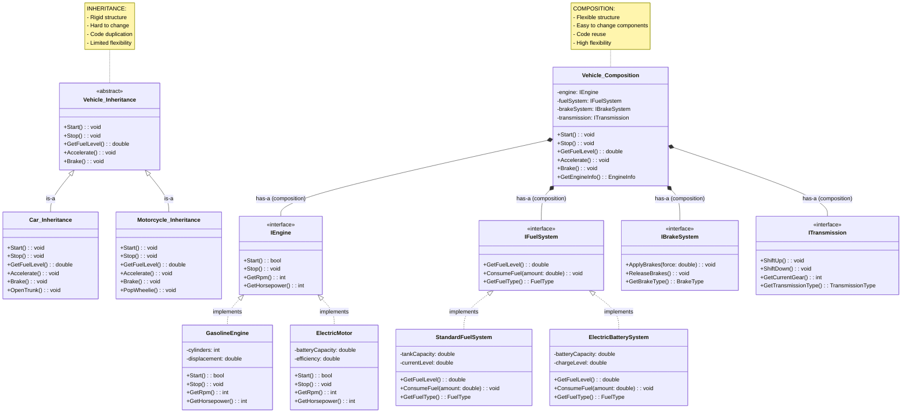

# Composition

> **"Composition enables building complex objects by combining simpler objects, promoting flexibility through 'has-a' relationships rather than 'is-a' inheritance relationships."**

## 🎯 Definition

Composition is an OOP principle where **complex objects are built by combining simpler objects**. It represents a **"has-a" relationship** where one class contains instances of other classes as components. Composition provides **flexibility**, **reusability**, and **maintainability** by allowing objects to be assembled from smaller, focused components.

## 🏠 Real-World Analogy

Think of composition like building a **computer system**:

- ✅ **Computer "has-a" CPU** - The computer contains a CPU component
- ✅ **Computer "has-a" Memory** - The computer contains memory components  
- ✅ **Computer "has-a" Hard Drive** - The computer contains storage components
- ✅ **Modular design** - You can upgrade individual components without replacing the entire computer
- ✅ **Mix and match** - Different combinations create computers for different purposes (gaming, office work, servers)

## 📊 UML Diagram - Composition vs Inheritance



## 🚫 Violation Example (Over-reliance on Inheritance)

```csharp
// ❌ BAD: Using inheritance where composition would be better

// Base class tries to handle everything
public abstract class Employee
{
    public string Name { get; set; }
    public string Email { get; set; }
    public decimal BaseSalary { get; set; }
    public DateTime HireDate { get; set; }
    
    // Trying to handle all possible employee behaviors in base class
    public virtual decimal CalculateSalary()
    {
        throw new NotImplementedException("Must be implemented by derived class");
    }
    
    public virtual void GeneratePaystub()
    {
        throw new NotImplementedException("Must be implemented by derived class");
    }
    
    public virtual List<string> GetBenefits()
    {
        throw new NotImplementedException("Must be implemented by derived class");
    }
    
    public virtual decimal CalculateTax()
    {
        throw new NotImplementedException("Must be implemented by derived class");
    }
    
    public virtual void ProcessTimeOff(TimeOffRequest request)
    {
        throw new NotImplementedException("Must be implemented by derived class");
    }
    
    public virtual PerformanceReview ConductPerformanceReview()
    {
        throw new NotImplementedException("Must be implemented by derived class");
    }
}

// Each employee type must implement ALL methods, even if they don't apply
public class FullTimeEmployee : Employee
{
    public int VacationDays { get; set; }
    public bool HasHealthInsurance { get; set; }
    public decimal BonusPercentage { get; set; }

    public override decimal CalculateSalary()
    {
        // Full-time salary calculation
        return BaseSalary + (BaseSalary * BonusPercentage);
    }

    public override void GeneratePaystub()
    {
        // Full-time paystub generation - lots of details
        var grossPay = CalculateSalary();
        var taxes = CalculateTax();
        var netPay = grossPay - taxes;
        
        var paystub = new StringBuilder();
        paystub.AppendLine($"Employee: {Name}");
        paystub.AppendLine($"Pay Period: {DateTime.Now:MM/dd/yyyy}");
        paystub.AppendLine($"Gross Pay: ${grossPay:F2}");
        paystub.AppendLine($"Federal Tax: ${taxes * 0.25:F2}");
        patstub.AppendLine($"State Tax: ${taxes * 0.08:F2}");
        paystub.AppendLine($"Social Security: ${grossPay * 0.062:F2}");
        paystub.AppendLine($"Medicare: ${grossPay * 0.0145:F2}");
        
        if (HasHealthInsurance)
        {
            paystub.AppendLine($"Health Insurance: ${200:F2}");
            netPay -= 200;
        }
        
        paystub.AppendLine($"Net Pay: ${netPay:F2}");
        
        Console.WriteLine(paystub.ToString());
    }

    public override List<string> GetBenefits()
    {
        var benefits = new List<string> { "401k", "Vacation Days" };
        
        if (HasHealthInsurance)
            benefits.Add("Health Insurance");
            
        return benefits;
    }

    public override decimal CalculateTax()
    {
        // Complex tax calculation for full-time employees
        var grossPay = CalculateSalary();
        var federalTax = grossPay * 0.25m;
        var stateTax = grossPay * 0.08m;
        var socialSecurity = grossPay * 0.062m;
        var medicare = grossPay * 0.0145m;
        
        return federalTax + stateTax + socialSecurity + medicare;
    }

    public override void ProcessTimeOff(TimeOffRequest request)
    {
        if (request.Days > VacationDays)
        {
            throw new InvalidOperationException("Insufficient vacation days");
        }
        
        VacationDays -= request.Days;
        // Process the time off request...
    }

    public override PerformanceReview ConductPerformanceReview()
    {
        // Annual performance review process
        return new PerformanceReview
        {
            ReviewDate = DateTime.Now,
            OverallRating = PerformanceRating.MeetsExpectations,
            Comments = "Annual review completed"
        };
    }
}

public class PartTimeEmployee : Employee
{
    public decimal HourlyRate { get; set; }
    public int HoursWorked { get; set; }

    public override decimal CalculateSalary()
    {
        return HourlyRate * HoursWorked;
    }

    public override void GeneratePaystub()
    {
        // Simpler paystub for part-time
        var grossPay = CalculateSalary();
        var taxes = CalculateTax();
        var netPay = grossPay - taxes;
        
        Console.WriteLine($"Part-Time Employee: {Name}");
        Console.WriteLine($"Hours Worked: {HoursWorked}");
        Console.WriteLine($"Hourly Rate: ${HourlyRate:F2}");
        Console.WriteLine($"Gross Pay: ${grossPay:F2}");
        Console.WriteLine($"Taxes: ${taxes:F2}");
        Console.WriteLine($"Net Pay: ${netPay:F2}");
    }

    public override List<string> GetBenefits()
    {
        // Part-time employees have limited benefits
        return new List<string>(); // No benefits
    }

    public override decimal CalculateTax()
    {
        // Simpler tax calculation for part-time
        var grossPay = CalculateSalary();
        return grossPay * 0.15m; // Flat 15% tax
    }

    public override void ProcessTimeOff(TimeOffRequest request)
    {
        // Part-time employees don't have vacation days
        throw new NotSupportedException("Part-time employees don't have paid time off");
    }

    public override PerformanceReview ConductPerformanceReview()
    {
        // Part-time employees don't get formal reviews
        throw new NotSupportedException("Part-time employees don't receive formal performance reviews");
    }
}

public class ContractorEmployee : Employee
{
    public decimal ContractAmount { get; set; }
    public DateTime ContractEndDate { get; set; }

    public override decimal CalculateSalary()
    {
        return ContractAmount;
    }

    public override void GeneratePaystub()
    {
        // Contractor payment is different - it's an invoice
        Console.WriteLine($"Contractor Payment: {Name}");
        Console.WriteLine($"Contract Amount: ${ContractAmount:F2}");
        Console.WriteLine($"Payment Date: {DateTime.Now:MM/dd/yyyy}");
        Console.WriteLine($"Contract End Date: {ContractEndDate:MM/dd/yyyy}");
    }

    public override List<string> GetBenefits()
    {
        // Contractors don't get benefits
        return new List<string>();
    }

    public override decimal CalculateTax()
    {
        // Contractors handle their own taxes
        return 0; // No tax withholding
    }

    public override void ProcessTimeOff(TimeOffRequest request)
    {
        // Contractors don't have paid time off
        throw new NotSupportedException("Contractors don't have paid time off benefits");
    }

    public override PerformanceReview ConductPerformanceReview()
    {
        // Contractors don't get performance reviews
        throw new NotSupportedException("Contractors don't receive performance reviews");
    }
}

// Inflexible PayrollProcessor that must know about all employee types
public class PayrollProcessor
{
    public void ProcessPayroll(List<Employee> employees)
    {
        foreach (var employee in employees)
        {
            try
            {
                // Must handle different employee types differently
                if (employee is FullTimeEmployee fullTime)
                {
                    // Full-time specific processing
                    Console.WriteLine($"Processing full-time employee: {fullTime.Name}");
                    fullTime.GeneratePaystub();
                    
                    // Additional full-time processing
                    var benefits = fullTime.GetBenefits();
                    Console.WriteLine($"Benefits: {string.Join(", ", benefits)}");
                }
                else if (employee is PartTimeEmployee partTime)
                {
                    // Part-time specific processing
                    Console.WriteLine($"Processing part-time employee: {partTime.Name}");
                    partTime.GeneratePaystub();
                    
                    // Part-time employees don't get benefits processing
                }
                else if (employee is ContractorEmployee contractor)
                {
                    // Contractor specific processing
                    Console.WriteLine($"Processing contractor: {contractor.Name}");
                    contractor.GeneratePaystub();
                    
                    // Check contract expiration
                    if (contractor.ContractEndDate < DateTime.Now.AddDays(30))
                    {
                        Console.WriteLine("WARNING: Contract expiring soon!");
                    }
                }
            }
            catch (NotSupportedException ex)
            {
                // Many methods throw NotSupportedException for different employee types
                Console.WriteLine($"Skipping unsupported operation for {employee.Name}: {ex.Message}");
            }
        }
    }
}
```

### Problems with inheritance-heavy approach

1. **Rigid structure** - Adding new employee types requires changing base class
2. **Method pollution** - All subclasses must implement methods they don't need
3. **Code duplication** - Similar logic repeated across different employee types
4. **Violation of ISP** - Classes forced to implement interfaces they don't use
5. **Hard to test** - Cannot test individual components in isolation
6. **Not extensible** - Cannot easily mix and match different behaviors

## ✅ Correct Implementation (Composition)

```csharp
// ✅ GOOD: Using composition to build flexible employee system

// Core employee data - focused and simple
public class Employee
{
    public int Id { get; set; }
    public string Name { get; set; }
    public string Email { get; set; }
    public DateTime HireDate { get; set; }
    public EmployeeType Type { get; set; }
    
    // Composition - Employee HAS-A salary calculator, not IS-A specific employee type
    public ISalaryCalculator SalaryCalculator { get; set; }
    public IPaystubGenerator PaystubGenerator { get; set; }
    public IBenefitsProvider BenefitsProvider { get; set; }
    public ITaxCalculator TaxCalculator { get; set; }
    public ITimeOffManager TimeOffManager { get; set; }
    public IPerformanceReviewManager PerformanceReviewManager { get; set; }

    public Employee(ISalaryCalculator salaryCalculator, IPaystubGenerator paystubGenerator, 
        IBenefitsProvider benefitsProvider, ITaxCalculator taxCalculator,
        ITimeOffManager timeOffManager, IPerformanceReviewManager performanceReviewManager)
    {
        SalaryCalculator = salaryCalculator ?? throw new ArgumentNullException(nameof(salaryCalculator));
        PaystubGenerator = paystubGenerator ?? throw new ArgumentNullException(nameof(paystubGenerator));
        BenefitsProvider = benefitsProvider ?? throw new ArgumentNullException(nameof(benefitsProvider));
        TaxCalculator = taxCalculator ?? throw new ArgumentNullException(nameof(taxCalculator));
        TimeOffManager = timeOffManager ?? throw new ArgumentNullException(nameof(timeOffManager));
        PerformanceReviewManager = performanceReviewManager ?? throw new ArgumentNullException(nameof(performanceReviewManager));
    }

    // Delegate to composed objects
    public decimal CalculateSalary() => SalaryCalculator.CalculateSalary(this);
    public void GeneratePaystub() => PaystubGenerator.GeneratePaystub(this);
    public List<string> GetBenefits() => BenefitsProvider.GetBenefits(this);
    public decimal CalculateTax() => TaxCalculator.CalculateTax(this);
    public void ProcessTimeOff(TimeOffRequest request) => TimeOffManager.ProcessTimeOff(this, request);
    public PerformanceReview ConductPerformanceReview() => PerformanceReviewManager.ConductPerformanceReview(this);
}

// Separate interfaces for different responsibilities (Single Responsibility Principle)
public interface ISalaryCalculator
{
    decimal CalculateSalary(Employee employee);
    SalaryBreakdown GetSalaryBreakdown(Employee employee);
}

public interface IPaystubGenerator
{
    void GeneratePaystub(Employee employee);
    PaystubData CreatePaystubData(Employee employee);
}

public interface IBenefitsProvider
{
    List<string> GetBenefits(Employee employee);
    decimal CalculateBenefitsCost(Employee employee);
    bool IsEligibleForBenefit(Employee employee, string benefitType);
}

public interface ITaxCalculator
{
    decimal CalculateTax(Employee employee);
    TaxBreakdown GetTaxBreakdown(Employee employee);
}

public interface ITimeOffManager
{
    void ProcessTimeOff(Employee employee, TimeOffRequest request);
    int GetAvailableTimeOff(Employee employee);
    bool IsEligibleForTimeOff(Employee employee);
}

public interface IPerformanceReviewManager
{
    PerformanceReview ConductPerformanceReview(Employee employee);
    bool IsEligibleForReview(Employee employee);
    void ScheduleReview(Employee employee, DateTime reviewDate);
}

// Concrete implementations using composition

// Full-time salary calculator
public class FullTimeSalaryCalculator : ISalaryCalculator
{
    private readonly decimal _baseSalary;
    private readonly decimal _bonusPercentage;

    public FullTimeSalaryCalculator(decimal baseSalary, decimal bonusPercentage = 0)
    {
        _baseSalary = baseSalary;
        _bonusPercentage = bonusPercentage;
    }

    public decimal CalculateSalary(Employee employee)
    {
        return _baseSalary + (_baseSalary * _bonusPercentage);
    }

    public SalaryBreakdown GetSalaryBreakdown(Employee employee)
    {
        var bonus = _baseSalary * _bonusPercentage;
        return new SalaryBreakdown
        {
            BaseSalary = _baseSalary,
            Bonus = bonus,
            TotalSalary = _baseSalary + bonus
        };
    }
}

// Part-time salary calculator  
public class PartTimeSalaryCalculator : ISalaryCalculator
{
    private readonly decimal _hourlyRate;
    private readonly int _hoursWorked;

    public PartTimeSalaryCalculator(decimal hourlyRate, int hoursWorked)
    {
        _hourlyRate = hourlyRate;
        _hoursWorked = hoursWorked;
    }

    public decimal CalculateSalary(Employee employee)
    {
        return _hourlyRate * _hoursWorked;
    }

    public SalaryBreakdown GetSalaryBreakdown(Employee employee)
    {
        return new SalaryBreakdown
        {
            HourlyRate = _hourlyRate,
            HoursWorked = _hoursWorked,
            TotalSalary = _hourlyRate * _hoursWorked
        };
    }
}

// Contract-based salary calculator
public class ContractSalaryCalculator : ISalaryCalculator
{
    private readonly decimal _contractAmount;
    private readonly DateTime _contractStartDate;
    private readonly DateTime _contractEndDate;

    public ContractSalaryCalculator(decimal contractAmount, DateTime contractStartDate, DateTime contractEndDate)
    {
        _contractAmount = contractAmount;
        _contractStartDate = contractStartDate;
        _contractEndDate = contractEndDate;
    }

    public decimal CalculateSalary(Employee employee)
    {
        // Prorate contract amount based on current period
        var totalDays = (_contractEndDate - _contractStartDate).Days;
        var daysThisPeriod = Math.Min(30, totalDays); // Monthly calculation
        return (_contractAmount / totalDays) * daysThisPeriod;
    }

    public SalaryBreakdown GetSalaryBreakdown(Employee employee)
    {
        var totalDays = (_contractEndDate - _contractStartDate).Days;
        var daysThisPeriod = Math.Min(30, totalDays);
        var monthlySalary = (_contractAmount / totalDays) * daysThisPeriod;
        
        return new SalaryBreakdown
        {
            ContractAmount = _contractAmount,
            TotalContractDays = totalDays,
            CurrentPeriodDays = daysThisPeriod,
            TotalSalary = monthlySalary
        };
    }
}

// Full-time benefits provider
public class FullTimeBenefitsProvider : IBenefitsProvider
{
    private readonly bool _hasHealthInsurance;
    private readonly bool _has401k;
    private readonly int _vacationDays;

    public FullTimeBenefitsProvider(bool hasHealthInsurance = true, bool has401k = true, int vacationDays = 20)
    {
        _hasHealthInsurance = hasHealthInsurance;
        _has401k = has401k;
        _vacationDays = vacationDays;
    }

    public List<string> GetBenefits(Employee employee)
    {
        var benefits = new List<string>();
        
        if (_has401k)
            benefits.Add("401(k) Retirement Plan");
            
        if (_hasHealthInsurance)
            benefits.Add("Health Insurance");
            
        benefits.Add($"Paid Vacation ({_vacationDays} days)");
        benefits.Add("Sick Leave");
        benefits.Add("Life Insurance");
        
        return benefits;
    }

    public decimal CalculateBenefitsCost(Employee employee)
    {
        decimal cost = 0;
        
        if (_hasHealthInsurance)
            cost += 200; // Monthly health insurance cost
            
        if (_has401k)
            cost += 50; // 401k administration fee
            
        return cost;
    }

    public bool IsEligibleForBenefit(Employee employee, string benefitType)
    {
        return benefitType switch
        {
            "HealthInsurance" => _hasHealthInsurance,
            "401k" => _has401k,
            "PaidVacation" => true,
            "SickLeave" => true,
            "LifeInsurance" => true,
            _ => false
        };
    }
}

// No benefits provider (for contractors/part-time)
public class NoBenefitsProvider : IBenefitsProvider
{
    public List<string> GetBenefits(Employee employee)
    {
        return new List<string>();
    }

    public decimal CalculateBenefitsCost(Employee employee)
    {
        return 0;
    }

    public bool IsEligibleForBenefit(Employee employee, string benefitType)
    {
        return false;
    }
}

// Standard tax calculator
public class StandardTaxCalculator : ITaxCalculator
{
    private readonly decimal _federalTaxRate;
    private readonly decimal _stateTaxRate;
    private readonly decimal _socialSecurityRate;
    private readonly decimal _medicareRate;

    public StandardTaxCalculator(decimal federalTaxRate = 0.25m, decimal stateTaxRate = 0.08m, 
        decimal socialSecurityRate = 0.062m, decimal medicareRate = 0.0145m)
    {
        _federalTaxRate = federalTaxRate;
        _stateTaxRate = stateTaxRate;
        _socialSecurityRate = socialSecurityRate;
        _medicareRate = medicareRate;
    }

    public decimal CalculateTax(Employee employee)
    {
        var grossPay = employee.SalaryCalculator.CalculateSalary(employee);
        
        var federalTax = grossPay * _federalTaxRate;
        var stateTax = grossPay * _stateTaxRate;
        var socialSecurity = grossPay * _socialSecurityRate;
        var medicare = grossPay * _medicareRate;
        
        return federalTax + stateTax + socialSecurity + medicare;
    }

    public TaxBreakdown GetTaxBreakdown(Employee employee)
    {
        var grossPay = employee.SalaryCalculator.CalculateSalary(employee);
        
        return new TaxBreakdown
        {
            GrossPay = grossPay,
            FederalTax = grossPay * _federalTaxRate,
            StateTax = grossPay * _stateTaxRate,
            SocialSecurity = grossPay * _socialSecurityRate,
            Medicare = grossPay * _medicareRate
        };
    }
}

// Contractor tax calculator (no withholding)
public class ContractorTaxCalculator : ITaxCalculator
{
    public decimal CalculateTax(Employee employee)
    {
        return 0; // Contractors handle their own taxes
    }

    public TaxBreakdown GetTaxBreakdown(Employee employee)
    {
        var grossPay = employee.SalaryCalculator.CalculateSalary(employee);
        
        return new TaxBreakdown
        {
            GrossPay = grossPay,
            FederalTax = 0,
            StateTax = 0,
            SocialSecurity = 0,
            Medicare = 0,
            Note = "Contractor responsible for own tax payments"
        };
    }
}

// Standard paystub generator
public class StandardPaystubGenerator : IPaystubGenerator
{
    private readonly ITemplateEngine _templateEngine;

    public StandardPaystubGenerator(ITemplateEngine templateEngine)
    {
        _templateEngine = templateEngine ?? throw new ArgumentNullException(nameof(templateEngine));
    }

    public void GeneratePaystub(Employee employee)
    {
        var paystubData = CreatePaystubData(employee);
        var paystub = _templateEngine.RenderPaystub(paystubData);
        
        Console.WriteLine(paystub);
        
        // Could also save to file, send via email, etc.
    }

    public PaystubData CreatePaystubData(Employee employee)
    {
        var salaryBreakdown = employee.SalaryCalculator.GetSalaryBreakdown(employee);
        var taxBreakdown = employee.TaxCalculator.GetTaxBreakdown(employee);
        var benefitsCost = employee.BenefitsProvider.CalculateBenefitsCost(employee);
        
        return new PaystubData
        {
            Employee = employee,
            PayPeriod = DateTime.Now,
            SalaryBreakdown = salaryBreakdown,
            TaxBreakdown = taxBreakdown,
            BenefitsCost = benefitsCost,
            NetPay = salaryBreakdown.TotalSalary - taxBreakdown.TotalTax - benefitsCost
        };
    }
}

// Flexible employee factory using composition
public class EmployeeFactory
{
    public Employee CreateFullTimeEmployee(string name, string email, decimal baseSalary, 
        decimal bonusPercentage = 0, bool hasHealthInsurance = true)
    {
        var salaryCalculator = new FullTimeSalaryCalculator(baseSalary, bonusPercentage);
        var paystubGenerator = new StandardPaystubGenerator(new StandardTemplateEngine());
        var benefitsProvider = new FullTimeBenefitsProvider(hasHealthInsurance);
        var taxCalculator = new StandardTaxCalculator();
        var timeOffManager = new StandardTimeOffManager(20); // 20 vacation days
        var performanceReviewManager = new AnnualPerformanceReviewManager();

        return new Employee(salaryCalculator, paystubGenerator, benefitsProvider, 
            taxCalculator, timeOffManager, performanceReviewManager)
        {
            Name = name,
            Email = email,
            HireDate = DateTime.Now,
            Type = EmployeeType.FullTime
        };
    }

    public Employee CreatePartTimeEmployee(string name, string email, decimal hourlyRate, int hoursWorked)
    {
        var salaryCalculator = new PartTimeSalaryCalculator(hourlyRate, hoursWorked);
        var paystubGenerator = new StandardPaystubGenerator(new StandardTemplateEngine());
        var benefitsProvider = new NoBenefitsProvider(); // Part-time gets no benefits
        var taxCalculator = new StandardTaxCalculator(0.15m, 0.05m); // Lower tax rates
        var timeOffManager = new NoTimeOffManager(); // No paid time off
        var performanceReviewManager = new NoPerformanceReviewManager(); // No formal reviews

        return new Employee(salaryCalculator, paystubGenerator, benefitsProvider, 
            taxCalculator, timeOffManager, performanceReviewManager)
        {
            Name = name,
            Email = email,
            HireDate = DateTime.Now,
            Type = EmployeeType.PartTime
        };
    }

    public Employee CreateContractor(string name, string email, decimal contractAmount, 
        DateTime contractStartDate, DateTime contractEndDate)
    {
        var salaryCalculator = new ContractSalaryCalculator(contractAmount, contractStartDate, contractEndDate);
        var paystubGenerator = new ContractorPaystubGenerator(new StandardTemplateEngine());
        var benefitsProvider = new NoBenefitsProvider();
        var taxCalculator = new ContractorTaxCalculator(); // No tax withholding
        var timeOffManager = new NoTimeOffManager();
        var performanceReviewManager = new NoPerformanceReviewManager();

        return new Employee(salaryCalculator, paystubGenerator, benefitsProvider, 
            taxCalculator, timeOffManager, performanceReviewManager)
        {
            Name = name,
            Email = email,
            HireDate = contractStartDate,
            Type = EmployeeType.Contractor
        };
    }
}

// Flexible payroll processor using composition
public class PayrollProcessor
{
    private readonly ILogger _logger;

    public PayrollProcessor(ILogger logger)
    {
        _logger = logger ?? throw new ArgumentNullException(nameof(logger));
    }

    // Works with any employee composition - no need to know specific types!
    public async Task ProcessPayrollAsync(List<Employee> employees)
    {
        await _logger.LogInfoAsync("Starting payroll processing for {EmployeeCount} employees", employees.Count);

        var tasks = employees.Select(async employee =>
        {
            try
            {
                await _logger.LogDebugAsync("Processing payroll for employee {EmployeeName}", employee.Name);
                
                // Same code works for all employee types due to composition!
                employee.GeneratePaystub();
                
                // Log benefits if applicable
                var benefits = employee.GetBenefits();
                if (benefits.Any())
                {
                    await _logger.LogInfoAsync("Employee {EmployeeName} benefits: {Benefits}", 
                        employee.Name, string.Join(", ", benefits));
                }

                return new PayrollResult
                {
                    EmployeeId = employee.Id,
                    EmployeeName = employee.Name,
                    Success = true,
                    GrossPay = employee.CalculateSalary(),
                    TaxWithheld = employee.CalculateTax()
                };
            }
            catch (Exception ex)
            {
                await _logger.LogErrorAsync("Error processing payroll for employee {EmployeeName}", ex, employee.Name);
                
                return new PayrollResult
                {
                    EmployeeId = employee.Id,
                    EmployeeName = employee.Name,
                    Success = false,
                    ErrorMessage = ex.Message
                };
            }
        });

        var results = await Task.WhenAll(tasks);
        
        var successCount = results.Count(r => r.Success);
        await _logger.LogInfoAsync("Payroll processing completed. {SuccessCount}/{TotalCount} employees processed successfully", 
            successCount, employees.Count);
    }

    // Can easily add new functionality without modifying existing code
    public async Task ProcessBonusPaymentAsync(List<Employee> employees, decimal bonusAmount)
    {
        foreach (var employee in employees)
        {
            // Check if employee is eligible for bonus
            if (employee.BenefitsProvider.IsEligibleForBenefit(employee, "Bonus"))
            {
                // Create temporary bonus salary calculator
                var currentCalculator = employee.SalaryCalculator;
                employee.SalaryCalculator = new BonusSalaryCalculator(currentCalculator, bonusAmount);
                
                // Generate bonus paystub
                employee.GeneratePaystub();
                
                // Restore original calculator
                employee.SalaryCalculator = currentCalculator;
                
                await _logger.LogInfoAsync("Bonus payment of ${BonusAmount} processed for {EmployeeName}", 
                    bonusAmount, employee.Name);
            }
        }
    }
}

// Easy to add new behaviors through composition
public class BonusSalaryCalculator : ISalaryCalculator
{
    private readonly ISalaryCalculator _baseSalaryCalculator;
    private readonly decimal _bonusAmount;

    public BonusSalaryCalculator(ISalaryCalculator baseSalaryCalculator, decimal bonusAmount)
    {
        _baseSalaryCalculator = baseSalaryCalculator ?? throw new ArgumentNullException(nameof(baseSalaryCalculator));
        _bonusAmount = bonusAmount;
    }

    public decimal CalculateSalary(Employee employee)
    {
        return _baseSalaryCalculator.CalculateSalary(employee) + _bonusAmount;
    }

    public SalaryBreakdown GetSalaryBreakdown(Employee employee)
    {
        var baseBreakdown = _baseSalaryCalculator.GetSalaryBreakdown(employee);
        baseBreakdown.Bonus += _bonusAmount;
        baseBreakdown.TotalSalary += _bonusAmount;
        return baseBreakdown;
    }
}

// Supporting data classes
public class SalaryBreakdown
{
    public decimal BaseSalary { get; set; }
    public decimal Bonus { get; set; }
    public decimal HourlyRate { get; set; }
    public int HoursWorked { get; set; }
    public decimal ContractAmount { get; set; }
    public int TotalContractDays { get; set; }
    public int CurrentPeriodDays { get; set; }
    public decimal TotalSalary { get; set; }
}

public class TaxBreakdown
{
    public decimal GrossPay { get; set; }
    public decimal FederalTax { get; set; }
    public decimal StateTax { get; set; }
    public decimal SocialSecurity { get; set; }
    public decimal Medicare { get; set; }
    public decimal TotalTax => FederalTax + StateTax + SocialSecurity + Medicare;
    public string Note { get; set; }
}

public class PaystubData
{
    public Employee Employee { get; set; }
    public DateTime PayPeriod { get; set; }
    public SalaryBreakdown SalaryBreakdown { get; set; }
    public TaxBreakdown TaxBreakdown { get; set; }
    public decimal BenefitsCost { get; set; }
    public decimal NetPay { get; set; }
}

public enum EmployeeType
{
    FullTime,
    PartTime,
    Contractor
}
```

## 🧪 Unit Testing with Composition

```csharp
[TestFixture]
public class EmployeeCompositionTests
{
    [Test]
    public void Employee_Should_Use_Composed_SalaryCalculator()
    {
        // Arrange
        var mockSalaryCalculator = new Mock<ISalaryCalculator>();
        var mockPaystubGenerator = new Mock<IPaystubGenerator>();
        var mockBenefitsProvider = new Mock<IBenefitsProvider>();
        var mockTaxCalculator = new Mock<ITaxCalculator>();
        var mockTimeOffManager = new Mock<ITimeOffManager>(); 
        var mockPerformanceReviewManager = new Mock<IPerformanceReviewManager>();

        mockSalaryCalculator.Setup(s => s.CalculateSalary(It.IsAny<Employee>()))
            .Returns(5000m);

        var employee = new Employee(
            mockSalaryCalculator.Object,
            mockPaystubGenerator.Object,
            mockBenefitsProvider.Object,
            mockTaxCalculator.Object,
            mockTimeOffManager.Object,
            mockPerformanceReviewManager.Object)
        {
            Name = "John Doe"
        };

        // Act
        var salary = employee.CalculateSalary();

        // Assert
        Assert.AreEqual(5000m, salary);
        mockSalaryCalculator.Verify(s => s.CalculateSalary(employee), Times.Once);
    }

    [Test]
    public void Employee_Can_Swap_Components_At_Runtime()
    {
        // Arrange - Create employee with full-time components
        var employee = new EmployeeFactory()
            .CreateFullTimeEmployee("Jane Doe", "jane@company.com", 60000m);

        var originalSalary = employee.CalculateSalary();

        // Act - Swap to part-time salary calculator
        employee.SalaryCalculator = new PartTimeSalaryCalculator(25m, 80); // 25/hour, 80 hours

        var newSalary = employee.CalculateSalary();

        // Assert
        Assert.AreEqual(60000m, originalSalary);
        Assert.AreEqual(2000m, newSalary); // 25 * 80
    }

    [Test]
    public void FullTimeSalaryCalculator_Should_Calculate_Salary_With_Bonus()
    {
        // Arrange
        var calculator = new FullTimeSalaryCalculator(50000m, 0.10m); // 10% bonus
        var employee = CreateTestEmployee();

        // Act
        var salary = calculator.CalculateSalary(employee);
        var breakdown = calculator.GetSalaryBreakdown(employee);

        // Assert
        Assert.AreEqual(55000m, salary); // 50000 + (50000 * 0.10)
        Assert.AreEqual(50000m, breakdown.BaseSalary);
        Assert.AreEqual(5000m, breakdown.Bonus);
        Assert.AreEqual(55000m, breakdown.TotalSalary);
    }

    [Test]
    public void PartTimeSalaryCalculator_Should_Calculate_Hourly_Salary()
    {
        // Arrange
        var calculator = new PartTimeSalaryCalculator(20m, 40); // $20/hour, 40 hours
        var employee = CreateTestEmployee();

        // Act
        var salary = calculator.CalculateSalary(employee);
        var breakdown = calculator.GetSalaryBreakdown(employee);

        // Assert
        Assert.AreEqual(800m, salary); // 20 * 40
        Assert.AreEqual(20m, breakdown.HourlyRate);
        Assert.AreEqual(40, breakdown.HoursWorked);
        Assert.AreEqual(800m, breakdown.TotalSalary);
    }

    [Test]
    public void StandardTaxCalculator_Should_Calculate_All_Tax_Components()
    {
        // Arrange
        var calculator = new StandardTaxCalculator(0.25m, 0.08m, 0.062m, 0.0145m);
        var employee = CreateTestEmployeeWithSalary(10000m);

        // Act
        var totalTax = calculator.CalculateTax(employee);
        var breakdown = calculator.GetTaxBreakdown(employee);

        // Assert
        Assert.AreEqual(4015m, totalTax); // (0.25 + 0.08 + 0.062 + 0.0145) * 10000
        Assert.AreEqual(2500m, breakdown.FederalTax);
        Assert.AreEqual(800m, breakdown.StateTax);
        Assert.AreEqual(620m, breakdown.SocialSecurity);
        Assert.AreEqual(145m, breakdown.Medicare);
        Assert.AreEqual(4065m, breakdown.TotalTax);
    }

    [Test]
    public void FullTimeBenefitsProvider_Should_Provide_All_Benefits()
    {
        // Arrange
        var provider = new FullTimeBenefitsProvider(hasHealthInsurance: true, has401k: true, vacationDays: 25);
        var employee = CreateTestEmployee();

        // Act
        var benefits = provider.GetBenefits(employee);
        var cost = provider.CalculateBenefitsCost(employee);

        // Assert
        Assert.AreEqual(5, benefits.Count);
        Assert.Contains("401(k) Retirement Plan", benefits);
        Assert.Contains("Health Insurance", benefits);
        Assert.Contains("Paid Vacation (25 days)", benefits);
        Assert.Contains("Sick Leave", benefits);
        Assert.Contains("Life Insurance", benefits);
        Assert.AreEqual(250m, cost); // $200 health + $50 401k
    }

    [Test]
    public void NoBenefitsProvider_Should_Provide_No_Benefits()
    {
        // Arrange
        var provider = new NoBenefitsProvider();
        var employee = CreateTestEmployee();

        // Act
        var benefits = provider.GetBenefits(employee);
        var cost = provider.CalculateBenefitsCost(employee);

        // Assert
        Assert.AreEqual(0, benefits.Count);
        Assert.AreEqual(0m, cost);
        Assert.IsFalse(provider.IsEligibleForBenefit(employee, "HealthInsurance"));
    }

    [Test]
    public void PayrollProcessor_Should_Process_Different_Employee_Types_Uniformly()
    {
        // Arrange
        var mockLogger = new Mock<ILogger>();
        var processor = new PayrollProcessor(mockLogger.Object);

        var employees = new List<Employee>
        {
            new EmployeeFactory().CreateFullTimeEmployee("John", "john@company.com", 60000m),
            new EmployeeFactory().CreatePartTimeEmployee("Jane", "jane@company.com", 20m, 80),
            new EmployeeFactory().CreateContractor("Bob", "bob@company.com", 120000m, 
                DateTime.Now, DateTime.Now.AddMonths(12))
        };

        // Act & Assert - Should not throw exceptions
        Assert.DoesNotThrowAsync(async () => await processor.ProcessPayrollAsync(employees));

        // Verify logging was called for each employee
        mockLogger.Verify(l => l.LogInfoAsync(It.Is<string>(s => s.Contains("Starting payroll processing")), 
            It.IsAny<object[]>()), Times.Once);
    }

    [Test]
    public void BonusSalaryCalculator_Should_Add_Bonus_To_Base_Salary()
    {
        // Arrange
        var baseSalaryCalculator = new FullTimeSalaryCalculator(50000m);
        var bonusCalculator = new BonusSalaryCalculator(baseSalaryCalculator, 5000m);
        var employee = CreateTestEmployee();

        // Act
        var baseSalary = baseSalaryCalculator.CalculateSalary(employee);
        var totalWithBonus = bonusCalculator.CalculateSalary(employee);

        // Assert
        Assert.AreEqual(50000m, baseSalary);
        Assert.AreEqual(55000m, totalWithBonus);
    }

    private Employee CreateTestEmployee()
    {
        return new EmployeeFactory().CreateFullTimeEmployee("Test Employee", "test@company.com", 50000m);
    }

    private Employee CreateTestEmployeeWithSalary(decimal salary)
    {
        var mockSalaryCalculator = new Mock<ISalaryCalculator>();
        mockSalaryCalculator.Setup(s => s.CalculateSalary(It.IsAny<Employee>())).Returns(salary);

        var employee = CreateTestEmployee();
        employee.SalaryCalculator = mockSalaryCalculator.Object;
        return employee;
    }
}
```

## ✅ Benefits of Composition

1. **Flexibility** - Can mix and match different behaviors at runtime
2. **Reusability** - Components can be reused across different classes
3. **Testability** - Each component can be tested in isolation
4. **Single Responsibility** - Each component has one focused responsibility
5. **Open/Closed Principle** - Easy to add new components without modifying existing code
6. **Runtime behavior changes** - Can swap components dynamically

## 🎯 Composition Types

### 1. **Aggregation (Has-A, Weak)**

- Component can exist independently
- Shared ownership possible
- Example: Department has Employees (employees can exist without department)

### 2. **Composition (Part-Of, Strong)**

- Component cannot exist independently
- Exclusive ownership
- Example: House has Rooms (rooms don't exist without the house)

## 🎯 When to Use Composition

- **"Has-a" relationships** - When objects contain other objects
- **Multiple inheritance needs** - When you need behaviors from multiple sources
- **Runtime flexibility** - When behavior should be changeable at runtime
- **Avoiding inheritance problems** - When inheritance hierarchy becomes too complex
- **Plugin architectures** - When you want to support pluggable components

## 🚨 Common Mistakes

1. **Overcomplicating simple cases** - Creating composition for simple inheritance scenarios
2. **Too many small interfaces** - Breaking down responsibilities too granularly
3. **Circular dependencies** - Components depending on each other
4. **Forgetting dependency injection** - Hard-coding component creation
5. **Not considering performance** - Too many indirection levels affecting performance

## 🎯 Interview Questions

**Q: When should you prefer composition over inheritance?**
**A:** Prefer composition when you need flexibility, have "has-a" relationships, want to avoid deep inheritance hierarchies, need to change behavior at runtime, or when inheritance would violate the Liskov Substitution Principle. Use inheritance for true "is-a" relationships with stable hierarchies.

**Q: What's the difference between aggregation and composition?**
**A:** Aggregation is a "has-a" relationship with weak ownership where components can exist independently (Department has Employees). Composition is a "part-of" relationship with strong ownership where components cannot exist without the parent (House has Rooms).

**Q: How does composition support the Single Responsibility Principle?**
**A:** Composition allows breaking down complex classes into smaller, focused components, each with a single responsibility. Instead of one class doing everything, you compose multiple specialized classes that each handle one aspect of the functionality.

**Q: Give an ERP example where composition provides significant business value.**
**A:** In an ERP system, an Invoice class can be composed of different tax calculators (US tax, EU VAT, Canadian GST), payment processors (credit card, bank transfer, PayPal), and document generators (PDF, XML, email). This allows the same invoice system to work in different countries with different regulations by composing appropriate components, rather than creating separate invoice classes for each country.

## 📝 Checklist

- [ ] Uses "has-a" relationships appropriately
- [ ] Components are focused and have single responsibilities
- [ ] Composition is preferred over inheritance for flexibility needs
- [ ] Components can be easily tested in isolation
- [ ] Dependencies are injected rather than hard-coded
- [ ] Interfaces define clear contracts for components
- [ ] Components can be swapped or combined in different ways

---

**Previous**: [← Coupling](./05-coupling.md) | **Next**: [Composition vs Inheritance →](./07-composition-vs-inheritance.md)