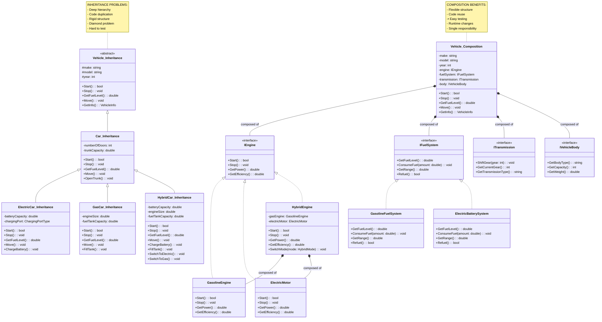

# Composition vs Inheritance

> **"Favor composition over inheritance. Inheritance says 'is-a' while composition says 'has-a' or 'uses-a'. Composition provides greater flexibility and maintainability."**

## 🎯 Definition

**Composition vs Inheritance** is a fundamental OOP design decision. **Inheritance** creates "is-a" relationships through class hierarchies, while **Composition** creates "has-a" relationships by combining objects. The principle "favor composition over inheritance" suggests that composition often provides better **flexibility**, **testability**, and **maintainability**.

## 🏠 Real-World Analogy

Think of building a **transportation system**:

### Inheritance Approach (Is-A)
- ❌ **ElectricCar IS-A Car IS-A Vehicle**
- ❌ **GasCar IS-A Car IS-A Vehicle** 
- ❌ **Motorcycle IS-A Vehicle**
- ❌ **Rigid hierarchy** - hard to add hybrid vehicles or change engine types

### Composition Approach (Has-A)
- ✅ **Vehicle HAS-A Engine** (could be gas, electric, or hybrid)
- ✅ **Vehicle HAS-A FuelSystem** (could be gas tank, battery, or both)
- ✅ **Vehicle HAS-A Transmission** (manual, automatic, CVT)
- ✅ **Flexible combinations** - easy to create new vehicle types by mixing components

## 📊 UML Diagram - Side-by-Side Comparison



## 🚫 Violation Example (Over-using Inheritance)

```csharp
// ❌ BAD: Inheritance-heavy approach leading to rigid, hard-to-maintain code

// Deep inheritance hierarchy
public abstract class Employee
{
    public string Name { get; set; }
    public string Email { get; set; }
    public DateTime HireDate { get; set; }
    
    public abstract decimal CalculateSalary();
    public abstract void GeneratePaystub();
    public abstract List<string> GetBenefits();
    public abstract void ProcessTimeOff(TimeOffRequest request);
    public abstract void ConductPerformanceReview();
}

// First level of inheritance
public abstract class SalariedEmployee : Employee
{
    public decimal BaseSalary { get; set; }
    
    public override decimal CalculateSalary()
    {
        return BaseSalary;
    }
    
    public override void GeneratePaystub()
    {
        Console.WriteLine($"Salaried Employee Paystub: {Name}");
        Console.WriteLine($"Base Salary: ${BaseSalary:F2}");
        Console.WriteLine($"Gross Pay: ${CalculateSalary():F2}");
    }
    
    public override List<string> GetBenefits()
    {
        return new List<string> { "Health Insurance", "401k" };
    }
}

public abstract class HourlyEmployee : Employee
{
    public decimal HourlyRate { get; set; }
    public int HoursWorked { get; set; }
    
    public override decimal CalculateSalary()
    {
        return HourlyRate * HoursWorked;
    }
    
    public override void GeneratePaystub()
    {
        Console.WriteLine($"Hourly Employee Paystub: {Name}");
        Console.WriteLine($"Hourly Rate: ${HourlyRate:F2}");
        Console.WriteLine($"Hours Worked: {HoursWorked}");
        Console.WriteLine($"Gross Pay: ${CalculateSalary():F2}");
    }
    
    public override List<string> GetBenefits()
    {
        return new List<string>(); // No benefits for hourly
    }
}

// Second level of inheritance
public class FullTimeEmployee : SalariedEmployee
{
    public decimal BonusPercentage { get; set; }
    public int VacationDays { get; set; }
    
    public override decimal CalculateSalary()
    {
        return BaseSalary + (BaseSalary * BonusPercentage);
    }
    
    public override void GeneratePaystub()
    {
        Console.WriteLine($"Full-Time Employee Paystub: {Name}");
        Console.WriteLine($"Base Salary: ${BaseSalary:F2}");
        Console.WriteLine($"Bonus: ${BaseSalary * BonusPercentage:F2}");
        Console.WriteLine($"Gross Pay: ${CalculateSalary():F2}");
    }
    
    public override List<string> GetBenefits()
    {
        var benefits = base.GetBenefits();
        benefits.Add("Vacation Days");
        benefits.Add("Sick Leave");
        return benefits;
    }
    
    public override void ProcessTimeOff(TimeOffRequest request)
    {
        if (request.Days > VacationDays)
            throw new InvalidOperationException("Insufficient vacation days");
        
        VacationDays -= request.Days;
    }
    
    public override void ConductPerformanceReview()
    {
        Console.WriteLine($"Conducting annual performance review for {Name}");
    }
}

public class PartTimeSalariedEmployee : SalariedEmployee
{
    public double WorkPercentage { get; set; } // 0.5 for 50% time
    
    public override decimal CalculateSalary()
    {
        return BaseSalary * (decimal)WorkPercentage;
    }
    
    public override void ProcessTimeOff(TimeOffRequest request)
    {
        throw new NotSupportedException("Part-time salaried employees don't have paid time off");
    }
    
    public override void ConductPerformanceReview()
    {
        Console.WriteLine($"Conducting quarterly performance review for {Name}");
    }
}

public class RegularHourlyEmployee : HourlyEmployee
{
    public override void ProcessTimeOff(TimeOffRequest request)
    {
        throw new NotSupportedException("Hourly employees don't have paid time off");
    }
    
    public override void ConductPerformanceReview()
    {
        throw new NotSupportedException("Hourly employees don't receive formal reviews");
    }
}

public class ContractorEmployee : HourlyEmployee
{
    public DateTime ContractEndDate { get; set; }
    
    public override void GeneratePaystub()
    {
        Console.WriteLine($"Contractor Invoice: {Name}");
        Console.WriteLine($"Hourly Rate: ${HourlyRate:F2}");
        Console.WriteLine($"Hours Worked: {HoursWorked}");
        Console.WriteLine($"Total Payment: ${CalculateSalary():F2}");
        Console.WriteLine($"Contract End Date: {ContractEndDate:MM/dd/yyyy}");
    }
    
    public override void ProcessTimeOff(TimeOffRequest request)
    {
        throw new NotSupportedException("Contractors don't have time off benefits");
    }
    
    public override void ConductPerformanceReview()
    {
        throw new NotSupportedException("Contractors don't receive performance reviews");
    }
}

// Third level - even deeper inheritance problems!
public class SeniorFullTimeEmployee : FullTimeEmployee
{
    public decimal StockOptionValue { get; set; }
    public int MentorshipHours { get; set; }
    
    public override decimal CalculateSalary()
    {
        return base.CalculateSalary() + StockOptionValue;
    }
    
    public override void GeneratePaystub()
    {
        Console.WriteLine($"Senior Full-Time Employee Paystub: {Name}");
        Console.WriteLine($"Base Salary: ${BaseSalary:F2}");
        Console.WriteLine($"Bonus: ${BaseSalary * BonusPercentage:F2}");
        Console.WriteLine($"Stock Options: ${StockOptionValue:F2}");
        Console.WriteLine($"Gross Pay: ${CalculateSalary():F2}");
    }
    
    public override List<string> GetBenefits()
    {
        var benefits = base.GetBenefits();
        benefits.Add("Stock Options");
        benefits.Add("Professional Development");
        benefits.Add("Conference Attendance");
        return benefits;
    }
    
    public override void ConductPerformanceReview()
    {
        base.ConductPerformanceReview();
        Console.WriteLine($"Additional mentorship evaluation for {Name}");
        Console.WriteLine($"Mentorship hours: {MentorshipHours}");
    }
}

public class ExecutiveEmployee : SeniorFullTimeEmployee
{
    public decimal ExecutiveBonus { get; set; }
    public List<string> BoardMemberships { get; set; } = new List<string>();
    
    public override decimal CalculateSalary()
    {
        return base.CalculateSalary() + ExecutiveBonus;
    }
    
    public override void GeneratePaystub()
    {
        Console.WriteLine($"Executive Employee Paystub: {Name}");
        Console.WriteLine($"Base Salary: ${BaseSalary:F2}");
        Console.WriteLine($"Bonus: ${BaseSalary * BonusPercentage:F2}");
        Console.WriteLine($"Stock Options: ${StockOptionValue:F2}");
        Console.WriteLine($"Executive Bonus: ${ExecutiveBonus:F2}");
        Console.WriteLine($"Gross Pay: ${CalculateSalary():F2}");
    }
    
    public override List<string> GetBenefits()
    {
        var benefits = base.GetBenefits();
        benefits.Add("Executive Health Plan");
        benefits.Add("Company Car");
        benefits.Add("Executive Assistant");
        return benefits;
    }
}

// Inflexible payroll system that must know about all types
public class PayrollSystem
{
    public void ProcessPayroll(List<Employee> employees)
    {
        foreach (var employee in employees)
        {
            try
            {
                // Must handle each type differently due to inheritance issues
                if (employee is ExecutiveEmployee executive)
                {
                    ProcessExecutivePayroll(executive);
                }
                else if (employee is SeniorFullTimeEmployee senior)
                {
                    ProcessSeniorPayroll(senior);
                }
                else if (employee is FullTimeEmployee fullTime)
                {
                    ProcessFullTimePayroll(fullTime);
                }
                else if (employee is PartTimeSalariedEmployee partTimeSalaried)
                {
                    ProcessPartTimeSalariedPayroll(partTimeSalaried);
                }
                else if (employee is ContractorEmployee contractor)
                {
                    ProcessContractorPayroll(contractor);
                }
                else if (employee is RegularHourlyEmployee hourly)
                {
                    ProcessHourlyPayroll(hourly);
                }
                
                employee.GeneratePaystub();
            }
            catch (NotSupportedException ex)
            {
                Console.WriteLine($"Skipping unsupported operation for {employee.Name}: {ex.Message}");
            }
        }
    }
    
    // Must have separate methods for each employee type
    private void ProcessExecutivePayroll(ExecutiveEmployee executive)
    {
        // Executive-specific logic
        Console.WriteLine($"Processing executive payroll with board memberships...");
    }
    
    private void ProcessSeniorPayroll(SeniorFullTimeEmployee senior)
    {
        // Senior-specific logic
        Console.WriteLine($"Processing senior payroll with stock options...");
    }
    
    private void ProcessFullTimePayroll(FullTimeEmployee fullTime)
    {
        // Full-time specific logic
        Console.WriteLine($"Processing full-time payroll with benefits...");
    }
    
    private void ProcessPartTimeSalariedPayroll(PartTimeSalariedEmployee partTime)
    {
        // Part-time salaried specific logic
        Console.WriteLine($"Processing part-time salaried payroll...");
    }
    
    private void ProcessContractorPayroll(ContractorEmployee contractor)
    {
        // Contractor specific logic
        Console.WriteLine($"Processing contractor payment...");
    }
    
    private void ProcessHourlyPayroll(RegularHourlyEmployee hourly)
    {
        // Hourly specific logic
        Console.WriteLine($"Processing hourly payroll...");
    }
}

// What happens when we need a new employee type? 
// We have to modify the base classes and add new inheritance levels!
public class InternEmployee : HourlyEmployee
{
    public string University { get; set; }
    public string Mentor { get; set; }
    
    // Interns have different rules - breaks Liskov Substitution Principle
    public override decimal CalculateSalary()
    {
        // Interns might have unpaid positions
        return Math.Min(base.CalculateSalary(), 1000m); // Cap at $1000
    }
    
    public override void GeneratePaystub()
    {
        Console.WriteLine($"Intern Paystub: {Name}");
        Console.WriteLine($"University: {University}");
        Console.WriteLine($"Mentor: {Mentor}");
        Console.WriteLine($"Hours: {HoursWorked}");
        Console.WriteLine($"Payment: ${CalculateSalary():F2}");
    }
    
    public override List<string> GetBenefits()
    {
        return new List<string> { "Learning Experience", "Mentorship" };
    }
    
    public override void ProcessTimeOff(TimeOffRequest request)
    {
        // Interns might have different time off rules
        Console.WriteLine($"Intern time off processed for {Name}");
    }
    
    public override void ConductPerformanceReview()
    {
        Console.WriteLine($"Conducting internship evaluation for {Name}");
    }
}
```

### Problems with inheritance-heavy approach

1. **Deep hierarchy** - Hard to understand and navigate
2. **Rigid structure** - Adding new types requires modifying existing classes
3. **Code duplication** - Similar logic repeated across inheritance levels
4. **Fragile base class** - Changes to base classes affect all subclasses
5. **Method pollution** - Classes forced to implement methods they don't need
6. **Testing complexity** - Hard to test individual behaviors in isolation

## ✅ Correct Implementation (Composition Over Inheritance)

```csharp
// ✅ GOOD: Composition-based approach with flexible, testable design

// Simple employee data class - no behavior, just data
public class Employee
{
    public int Id { get; set; }
    public string Name { get; set; }
    public string Email { get; set; }
    public DateTime HireDate { get; set; }
    public EmployeeType Type { get; set; }
    
    // Composition - Employee HAS behaviors, not IS a specific type
    public ISalaryCalculator SalaryCalculator { get; set; }
    public IPaystubGenerator PaystubGenerator { get; set; }
    public IBenefitsProvider BenefitsProvider { get; set; }
    public ITimeOffManager TimeOffManager { get; set; }
    public IPerformanceReviewManager PerformanceReviewManager { get; set; }

    public Employee(ISalaryCalculator salaryCalculator, IPaystubGenerator paystubGenerator,
        IBenefitsProvider benefitsProvider, ITimeOffManager timeOffManager,
        IPerformanceReviewManager performanceReviewManager)
    {
        SalaryCalculator = salaryCalculator ?? throw new ArgumentNullException(nameof(salaryCalculator));
        PaystubGenerator = paystubGenerator ?? throw new ArgumentNullException(nameof(paystubGenerator));
        BenefitsProvider = benefitsProvider ?? throw new ArgumentNullException(nameof(benefitsProvider));
        TimeOffManager = timeOffManager ?? throw new ArgumentNullException(nameof(timeOffManager));
        PerformanceReviewManager = performanceReviewManager ?? throw new ArgumentNullException(nameof(performanceReviewManager));
    }

    // Delegation to composed objects
    public decimal CalculateSalary() => SalaryCalculator.CalculateSalary(this);
    public void GeneratePaystub() => PaystubGenerator.GeneratePaystub(this);
    public List<string> GetBenefits() => BenefitsProvider.GetBenefits(this);
    public void ProcessTimeOff(TimeOffRequest request) => TimeOffManager.ProcessTimeOff(this, request);
    public void ConductPerformanceReview() => PerformanceReviewManager.ConductPerformanceReview(this);
}

// Focused interfaces for single responsibilities
public interface ISalaryCalculator
{
    decimal CalculateSalary(Employee employee);
    SalaryBreakdown GetSalaryBreakdown(Employee employee);
}

public interface IPaystubGenerator
{
    void GeneratePaystub(Employee employee);
    PaystubData CreatePaystubData(Employee employee);
}

public interface IBenefitsProvider
{
    List<string> GetBenefits(Employee employee);
    decimal CalculateBenefitsCost(Employee employee);
    bool IsEligibleForBenefit(Employee employee, string benefitType);
}

public interface ITimeOffManager
{
    void ProcessTimeOff(Employee employee, TimeOffRequest request);
    int GetAvailableTimeOff(Employee employee);
    bool IsEligibleForTimeOff(Employee employee);
}

public interface IPerformanceReviewManager
{
    void ConductPerformanceReview(Employee employee);
    bool IsEligibleForReview(Employee employee);
    void ScheduleReview(Employee employee, DateTime reviewDate);
}

// Concrete implementations - each focused on one responsibility

// Salary Calculators
public class BaseSalaryCalculator : ISalaryCalculator
{
    private readonly decimal _baseSalary;

    public BaseSalaryCalculator(decimal baseSalary)
    {
        _baseSalary = baseSalary;
    }

    public decimal CalculateSalary(Employee employee)
    {
        return _baseSalary;
    }

    public SalaryBreakdown GetSalaryBreakdown(Employee employee)
    {
        return new SalaryBreakdown
        {
            BaseSalary = _baseSalary,
            TotalSalary = _baseSalary
        };
    }
}

public class BonusSalaryCalculator : ISalaryCalculator
{
    private readonly ISalaryCalculator _baseSalaryCalculator;
    private readonly decimal _bonusPercentage;

    public BonusSalaryCalculator(ISalaryCalculator baseSalaryCalculator, decimal bonusPercentage)
    {
        _baseSalaryCalculator = baseSalaryCalculator ?? throw new ArgumentNullException(nameof(baseSalaryCalculator));
        _bonusPercentage = bonusPercentage;
    }

    public decimal CalculateSalary(Employee employee)
    {
        var baseSalary = _baseSalaryCalculator.CalculateSalary(employee);
        var bonus = baseSalary * _bonusPercentage;
        return baseSalary + bonus;
    }

    public SalaryBreakdown GetSalaryBreakdown(Employee employee)
    {
        var baseBreakdown = _baseSalaryCalculator.GetSalaryBreakdown(employee);
        var bonus = baseBreakdown.BaseSalary * _bonusPercentage;
        
        return new SalaryBreakdown
        {
            BaseSalary = baseBreakdown.BaseSalary,
            Bonus = bonus,
            TotalSalary = baseBreakdown.BaseSalary + bonus
        };
    }
}

public class HourlySalaryCalculator : ISalaryCalculator
{
    private readonly decimal _hourlyRate;
    private readonly int _hoursWorked;

    public HourlySalaryCalculator(decimal hourlyRate, int hoursWorked)
    {
        _hourlyRate = hourlyRate;
        _hoursWorked = hoursWorked;
    }

    public decimal CalculateSalary(Employee employee)
    {
        return _hourlyRate * _hoursWorked;
    }

    public SalaryBreakdown GetSalaryBreakdown(Employee employee)
    {
        return new SalaryBreakdown
        {
            HourlyRate = _hourlyRate,
            HoursWorked = _hoursWorked,
            TotalSalary = _hourlyRate * _hoursWorked
        };
    }
}

// Stock options can be composed with any salary calculator
public class StockOptionsSalaryCalculator : ISalaryCalculator
{
    private readonly ISalaryCalculator _baseSalaryCalculator;
    private readonly decimal _stockOptionsValue;

    public StockOptionsSalaryCalculator(ISalaryCalculator baseSalaryCalculator, decimal stockOptionsValue)
    {
        _baseSalaryCalculator = baseSalaryCalculator ?? throw new ArgumentNullException(nameof(baseSalaryCalculator));
        _stockOptionsValue = stockOptionsValue;
    }

    public decimal CalculateSalary(Employee employee)
    {
        return _baseSalaryCalculator.CalculateSalary(employee) + _stockOptionsValue;
    }

    public SalaryBreakdown GetSalaryBreakdown(Employee employee)
    {
        var baseBreakdown = _baseSalaryCalculator.GetSalaryBreakdown(employee);
        baseBreakdown.StockOptions = _stockOptionsValue;
        baseBreakdown.TotalSalary += _stockOptionsValue;
        return baseBreakdown;
    }
}

// Benefits Providers
public class FullTimeBenefitsProvider : IBenefitsProvider
{
    private readonly List<string> _benefits;
    private readonly decimal _benefitsCost;

    public FullTimeBenefitsProvider()
    {
        _benefits = new List<string> { "Health Insurance", "401k", "Vacation Days", "Sick Leave" };
        _benefitsCost = 250m;
    }

    public List<string> GetBenefits(Employee employee)
    {
        return new List<string>(_benefits);
    }

    public decimal CalculateBenefitsCost(Employee employee)
    {
        return _benefitsCost;
    }

    public bool IsEligibleForBenefit(Employee employee, string benefitType)
    {
        return _benefits.Contains(benefitType);
    }
}

public class ExecutiveBenefitsProvider : IBenefitsProvider
{
    private readonly IBenefitsProvider _baseBenefitsProvider;
    private readonly List<string> _executiveBenefits;
    private readonly decimal _executiveBenefitsCost;

    public ExecutiveBenefitsProvider(IBenefitsProvider baseBenefitsProvider)
    {
        _baseBenefitsProvider = baseBenefitsProvider ?? throw new ArgumentNullException(nameof(baseBenefitsProvider));
        _executiveBenefits = new List<string> { "Executive Health Plan", "Company Car", "Executive Assistant" };
        _executiveBenefitsCost = 1000m;
    }

    public List<string> GetBenefits(Employee employee)
    {
        var benefits = _baseBenefitsProvider.GetBenefits(employee);
        benefits.AddRange(_executiveBenefits);
        return benefits;
    }

    public decimal CalculateBenefitsCost(Employee employee)
    {
        return _baseBenefitsProvider.CalculateBenefitsCost(employee) + _executiveBenefitsCost;
    }

    public bool IsEligibleForBenefit(Employee employee, string benefitType)
    {
        return _baseBenefitsProvider.IsEligibleForBenefit(employee, benefitType) ||
               _executiveBenefits.Contains(benefitType);
    }
}

public class NoBenefitsProvider : IBenefitsProvider
{
    public List<string> GetBenefits(Employee employee)
    {
        return new List<string>();
    }

    public decimal CalculateBenefitsCost(Employee employee)
    {
        return 0m;
    }

    public bool IsEligibleForBenefit(Employee employee, string benefitType)
    {
        return false;
    }
}

// Time Off Managers
public class StandardTimeOffManager : ITimeOffManager
{
    private readonly int _vacationDays;
    private readonly Dictionary<int, int> _employeeVacationDays;

    public StandardTimeOffManager(int vacationDays)
    {
        _vacationDays = vacationDays;
        _employeeVacationDays = new Dictionary<int, int>();
    }

    public void ProcessTimeOff(Employee employee, TimeOffRequest request)
    {
        var availableDays = GetAvailableTimeOff(employee);
        
        if (request.Days > availableDays)
            throw new InvalidOperationException($"Insufficient vacation days. Available: {availableDays}, Requested: {request.Days}");
        
        _employeeVacationDays[employee.Id] = availableDays - request.Days;
        Console.WriteLine($"Time off processed for {employee.Name}: {request.Days} days");
    }

    public int GetAvailableTimeOff(Employee employee)
    {
        return _employeeVacationDays.TryGetValue(employee.Id, out var days) ? days : _vacationDays;
    }

    public bool IsEligibleForTimeOff(Employee employee)
    {
        return true;
    }
}

public class NoTimeOffManager : ITimeOffManager
{
    public void ProcessTimeOff(Employee employee, TimeOffRequest request)
    {
        throw new NotSupportedException($"Employee {employee.Name} is not eligible for paid time off");
    }

    public int GetAvailableTimeOff(Employee employee)
    {
        return 0;
    }

    public bool IsEligibleForTimeOff(Employee employee)
    {
        return false;
    }
}

// Performance Review Managers
public class AnnualPerformanceReviewManager : IPerformanceReviewManager
{
    public void ConductPerformanceReview(Employee employee)
    {
        Console.WriteLine($"Conducting annual performance review for {employee.Name}");
    }

    public bool IsEligibleForReview(Employee employee)
    {
        return DateTime.Now.Subtract(employee.HireDate).Days > 365;
    }

    public void ScheduleReview(Employee employee, DateTime reviewDate)
    {
        Console.WriteLine($"Performance review scheduled for {employee.Name} on {reviewDate:MM/dd/yyyy}");
    }
}

public class NoPerformanceReviewManager : IPerformanceReviewManager
{
    public void ConductPerformanceReview(Employee employee)
    {
        throw new NotSupportedException($"Employee {employee.Name} does not receive formal performance reviews");
    }

    public bool IsEligibleForReview(Employee employee)
    {
        return false;
    }

    public void ScheduleReview(Employee employee, DateTime reviewDate)
    {
        throw new NotSupportedException($"Employee {employee.Name} does not receive formal performance reviews");
    }
}

// Factory to compose different employee types
public class EmployeeFactory
{
    // Create employees by composing different behaviors
    public Employee CreateFullTimeEmployee(string name, string email, decimal baseSalary, decimal bonusPercentage = 0)
    {
        ISalaryCalculator salaryCalculator = new BaseSalaryCalculator(baseSalary);
        
        if (bonusPercentage > 0)
            salaryCalculator = new BonusSalaryCalculator(salaryCalculator, bonusPercentage);

        return new Employee(
            salaryCalculator,
            new StandardPaystubGenerator(),
            new FullTimeBenefitsProvider(),
            new StandardTimeOffManager(20),
            new AnnualPerformanceReviewManager())
        {
            Name = name,
            Email = email,
            HireDate = DateTime.Now,
            Type = EmployeeType.FullTime
        };
    }

    public Employee CreateSeniorEmployee(string name, string email, decimal baseSalary, 
        decimal bonusPercentage, decimal stockOptionsValue)
    {
        // Compose multiple salary components
        ISalaryCalculator salaryCalculator = new BaseSalaryCalculator(baseSalary);
        salaryCalculator = new BonusSalaryCalculator(salaryCalculator, bonusPercentage);
        salaryCalculator = new StockOptionsSalaryCalculator(salaryCalculator, stockOptionsValue);

        return new Employee(
            salaryCalculator,
            new StandardPaystubGenerator(),
            new FullTimeBenefitsProvider(),
            new StandardTimeOffManager(25), // More vacation days
            new AnnualPerformanceReviewManager())
        {
            Name = name,
            Email = email,
            HireDate = DateTime.Now,
            Type = EmployeeType.Senior
        };
    }

    public Employee CreateExecutiveEmployee(string name, string email, decimal baseSalary, 
        decimal bonusPercentage, decimal stockOptionsValue, decimal executiveBonus)
    {
        // Compose multiple salary components
        ISalaryCalculator salaryCalculator = new BaseSalaryCalculator(baseSalary);
        salaryCalculator = new BonusSalaryCalculator(salaryCalculator, bonusPercentage);
        salaryCalculator = new StockOptionsSalaryCalculator(salaryCalculator, stockOptionsValue);
        salaryCalculator = new ExecutiveBonusSalaryCalculator(salaryCalculator, executiveBonus);

        // Compose executive benefits
        var baseBenefits = new FullTimeBenefitsProvider();
        var executiveBenefits = new ExecutiveBenefitsProvider(baseBenefits);

        return new Employee(
            salaryCalculator,
            new ExecutivePaystubGenerator(),
            executiveBenefits,
            new StandardTimeOffManager(30), // More vacation days
            new ExecutivePerformanceReviewManager())
        {
            Name = name,
            Email = email,
            HireDate = DateTime.Now,
            Type = EmployeeType.Executive
        };
    }

    public Employee CreateHourlyEmployee(string name, string email, decimal hourlyRate, int hoursWorked)
    {
        return new Employee(
            new HourlySalaryCalculator(hourlyRate, hoursWorked),
            new StandardPaystubGenerator(),
            new NoBenefitsProvider(),
            new NoTimeOffManager(),
            new NoPerformanceReviewManager())
        {
            Name = name,      
            Email = email,
            HireDate = DateTime.Now,
            Type = EmployeeType.Hourly
        };
    }

    public Employee CreateContractorEmployee(string name, string email, decimal hourlyRate, int hoursWorked)
    {
        return new Employee(
            new HourlySalaryCalculator(hourlyRate, hoursWorked),
            new ContractorPaystubGenerator(),
            new NoBenefitsProvider(),
            new NoTimeOffManager(),
            new NoPerformanceReviewManager())
        {
            Name = name,
            Email = email,
            HireDate = DateTime.Now,
            Type = EmployeeType.Contractor
        };
    }

    public Employee CreateInternEmployee(string name, string email, decimal hourlyRate, int hoursWorked)
    {
        // Compose intern-specific behaviors
        var hourlySalaryCalculator = new HourlySalaryCalculator(hourlyRate, hoursWorked);
        var cappedSalaryCalculator = new CappedSalaryCalculator(hourlySalaryCalculator, 1000m);

        return new Employee(
            cappedSalaryCalculator,
            new InternPaystubGenerator(),
            new InternBenefitsProvider(), // Learning experience, mentorship
            new InternTimeOffManager(), // Different time off rules
            new InternPerformanceReviewManager()) // Evaluation instead of review
        {
            Name = name,
            Email = email,
            HireDate = DateTime.Now,
            Type = EmployeeType.Intern
        };
    }
}

// Simple, flexible payroll processor
public class PayrollProcessor
{
    private readonly ILogger _logger;

    public PayrollProcessor(ILogger logger)
    {
        _logger = logger ?? throw new ArgumentNullException(nameof(logger));
    }

    // Works with ANY employee composition - no type checking needed!
    public async Task ProcessPayrollAsync(List<Employee> employees)
    {
        await _logger.LogInfoAsync("Processing payroll for {EmployeeCount} employees", employees.Count);

        var tasks = employees.Select(async employee =>
        {
            try
            {
                // Same code works for ALL employee types!
                employee.GeneratePaystub();
                
                await _logger.LogInfoAsync("Processed payroll for {EmployeeName}, Salary: ${Salary:F2}", 
                    employee.Name, employee.CalculateSalary());

                return new PayrollResult { Success = true, EmployeeId = employee.Id };
            }
            catch (Exception ex)
            {
                await _logger.LogErrorAsync("Error processing payroll for {EmployeeName}", ex, employee.Name);
                return new PayrollResult { Success = false, EmployeeId = employee.Id, ErrorMessage = ex.Message };
            }
        });

        var results = await Task.WhenAll(tasks);
        
        var successCount = results.Count(r => r.Success);
        await _logger.LogInfoAsync("Payroll processing completed: {SuccessCount}/{TotalCount} successful", 
            successCount, employees.Count);
    }

    // Easy to add new functionality without changing existing code
    public async Task ProcessPerformanceReviewsAsync(List<Employee> employees)
    {
        foreach (var employee in employees)
        {
            try
            {
                if (employee.PerformanceReviewManager.IsEligibleForReview(employee))
                {
                    employee.ConductPerformanceReview();
                    await _logger.LogInfoAsync("Performance review completed for {EmployeeName}", employee.Name);
                }
                else
                {
                    await _logger.LogInfoAsync("Employee {EmployeeName} not eligible for performance review", employee.Name);
                }
            }
            catch (NotSupportedException)
            {
                await _logger.LogInfoAsync("Employee {EmployeeName} does not receive performance reviews", employee.Name);
            }
        }
    }
}
```

## 📊 Comparison Table

| Aspect | Inheritance | Composition |
|--------|-------------|-------------|
| **Relationship** | "Is-A" | "Has-A" / "Uses-A" |
| **Flexibility** | ❌ Rigid, compile-time | ✅ Flexible, runtime |
| **Code reuse** | ❌ Through hierarchy | ✅ Through composition |
| **Testing** | ❌ Hard to isolate | ✅ Easy to mock/test |
| **Coupling** | ❌ Tight (base class) | ✅ Loose (interfaces) |
| **Extensibility** | ❌ Must modify hierarchy | ✅ Add new components |
| **Multiple inheritance** | ❌ Not supported in C# | ✅ Compose multiple behaviors |
| **Performance** | ✅ Direct method calls | ❌ Indirection (minimal) |
| **Memory usage** | ✅ Single object | ❌ Multiple objects |
| **Complexity** | ❌ Deep hierarchies | ✅ Flat structure |

## 🧪 Unit Testing Comparison

```csharp
[TestFixture]
public class CompositionVsInheritanceTests
{
    [Test]
    public void Composition_Employee_Can_Be_Tested_In_Isolation()
    {
        // Arrange - Easy to mock each component
        var mockSalaryCalculator = new Mock<ISalaryCalculator>();
        var mockPaystubGenerator = new Mock<IPaystubGenerator>();
        var mockBenefitsProvider = new Mock<IBenefitsProvider>();
        var mockTimeOffManager = new Mock<ITimeOffManager>();
        var mockPerformanceReviewManager = new Mock<IPerformanceReviewManager>();

        mockSalaryCalculator.Setup(s => s.CalculateSalary(It.IsAny<Employee>())).Returns(50000m);

        var employee = new Employee(
            mockSalaryCalculator.Object,
            mockPaystubGenerator.Object,
            mockBenefitsProvider.Object,
            mockTimeOffManager.Object,
            mockPerformanceReviewManager.Object)
        {
            Name = "Test Employee"
        };

        // Act
        var salary = employee.CalculateSalary();

        // Assert
        Assert.AreEqual(50000m, salary);
        mockSalaryCalculator.Verify(s => s.CalculateSalary(employee), Times.Once);
    }

    [Test]
    public void Composition_Allows_Runtime_Behavior_Changes()
    {
        // Arrange
        var employee = new EmployeeFactory().CreateFullTimeEmployee("John", "john@company.com", 60000m);
        var originalSalary = employee.CalculateSalary();

        // Act - Change behavior at runtime
        employee.SalaryCalculator = new HourlySalaryCalculator(30m, 80); // $30/hour, 80 hours
        var newSalary = employee.CalculateSalary();

        // Assert
        Assert.AreEqual(60000m, originalSalary);
        Assert.AreEqual(2400m, newSalary); // 30 * 80
    }

    [Test]
    public void Composition_Enables_Easy_Component_Testing()
    {
        // Test individual components in isolation
        var baseSalaryCalculator = new BaseSalaryCalculator(50000m);
        var bonusSalaryCalculator = new BonusSalaryCalculator(baseSalaryCalculator, 0.1m);
        var employee = CreateTestEmployee();

        // Act
        var baseSalary = baseSalaryCalculator.CalculateSalary(employee);
        var totalSalary = bonusSalaryCalculator.CalculateSalary(employee);

        // Assert
        Assert.AreEqual(50000m, baseSalary);
        Assert.AreEqual(55000m, totalSalary); // 50000 + (50000 * 0.1)
    }

    [Test]
    public void Composition_Supports_Complex_Behavior_Combinations()
    {
        // Arrange - Chain multiple salary calculators
        ISalaryCalculator salaryCalculator = new BaseSalaryCalculator(100000m);
        salaryCalculator = new BonusSalaryCalculator(salaryCalculator, 0.15m); // 15% bonus
        salaryCalculator = new StockOptionsSalaryCalculator(salaryCalculator, 25000m); // $25k stock options

        var employee = CreateTestEmployee();
        employee.SalaryCalculator = salaryCalculator;

        // Act
        var totalSalary = employee.CalculateSalary();

        // Assert
        Assert.AreEqual(140000m, totalSalary); // 100000 + 15000 + 25000
    }

    [Test]
    public void Inheritance_Testing_Is_More_Complex()
    {
        // With inheritance, testing a specific behavior requires creating the full object
        // and potentially dealing with unrelated behaviors
        
        var fullTimeEmployee = new FullTimeEmployeeInheritance
        {
            Name = "Test Employee",
            BaseSalary = 50000m,
            BonusPercentage = 0.1m,
            VacationDays = 20
        };

        // Act
        var salary = fullTimeEmployee.CalculateSalary();

        // Assert
        Assert.AreEqual(55000m, salary);
        
        // Problem: Can't easily test salary calculation without creating full FullTimeEmployee
        // Can't easily substitute different salary calculation logic
        // Hard to test edge cases in isolation
    }

    private Employee CreateTestEmployee()
    {
        return new EmployeeFactory().CreateFullTimeEmployee("Test", "test@company.com", 50000m);
    }
}
```

## ✅ When to Use Each Approach

### Use Inheritance When:

- ✅ **True "is-a" relationship** - Clear hierarchical relationship exists
- ✅ **Stable hierarchy** - Unlikely to change frequently
- ✅ **Shared behavior** - Common behavior across all subclasses
- ✅ **Performance critical** - Direct method calls needed
- ✅ **Framework design** - Creating extensible frameworks or base classes

### Use Composition When:

- ✅ **"Has-a" relationship** - Objects contain or use other objects
- ✅ **Flexible behavior** - Need to change behavior at runtime
- ✅ **Multiple inheritance** - Need behaviors from multiple sources
- ✅ **Testing requirements** - Need to test components in isolation
- ✅ **Avoiding deep hierarchies** - Preventing complex inheritance trees

## 🎯 Best Practices

### Favor Composition When:

1. **You need flexibility** - Behavior should be changeable at runtime
2. **You're testing extensively** - Need to mock/stub dependencies
3. **You have multiple inheritance needs** - Need behaviors from multiple sources
4. **You're building configurable systems** - Behavior should be configurable
5. **You want to avoid fragile base class problems** - Changes shouldn't ripple through hierarchies

### Consider Inheritance When:

1. **You have stable "is-a" relationships** - Clear, stable hierarchical relationships
2. **You're building frameworks** - Providing extension points for others
3. **Performance is critical** - Need the fastest possible method calls
4. **You have shared invariants** - All subclasses must maintain certain contracts

## 🚨 Common Mistakes

1. **Using inheritance for code reuse** - Composition is better for reusing code
2. **Deep inheritance hierarchies** - More than 3-4 levels becomes unmanageable
3. **Violating LSP with inheritance** - Subclasses that can't properly substitute for base classes
4. **Over-composing simple cases** - Creating composition when simple inheritance would suffice
5. **Not considering performance implications** - Too many indirection levels

## 🎯 Interview Questions

**Q: When would you choose composition over inheritance?**
**A:** Choose composition when you need flexibility, have "has-a" relationships, need to change behavior at runtime, want to avoid deep hierarchies, or need extensive testing with mocks. For example, an Employee "has-a" salary calculator rather than "is-a" specific employee type, allowing flexible salary calculation strategies.

**Q: What problems does favoring composition solve?**
**A:** Composition solves fragile base class problems, tight coupling, testing difficulties, inflexible hierarchies, and multiple inheritance limitations. It enables runtime behavior changes, easier testing with mocks, and better separation of concerns.

**Q: Can you give an ERP example where composition is better than inheritance?**
**A:** In an ERP system, an Invoice class using composition can have different tax calculators (US tax, EU VAT, Canadian GST), payment processors (credit card, bank transfer, PayPal), and document generators (PDF, XML, email). This is better than creating separate invoice classes for each combination, as you can mix and match components flexibly.

**Q: What are the performance implications of composition vs inheritance?**
**A:** Inheritance has slightly better performance due to direct method calls, while composition has minimal overhead from indirection. However, composition's benefits (flexibility, testability, maintainability) usually outweigh the small performance cost. Modern JIT compilers often optimize composition patterns effectively.

## 📝 Checklist

- [ ] Evaluated whether relationship is "is-a" (inheritance) or "has-a" (composition)
- [ ] Considered flexibility requirements and runtime behavior changes
- [ ] Assessed testing needs and mockability requirements
- [ ] Reviewed potential for deep inheritance hierarchies
- [ ] Ensured components have single responsibilities
- [ ] Considered performance requirements vs. flexibility benefits
- [ ] Planned for future extensibility and maintenance

---

**Previous**: [← Composition](./06-composition.md) | **Next**: [Fragile Base Class Problem →](./08-fragile-base-class-problem.md)