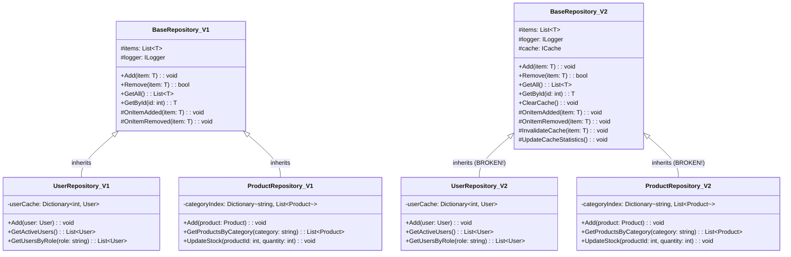

# Fragile Base Class Problem

> **"The Fragile Base Class Problem occurs when changes to a base class break derived classes, even though the base class interface remains unchanged. This highlights why composition is often preferred over inheritance."**

## 🎯 Definition

The **Fragile Base Class Problem** is a fundamental weakness of inheritance where seemingly innocent changes to a base class can **break derived classes** in unexpected ways. It occurs because derived classes depend not just on the **interface** of the base class, but also on its **implementation details** and **internal behavior**.

## 🏠 Real-World Analogy

Think of the fragile base class problem like **foundation changes in a building**:

- ❌ **Original foundation** - Houses built on top work fine
- ❌ **Foundation "improvement"** - Add new support beams, change materials
- ❌ **Houses start cracking** - Upper floors break even though foundation interface (size, shape) didn't change
- ❌ **Hidden dependencies** - Houses depended on specific foundation implementation details
- ✅ **Better approach** - Modular construction where each floor is independent

## 📊 UML Diagram - Fragile Base Class Problem



```text
    note for BaseRepository_V1 : "VERSION 1:\nStable base class\nDerived classes work correctly"
    
    note for BaseRepository_V2 : "VERSION 2:\n'Improved' with caching\nSame public interface\nBUT breaks derived classes!"
    
    note for UserRepository_V2 : "BROKEN:\nBase class caching conflicts\nwith UserRepository's own cache\nDouble-caching issues"
    
    note for ProductRepository_V2 : "BROKEN:\nCache invalidation conflicts\nwith category indexing\nInconsistent state"
```

## 🚫 Violation Example (Fragile Base Class)

```csharp
// ❌ BAD: Fragile base class that will break derived classes over time

// Version 1.0 - Original base class
public class BaseRepository<T> where T : class, IEntity
{
    protected List<T> _items = new List<T>();
    protected ILogger _logger;

    public BaseRepository(ILogger logger)
    {
        _logger = logger ?? throw new ArgumentNullException(nameof(logger));
    }

    public virtual void Add(T item)
    {
        if (item == null) throw new ArgumentNullException(nameof(item));
        
        _logger.LogInfo($"Adding item with ID {item.Id}");
        _items.Add(item);
        OnItemAdded(item);
    }

    public virtual bool Remove(T item)
    {
        if (item == null) return false;
        
        var removed = _items.Remove(item);
        if (removed)
        {
            _logger.LogInfo($"Removed item with ID {item.Id}");
            OnItemRemoved(item);
        }
        return removed;
    }

    public virtual List<T> GetAll()
    {
        return new List<T>(_items);
    }

    public virtual T GetById(int id)
    {
        return _items.FirstOrDefault(item => item.Id == id);
    }

    protected virtual void OnItemAdded(T item)
    {
        // Base implementation does nothing - derived classes can override
    }

    protected virtual void OnItemRemoved(T item)
    {
        // Base implementation does nothing - derived classes can override
    }
}

// Derived class 1 - Works fine with Version 1.0
public class UserRepository : BaseRepository<User>
{
    private readonly Dictionary<int, User> _userCache = new Dictionary<int, User>();
    private readonly Dictionary<string, List<User>> _roleIndex = new Dictionary<string, List<User>>();

    public UserRepository(ILogger logger) : base(logger) { }

    public override void Add(User user)
    {
        base.Add(user); // Calls base class Add method
        
        // UserRepository's custom logic
        _userCache[user.Id] = user;
        
        if (!_roleIndex.ContainsKey(user.Role))
            _roleIndex[user.Role] = new List<User>();
        
        _roleIndex[user.Role].Add(user);
    }

    public override bool Remove(User user)
    {
        var removed = base.Remove(user);
        
        if (removed)
        {
            _userCache.Remove(user.Id);
            if (_roleIndex.ContainsKey(user.Role))
            {
                _roleIndex[user.Role].Remove(user);
                if (!_roleIndex[user.Role].Any())
                    _roleIndex.Remove(user.Role);
            }
        }
        
        return removed;
    }

    public List<User> GetActiveUsers()
    {
        return _items.Where(u => u.IsActive).ToList();
    }

    public List<User> GetUsersByRole(string role)
    {
        return _roleIndex.TryGetValue(role, out var users) ? new List<User>(users) : new List<User>();
    }

    protected override void OnItemAdded(User user)
    {
        _logger.LogInfo($"User added to UserRepository: {user.Name} with role {user.Role}");
    }
}

// Derived class 2 - Also works fine with Version 1.0
public class ProductRepository : BaseRepository<Product>
{
    private readonly Dictionary<string, List<Product>> _categoryIndex = new Dictionary<string, List<Product>>();
    private readonly Dictionary<int, int> _stockLevels = new Dictionary<int, int>();

    public ProductRepository(ILogger logger) : base(logger) { }

    public override void Add(Product product)
    {
        base.Add(product);
        
        // ProductRepository's custom logic
        if (!_categoryIndex.ContainsKey(product.Category))
            _categoryIndex[product.Category] = new List<Product>();
        
        _categoryIndex[product.Category].Add(product);
        _stockLevels[product.Id] = product.Stock;
    }

    public override bool Remove(Product product)
    {
        var removed = base.Remove(product);
        
        if (removed)
        {
            if (_categoryIndex.ContainsKey(product.Category))
            {
                _categoryIndex[product.Category].Remove(product);
                if (!_categoryIndex[product.Category].Any())
                    _categoryIndex.Remove(product.Category);
            }
            _stockLevels.Remove(product.Id);
        }
        
        return removed;
    }

    public List<Product> GetProductsByCategory(string category)
    {
        return _categoryIndex.TryGetValue(category, out var products) ? new List<Product>(products) : new List<Product>();
    }

    public void UpdateStock(int productId, int newStock)
    {
        var product = GetById(productId);
        if (product != null)
        {
            product.Stock = newStock;
            _stockLevels[productId] = newStock;
            _logger.LogInfo($"Updated stock for product {productId} to {newStock}");
        }
    }

    protected override void OnItemAdded(Product product)
    {
        _logger.LogInfo($"Product added to ProductRepository: {product.Name} in category {product.Category}");
    }
}

// Version 2.0 - "Improved" base class with caching (FRAGILE BASE CLASS!)
public class BaseRepository<T> where T : class, IEntity
{
    protected List<T> _items = new List<T>();
    protected ILogger _logger;
    protected ICache _cache; // NEW: Added caching functionality
    protected string _cachePrefix; // NEW: Cache key prefix

    public BaseRepository(ILogger logger, ICache cache)
    {
        _logger = logger ?? throw new ArgumentNullException(nameof(logger));
        _cache = cache ?? throw new ArgumentNullException(nameof(cache)); // NEW: Required dependency
        _cachePrefix = typeof(T).Name; // NEW: Derive cache prefix from type
    }

    public virtual void Add(T item)
    {
        if (item == null) throw new ArgumentNullException(nameof(item));
        
        _logger.LogInfo($"Adding item with ID {item.Id}");
        _items.Add(item);
        
        // NEW: Cache the item immediately after adding
        var cacheKey = $"{_cachePrefix}:{item.Id}";
        _cache.Set(cacheKey, item, TimeSpan.FromHours(1));
        
        // NEW: Invalidate list cache since we added an item
        InvalidateListCache();
        
        OnItemAdded(item);
        
        // NEW: Update cache statistics
        UpdateCacheStatistics();
    }

    public virtual bool Remove(T item)
    {
        if (item == null) return false;
        
        var removed = _items.Remove(item);
        if (removed)
        {
            _logger.LogInfo($"Removed item with ID {item.Id}");
            
            // NEW: Remove from cache
            var cacheKey = $"{_cachePrefix}:{item.Id}";
            _cache.Remove(cacheKey);
            
            // NEW: Invalidate list cache since we removed an item
            InvalidateListCache();
            
            OnItemRemoved(item);
            
            // NEW: Update cache statistics
            UpdateCacheStatistics();
        }
        return removed;
    }

    public virtual List<T> GetAll()
    {
        // NEW: Try to get from cache first
        var listCacheKey = $"{_cachePrefix}:all";
        var cachedList = _cache.Get<List<T>>(listCacheKey);
        
        if (cachedList != null)
        {
            _logger.LogDebug("Returning cached list");
            return new List<T>(cachedList);
        }
        
        // Cache miss - get from memory and cache it
        var items = new List<T>(_items);
        _cache.Set(listCacheKey, items, TimeSpan.FromMinutes(30));
        
        return items;
    }

    public virtual T GetById(int id)
    {
        // NEW: Try cache first
        var cacheKey = $"{_cachePrefix}:{id}";
        var cachedItem = _cache.Get<T>(cacheKey);
        
        if (cachedItem != null)
        {
            _logger.LogDebug($"Returning cached item {id}");
            return cachedItem;
        }
        
        // Cache miss - get from memory and cache it
        var item = _items.FirstOrDefault(i => i.Id == id);
        if (item != null)
        {
            _cache.Set(cacheKey, item, TimeSpan.FromHours(1));
        }
        
        return item;
    }

    // NEW: Public method to clear cache
    public virtual void ClearCache()
    {
        _logger.LogInfo("Clearing repository cache");
        var pattern = $"{_cachePrefix}:*";
        _cache.RemoveByPattern(pattern);
    }

    protected virtual void OnItemAdded(T item)
    {
        // NEW: Base implementation now logs cache operations
        _logger.LogDebug($"Item added event triggered for {item.Id}, cache updated");
    }

    protected virtual void OnItemRemoved(T item)
    {
        // NEW: Base implementation now logs cache operations
        _logger.LogDebug($"Item removed event triggered for {item.Id}, cache updated");
    }

    // NEW: Protected methods that derived classes might accidentally depend on
    protected virtual void InvalidateListCache()
    {
        var listCacheKey = $"{_cachePrefix}:all";
        _cache.Remove(listCacheKey);
        _logger.LogDebug("List cache invalidated");
    }

    protected virtual void UpdateCacheStatistics()
    {
        // NEW: Update cache hit/miss statistics
        var statsKey = $"{_cachePrefix}:stats";
        var stats = _cache.Get<CacheStats>(statsKey) ?? new CacheStats();
        stats.LastUpdate = DateTime.UtcNow;
        stats.TotalOperations++;
        _cache.Set(statsKey, stats, TimeSpan.FromDays(1));
    }
}

// NOW THE DERIVED CLASSES ARE BROKEN! Even though the public interface didn't change much...

// UserRepository is now BROKEN because:
// 1. Constructor signature changed (needs ICache parameter)
// 2. Double caching - UserRepository has its own cache AND base class has cache
// 3. Cache invalidation conflicts with UserRepository's role indexing
// 4. OnItemAdded behavior changed, affecting UserRepository's logging
public class UserRepository : BaseRepository<User>
{
    private readonly Dictionary<int, User> _userCache = new Dictionary<int, User>(); // CONFLICT with base cache!
    private readonly Dictionary<string, List<User>> _roleIndex = new Dictionary<string, List<User>>();

    // BROKEN: Constructor signature changed
    public UserRepository(ILogger logger) : base(logger) // Missing ICache parameter!
    {
        // This won't even compile now!
    }

    public override void Add(User user)
    {
        base.Add(user); // Now this also caches in base class!
        
        // BROKEN: Double caching - both base class and UserRepository cache the same data
        _userCache[user.Id] = user; // Redundant and potentially inconsistent
        
        if (!_roleIndex.ContainsKey(user.Role))
            _roleIndex[user.Role] = new List<User>();
        
        _roleIndex[user.Role].Add(user);
        
        // PROBLEM: Base class InvalidateListCache() might interfere with role indexing
    }

    public List<User> GetActiveUsers()
    {
        // BROKEN: This might return cached data that doesn't include recent changes
        // because base class GetAll() now returns cached data that might be stale
        return GetAll().Where(u => u.IsActive).ToList();
    }

    public List<User> GetUsersByRole(string role)
    {
        // INCONSISTENCY: Role index might be out of sync with base class cache
        return _roleIndex.TryGetValue(role, out var users) ? new List<User>(users) : new List<User>();
    }
}

// ProductRepository is also BROKEN:
public class ProductRepository : BaseRepository<Product>
{
    private readonly Dictionary<string, List<Product>> _categoryIndex = new Dictionary<string, List<Product>>();
    private readonly Dictionary<int, int> _stockLevels = new Dictionary<int, int>();

    // BROKEN: Constructor signature changed
    public ProductRepository(ILogger logger) : base(logger) // Missing ICache parameter!
    {
        // Won't compile!
    }

    public void UpdateStock(int productId, int newStock)
    {
        var product = GetById(productId); // Now returns cached version
        if (product != null)
        {
            product.Stock = newStock;
            _stockLevels[productId] = newStock;
            
            // PROBLEM: Updated the cached object, but cache might not be invalidated properly
            // Other parts of the system might still see old stock levels
            
            _logger.LogInfo($"Updated stock for product {productId} to {newStock}");
        }
    }

    public List<Product> GetProductsByCategory(string category)
    {
        // INCONSISTENCY: Category index might be out of sync with cached data
        return _categoryIndex.TryGetValue(category, out var products) ? new List<Product>(products) : new List<Product>();
    }
}

// Usage code that worked with Version 1.0 is now BROKEN:
public class ProductService
{
    private readonly ProductRepository _productRepository;

    public ProductService(ILogger logger)
    {
        // BROKEN: ProductRepository constructor now requires ICache
        _productRepository = new ProductRepository(logger); // Compilation error!
    }

    public void UpdateProductStock(int productId, int newStock)
    {
        _productRepository.UpdateStock(productId, newStock);
        
        // PROBLEM: Due to caching issues, other parts of the system
        // might not see the updated stock immediately
        
        var product = _productRepository.GetById(productId);
        Console.WriteLine($"Product {product.Name} now has {product.Stock} in stock");
        // Might show old stock level due to cache inconsistencies!
    }
}
```

### Problems demonstrated

1. **Constructor changes** - Adding required dependencies breaks all derived classes
2. **Behavioral changes** - Caching changes the timing and behavior of method calls
3. **Internal conflicts** - Base class functionality conflicts with derived class logic
4. **Cache inconsistencies** - Multiple caching layers create inconsistent state
5. **Cascading failures** - Changes to base class break unrelated derived classes

## ✅ Correct Implementation (Avoiding Fragile Base Class)

```csharp
// ✅ GOOD: Using composition to avoid fragile base class problems

// Separate concerns into focused interfaces
public interface IRepository<T> where T : class, IEntity
{
    void Add(T item);
    bool Remove(T item);
    List<T> GetAll();
    T GetById(int id);
}

public interface ICacheableRepository<T> : IRepository<T> where T : class, IEntity
{
    void ClearCache();
    CacheStats GetCacheStats();
}

public interface ILogger
{
    void LogInfo(string message);
    void LogDebug(string message);
    void LogError(string message, Exception exception = null);
}

public interface ICache
{
    void Set<T>(string key, T value, TimeSpan expiration);
    T Get<T>(string key);
    void Remove(string key);
    void RemoveByPattern(string pattern);
}

// Base functionality through composition, not inheritance
public class RepositoryCore<T> where T : class, IEntity
{
    private readonly List<T> _items = new List<T>();
    private readonly ILogger _logger;

    public RepositoryCore(ILogger logger)
    {
        _logger = logger ?? throw new ArgumentNullException(nameof(logger));
    }

    public void Add(T item)
    {
        if (item == null) throw new ArgumentNullException(nameof(item));
        
        _logger.LogInfo($"Adding item with ID {item.Id}");
        _items.Add(item);
    }

    public bool Remove(T item)
    {
        if (item == null) return false;
        
        var removed = _items.Remove(item);
        if (removed)
        {
            _logger.LogInfo($"Removed item with ID {item.Id}");
        }
        return removed;
    }

    public List<T> GetAll()
    {
        return new List<T>(_items);
    }

    public T GetById(int id)
    {
        return _items.FirstOrDefault(item => item.Id == id);
    }
}

// Caching behavior as a separate component
public class CachingRepository<T> : ICacheableRepository<T> where T : class, IEntity
{
    private readonly IRepository<T> _baseRepository;
    private readonly ICache _cache;
    private readonly ILogger _logger;
    private readonly string _cachePrefix;

    public CachingRepository(IRepository<T> baseRepository, ICache cache, ILogger logger)
    {
        _baseRepository = baseRepository ?? throw new ArgumentNullException(nameof(baseRepository));
        _cache = cache ?? throw new ArgumentNullException(nameof(cache));
        _logger = logger ?? throw new ArgumentNullException(nameof(logger));
        _cachePrefix = typeof(T).Name;
    }

    public void Add(T item)
    {
        _baseRepository.Add(item);
        
        // Cache the item
        var cacheKey = $"{_cachePrefix}:{item.Id}";
        _cache.Set(cacheKey, item, TimeSpan.FromHours(1));
        
        // Invalidate list cache
        InvalidateListCache();
    }

    public bool Remove(T item)
    {
        var removed = _baseRepository.Remove(item);
        
        if (removed)
        {
            // Remove from cache
            var cacheKey = $"{_cachePrefix}:{item.Id}";
            _cache.Remove(cacheKey);
            
            // Invalidate list cache
            InvalidateListCache();
        }
        
        return removed;
    }

    public List<T> GetAll()
    {
        var listCacheKey = $"{_cachePrefix}:all";
        var cachedList = _cache.Get<List<T>>(listCacheKey);
        
        if (cachedList != null)
        {
            _logger.LogDebug("Returning cached list");
            return new List<T>(cachedList);
        }
        
        var items = _baseRepository.GetAll();
        _cache.Set(listCacheKey, items, TimeSpan.FromMinutes(30));
        
        return items;
    }

    public T GetById(int id)
    {
        var cacheKey = $"{_cachePrefix}:{id}";
        var cachedItem = _cache.Get<T>(cacheKey);
        
        if (cachedItem != null)
        {
            _logger.LogDebug($"Returning cached item {id}");
            return cachedItem;
        }
        
        var item = _baseRepository.GetById(id);
        if (item != null)
        {
            _cache.Set(cacheKey, item, TimeSpan.FromHours(1));
        }
        
        return item;
    }

    public void ClearCache()
    {
        _logger.LogInfo("Clearing repository cache");
        var pattern = $"{_cachePrefix}:*";
        _cache.RemoveByPattern(pattern);
    }

    public CacheStats GetCacheStats()
    {
        var statsKey = $"{_cachePrefix}:stats";
        return _cache.Get<CacheStats>(statsKey) ?? new CacheStats();
    }

    private void InvalidateListCache()
    {
        var listCacheKey = $"{_cachePrefix}:all";
        _cache.Remove(listCacheKey);
        _logger.LogDebug("List cache invalidated");
    }
}

// UserRepository using composition - stable and focused
public class UserRepository : IRepository<User>
{
    private readonly IRepository<User> _baseRepository;
    private readonly Dictionary<string, List<User>> _roleIndex = new Dictionary<string, List<User>>();
    private readonly ILogger _logger;

    public UserRepository(IRepository<User> baseRepository, ILogger logger)
    {
        _baseRepository = baseRepository ?? throw new ArgumentNullException(nameof(baseRepository));
        _logger = logger ?? throw new ArgumentNullException(nameof(logger));
        
        // Initialize role index
        RefreshRoleIndex();
    }

    public void Add(User user)
    {
        _baseRepository.Add(user);
        
        // Update role index
        if (!_roleIndex.ContainsKey(user.Role))
            _roleIndex[user.Role] = new List<User>();
        
        _roleIndex[user.Role].Add(user);
        
        _logger.LogInfo($"User added to UserRepository: {user.Name} with role {user.Role}");
    }

    public bool Remove(User user)
    {
        var removed = _baseRepository.Remove(user);
        
        if (removed)
        {
            // Update role index
            if (_roleIndex.ContainsKey(user.Role))
            {
                _roleIndex[user.Role].Remove(user);
                if (!_roleIndex[user.Role].Any())
                    _roleIndex.Remove(user.Role);
            }
        }
        
        return removed;
    }

    public List<User> GetAll()
    {
        return _baseRepository.GetAll();
    }

    public User GetById(int id)
    {
        return _baseRepository.GetById(id);
    }

    // User-specific methods
    public List<User> GetActiveUsers()
    {
        return GetAll().Where(u => u.IsActive).ToList();
    }

    public List<User> GetUsersByRole(string role)
    {
        return _roleIndex.TryGetValue(role, out var users) ? new List<User>(users) : new List<User>();
    }

    private void RefreshRoleIndex()
    {
        _roleIndex.Clear();
        foreach (var user in GetAll())
        {
            if (!_roleIndex.ContainsKey(user.Role))
                _roleIndex[user.Role] = new List<User>();
            
            _roleIndex[user.Role].Add(user);
        }
    }
}

// ProductRepository using composition - also stable and focused
public class ProductRepository : IRepository<Product>
{
    private readonly IRepository<Product> _baseRepository;
    private readonly Dictionary<string, List<Product>> _categoryIndex = new Dictionary<string, List<Product>>();
    private readonly Dictionary<int, int> _stockLevels = new Dictionary<int, int>();
    private readonly ILogger _logger;

    public ProductRepository(IRepository<Product> baseRepository, ILogger logger)
    {
        _baseRepository = baseRepository ?? throw new ArgumentNullException(nameof(baseRepository));
        _logger = logger ?? throw new ArgumentNullException(nameof(logger));
        
        // Initialize indexes
        RefreshIndexes();
    }

    public void Add(Product product)
    {
        _baseRepository.Add(product);
        
        // Update category index
        if (!_categoryIndex.ContainsKey(product.Category))
            _categoryIndex[product.Category] = new List<Product>();
        
        _categoryIndex[product.Category].Add(product);
        _stockLevels[product.Id] = product.Stock;
    }

    public bool Remove(Product product)
    {
        var removed = _baseRepository.Remove(product);
        
        if (removed)
        {
            // Update indexes
            if (_categoryIndex.ContainsKey(product.Category))
            {
                _categoryIndex[product.Category].Remove(product);
                if (!_categoryIndex[product.Category].Any())
                    _categoryIndex.Remove(product.Category);
            }
            _stockLevels.Remove(product.Id);
        }
        
        return removed;
    }

    public List<Product> GetAll()
    {
        return _baseRepository.GetAll();
    }

    public Product GetById(int id)
    {
        return _baseRepository.GetById(id);
    }

    // Product-specific methods
    public List<Product> GetProductsByCategory(string category)
    {
        return _categoryIndex.TryGetValue(category, out var products) ? new List<Product>(products) : new List<Product>();
    }

    public void UpdateStock(int productId, int newStock)
    {
        var product = GetById(productId);
        if (product != null)
        {
            product.Stock = newStock;
            _stockLevels[productId] = newStock;
            _logger.LogInfo($"Updated stock for product {productId} to {newStock}");
        }
    }

    public int GetStockLevel(int productId)
    {
        return _stockLevels.TryGetValue(productId, out var stock) ? stock : 0;
    }

    private void RefreshIndexes()
    {
        _categoryIndex.Clear();
        _stockLevels.Clear();
        
        foreach (var product in GetAll())
        {
            if (!_categoryIndex.ContainsKey(product.Category))
                _categoryIndex[product.Category] = new List<Product>();
            
            _categoryIndex[product.Category].Add(product);
            _stockLevels[product.Id] = product.Stock;
        }
    }
}

// Factory for creating repositories with or without caching
public class RepositoryFactory
{
    private readonly ILogger _logger;
    private readonly ICache _cache;

    public RepositoryFactory(ILogger logger, ICache cache = null)
    {
        _logger = logger ?? throw new ArgumentNullException(nameof(logger));
        _cache = cache;
    }

    public IRepository<User> CreateUserRepository(bool withCaching = false)
    {
        var coreRepository = new RepositoryCore<User>(_logger);
        
        IRepository<User> baseRepository = coreRepository;
        
        if (withCaching && _cache != null)
        {
            baseRepository = new CachingRepository<User>(baseRepository, _cache, _logger);
        }
        
        return new UserRepository(baseRepository, _logger);
    }

    public IRepository<Product> CreateProductRepository(bool withCaching = false)
    {
        var coreRepository = new RepositoryCore<Product>(_logger);
        
        IRepository<Product> baseRepository = coreRepository;
        
        if (withCaching && _cache != null)
        {
            baseRepository = new CachingRepository<Product>(baseRepository, _cache, _logger);
        }
        
        return new ProductRepository(baseRepository, _logger);
    }
}

// Usage - stable across changes to underlying implementations
public class ProductService
{
    private readonly IRepository<Product> _productRepository;

    public ProductService(IRepository<Product> productRepository)
    {
        _productRepository = productRepository ?? throw new ArgumentNullException(nameof(productRepository));
    }

    public void UpdateProductStock(int productId, int newStock)
    {
        // Get the product-specific repository if needed
        if (_productRepository is ProductRepository productRepo)
        {
            productRepo.UpdateStock(productId, newStock);
            
            var product = _productRepository.GetById(productId);
            Console.WriteLine($"Product {product.Name} now has {product.Stock} in stock");
        }
    }

    public List<Product> GetProductsByCategory(string category)
    {
        if (_productRepository is ProductRepository productRepo)
        {
            return productRepo.GetProductsByCategory(category);
        }
        
        // Fallback to filtering all products
        return _productRepository.GetAll().Where(p => p.Category == category).ToList();
    }
}

// Dependency injection setup
public static class ServiceCollectionExtensions
{
    public static IServiceCollection AddRepositories(this IServiceCollection services, bool withCaching = false)
    {
        services.AddSingleton<ILogger, ConsoleLogger>();
        
        if (withCaching)
        {
            services.AddSingleton<ICache, MemoryCache>();
        }
        
        services.AddScoped<RepositoryFactory>();
        
        services.AddScoped<IRepository<User>>(provider =>
        {
            var factory = provider.GetRequiredService<RepositoryFactory>();
            return factory.CreateUserRepository(withCaching);
        });
        
        services.AddScoped<IRepository<Product>>(provider =>
        {
            var factory = provider.GetRequiredService<RepositoryFactory>();
            return factory.CreateProductRepository(withCaching);
        });
        
        return services;
    }
}
```

## 🧪 Unit Testing - Avoiding Fragile Base Classes

```csharp
[TestFixture]
public class FragileBaseClassAvoidanceTests
{
    [Test]
    public void CompositionBased_Repository_Can_Be_Tested_In_Isolation()
    {
        // Arrange
        var mockBaseRepository = new Mock<IRepository<User>>();
        var mockLogger = new Mock<ILogger>();
        
        var user = new User { Id = 1, Name = "John Doe", Role = "Admin", IsActive = true };
        
        mockBaseRepository.Setup(r => r.Add(user));
        mockBaseRepository.Setup(r => r.GetAll()).Returns(new List<User> { user });

        var userRepository = new UserRepository(mockBaseRepository.Object, mockLogger.Object);

        // Act
        userRepository.Add(user);
        var activeUsers = userRepository.GetActiveUsers();
        var adminUsers = userRepository.GetUsersByRole("Admin");

        // Assert
        Assert.AreEqual(1, activeUsers.Count);
        Assert.AreEqual(1, adminUsers.Count);
        Assert.AreEqual("John Doe", adminUsers[0].Name);
        
        // Verify that base repository was called
        mockBaseRepository.Verify(r => r.Add(user), Times.Once);
        mockBaseRepository.Verify(r => r.GetAll(), Times.Once);
    }

    [Test]
    public void CachingRepository_Can_Be_Added_Without_Breaking_Existing_Code()
    {
        // Arrange
        var mockLogger = new Mock<ILogger>();
        var mockCache = new Mock<ICache>();
        
        var coreRepository = new RepositoryCore<Product>(mockLogger.Object);
        var product = new Product { Id = 1, Name = "Laptop", Category = "Electronics", Stock = 10 };

        // Add product to core repository
        coreRepository.Add(product);

        // Wrap with caching - existing functionality still works
        var cachingRepository = new CachingRepository<Product>(coreRepository, mockCache.Object, mockLogger.Object);
        var productRepository = new ProductRepository(cachingRepository, mockLogger.Object);

        // Act
        var retrievedProduct = productRepository.GetById(1);
        var categoryProducts = productRepository.GetProductsByCategory("Electronics");

        // Assert
        Assert.IsNotNull(retrievedProduct);
        Assert.AreEqual("Laptop", retrievedProduct.Name);
        Assert.AreEqual(1, categoryProducts.Count);
        Assert.AreEqual("Laptop", categoryProducts[0].Name);
        
        // Verify cache was used
        mockCache.Verify(c => c.Get<Product>(It.IsAny<string>()), Times.AtLeastOnce);
    }

    [Test] 
    public void Repository_Factory_Allows_Easy_Configuration_Changes()
    {
        // Arrange
        var mockLogger = new Mock<ILogger>();
        var mockCache = new Mock<ICache>();
        var factory = new RepositoryFactory(mockLogger.Object, mockCache.Object);

        // Act - Create repositories with different configurations
        var simpleUserRepo = factory.CreateUserRepository(withCaching: false);
        var cachedUserRepo = factory.CreateUserRepository(withCaching: true);

        // Assert - Both implement the same interface but have different behaviors
        Assert.IsNotNull(simpleUserRepo);
        Assert.IsNotNull(cachedUserRepo);
        Assert.IsAssignableFrom<IRepository<User>>(simpleUserRepo);
        Assert.IsAssignableFrom<IRepository<User>>(cachedUserRepo);
    }

    [Test]
    public void Changes_To_Core_Repository_Do_Not_Break_Derived_Repositories()
    {
        // Arrange - Simulate changing the core repository implementation
        var mockLogger = new Mock<ILogger>();
        var user = new User { Id = 1, Name = "Jane Doe", Role = "User", IsActive = true };

        // Original implementation
        IRepository<User> coreRepo = new RepositoryCore<User>(mockLogger.Object);
        var userRepo = new UserRepository(coreRepo, mockLogger.Object);

        userRepo.Add(user);
        var originalCount = userRepo.GetUsersByRole("User").Count;

        // Simulate upgrading to a new core implementation (like with database backing)
        var mockNewCoreRepo = new Mock<IRepository<User>>();
        mockNewCoreRepo.Setup(r => r.GetAll()).Returns(new List<User> { user });
        
        var newUserRepo = new UserRepository(mockNewCoreRepo.Object, mockLogger.Object);

        // Act
        var newCount = newUserRepo.GetUsersByRole("User").Count;

        // Assert - UserRepository works with any IRepository<User> implementation
        Assert.AreEqual(1, originalCount);
        Assert.AreEqual(1, newCount);
        
        // UserRepository's behavior is consistent regardless of underlying implementation
        mockNewCoreRepo.Verify(r => r.GetAll(), Times.Once);
    }
}
```

## ✅ Benefits of Avoiding Fragile Base Class

1. **Stability** - Changes to components don't break other components
2. **Testability** - Each component can be tested in isolation
3. **Flexibility** - Can easily swap implementations
4. **Loose coupling** - Components depend on interfaces, not implementations
5. **Single responsibility** - Each component has one focused purpose
6. **Composability** - Can combine components in different ways

## 🎯 Strategies to Avoid Fragile Base Class

### 1. **Favor Composition Over Inheritance**

- Use "has-a" relationships instead of "is-a"
- Compose behavior from multiple focused components
- Depend on interfaces, not concrete classes

### 2. **Keep Base Classes Minimal**

- Only include stable, rarely-changing functionality
- Avoid adding "convenience" methods that change behavior
- Don't add functionality that derived classes might conflict with

### 3. **Use Abstract Interfaces**

- Define clear contracts through interfaces  
- Let implementations vary without affecting clients
- Enable easy substitution and testing

### 4. **Apply Single Responsibility Principle**

- Each class should have one reason to change
- Split complex functionality into focused components
- Reduce the impact of changes

## 🚨 Warning Signs of Fragile Base Class

1. **Frequent breaking changes** - Updates to base class break derived classes
2. **Complex inheritance hierarchies** - Deep or wide inheritance trees
3. **Protected member pollution** - Many protected methods and fields
4. **Behavioral coupling** - Derived classes depend on base class implementation details
5. **Testing difficulties** - Hard to test derived classes in isolation

## 🎯 Interview Questions

**Q: What is the Fragile Base Class Problem?**
**A:** The Fragile Base Class Problem occurs when changes to a base class break derived classes, even when the public interface remains unchanged. It happens because derived classes often depend on implementation details and internal behavior of the base class, not just its interface.

**Q: How can composition help avoid the Fragile Base Class Problem?**
**A:** Composition avoids fragile base classes by using "has-a" relationships instead of "is-a" relationships. Components depend on interfaces rather than concrete implementations, making them immune to internal changes in other components. When you change one component, others aren't affected as long as the interface remains stable.

**Q: Give an ERP example where the Fragile Base Class Problem could cause issues.**
**A:** In an ERP system, imagine a BaseDocument class with methods for saving, validating, and auditing. Initially, Invoice and PurchaseOrder inherit from it. Later, adding caching to BaseDocument breaks both derived classes because they have their own caching logic. Using composition, each document type would compose with separate persistence, validation, and auditing services, avoiding conflicts.

**Q: What strategies help prevent fragile base classes?**
**A:** Key strategies include: favoring composition over inheritance, keeping base classes minimal and stable, depending on interfaces rather than concrete classes, applying single responsibility principle, avoiding protected members, and thoroughly testing inheritance hierarchies. The goal is to minimize coupling between base and derived classes.

## 📝 Checklist

- [ ] Evaluated inheritance hierarchies for fragility risks
- [ ] Considered composition as alternative to inheritance
- [ ] Designed interfaces for stability and extensibility
- [ ] Minimized protected members in base classes
- [ ] Applied single responsibility principle to reduce change impact
- [ ] Created unit tests that verify component isolation
- [ ] Documented assumptions and dependencies clearly
- [ ] Planned for future extensibility without breaking existing code

---

**Previous**: [← Composition vs Inheritance](./07-composition-vs-inheritance.md) | **Up**: [OOP Principles ↑](./README.md)