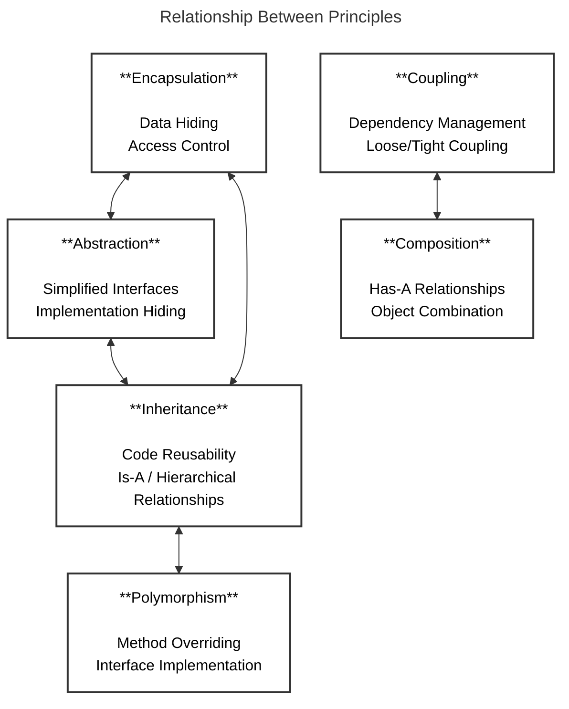

# Object-Oriented Programming (OOP) Principles

> **"Object-oriented programming is a programming paradigm based on the concept of 'objects', which can contain data and code: data in the form of fields (often known as attributes or properties), and code, in the form of procedures (often known as methods)."**

## 📚 Table of Contents

### Core OOP Principles
1. [Encapsulation](./01-encapsulation.md) - Data hiding and access control
2. [Abstraction](./02-abstraction.md) - Hiding implementation complexity
3. [Inheritance](./03-inheritance.md) - Code reuse through "is-a" relationships
4. [Polymorphism](./04-polymorphism.md) - Multiple forms of the same interface

### Advanced OOP Concepts
5. [Coupling](./05-coupling.md) - Degree of interdependence between classes
6. [Composition](./06-composition.md) - "Has-a" relationships and object collaboration
7. [Composition vs Inheritance](./07-composition-vs-inheritance.md) - When to use each approach
8. [Fragile Base Class Problem](./08-fragile-base-class.md) - Inheritance pitfalls and solutions

## 🎯 Learning Path

### **Beginner Level**
Start with the core four principles in order:
1. **Encapsulation** - Learn data hiding and access control
2. **Abstraction** - Understand hiding implementation details
3. **Inheritance** - Master code reuse through class hierarchies
4. **Polymorphism** - Explore multiple forms and dynamic binding

### **Intermediate Level**
Move to advanced concepts:
5. **Coupling** - Learn about dependencies between classes
6. **Composition** - Master object collaboration patterns

### **Advanced Level**
Tackle design decisions and pitfalls:
7. **Composition vs Inheritance** - Make informed architectural choices
8. **Fragile Base Class Problem** - Avoid common inheritance traps

## 🏢 ERP System Context

All examples in this documentation use a comprehensive **Enterprise Resource Planning (ERP)** system context, including:

- **Human Resources Management**
- **Financial Management** 
- **Inventory Management**
- **Customer Relationship Management**
- **Supply Chain Management**
- **Manufacturing Management**
- **Project Management**
- **Document Management**

This approach ensures all examples are relevant to enterprise software development and senior developer interview scenarios.

## 🧪 Key Features

Each principle includes:
- ✅ **UML Diagrams** - Visual representation of concepts
- ✅ **Real-world analogies** - Easy-to-understand comparisons
- ✅ **Violation examples** - What NOT to do
- ✅ **Correct implementations** - Production-ready C# code
- ✅ **ERP use cases** - Enterprise-relevant scenarios
- ✅ **Unit testing strategies** - Testing OOP implementations
- ✅ **Interview questions** - Common technical interview topics
- ✅ **Best practices** - Industry-standard approaches

## 🔄 Relationships Between Principles

## 🎯 Interview Preparation

This documentation is specifically designed for:
- **Senior Software Developer** positions
- **ERP System Development** roles
- **Technical Architecture** interviews
- **Object-Oriented Design** assessments
- **Code Review** discussions

## 📋 Progress Tracking

- [ ] **Encapsulation** - Master data hiding and access control
- [ ] **Abstraction** - Learn interface design and implementation hiding
- [ ] **Inheritance** - Understand class hierarchies and code reuse
- [ ] **Polymorphism** - Explore runtime binding and multiple forms
- [ ] **Coupling** - Analyze dependencies and design for maintainability
- [ ] **Composition** - Master object collaboration and "has-a" relationships
- [ ] **Composition vs Inheritance** - Make informed design decisions
- [ ] **Fragile Base Class** - Avoid inheritance pitfalls

---

**Next**: [Start with Encapsulation →](./01-encapsulation.md)